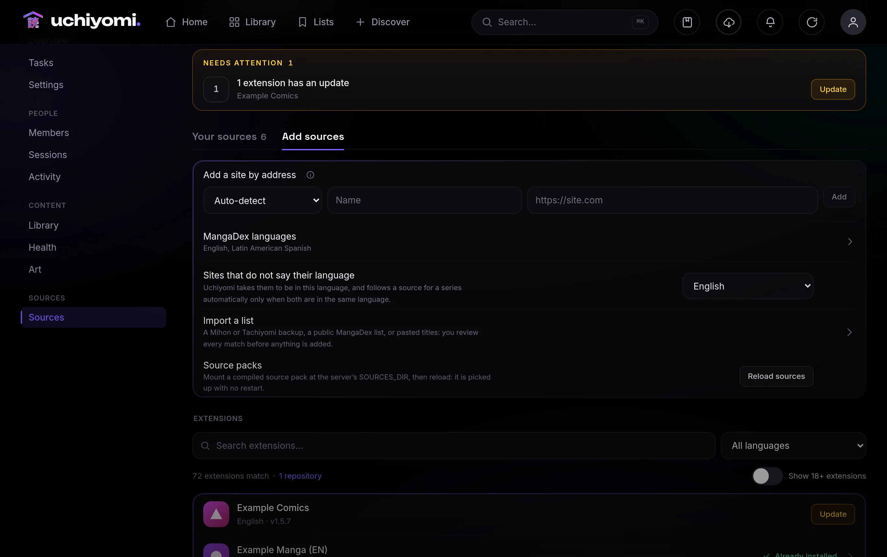
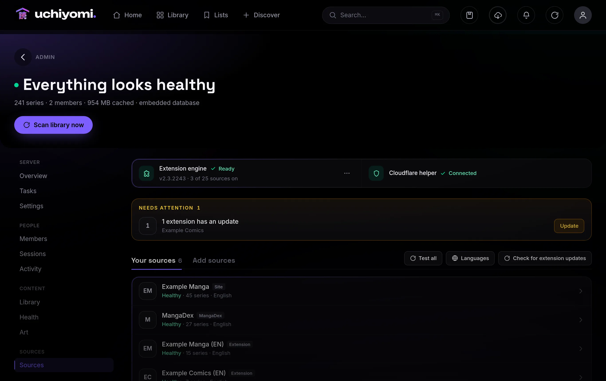

# Uchiyomi — User Guide

Everything you can do in Uchiyomi, screen by screen. To install it see [INSTALL.md](INSTALL.md); for
environment variables see [CONFIGURATION.md](CONFIGURATION.md).

- [1. First run & setup](#1-first-run--setup)
- [2. Signing in](#2-signing-in)
- [3. Your library](#3-your-library)
- [4. A series & its chapters](#4-a-series--its-chapters)
- [5. The reader](#5-the-reader)
- [6. Discover & add new series](#6-discover--add-new-series)
- [7. Sources: extensions, add-a-site and MangaDex](#7-sources-extensions-add-a-site-and-mangadex)
- [8. The admin panel](#8-the-admin-panel)
- [9. Security: 2FA, sessions, password](#9-security-2fa-sessions-password)
- [10. Tracking: AniList, MyAnimeList and Kitsu](#10-tracking-anilist-myanimelist-and-kitsu)
- [11. Install as an app & offline](#11-install-as-an-app--offline)
- [12. Backups & restore](#12-backups--restore)
- [13. Troubleshooting & FAQ](#13-troubleshooting--faq)
- [14. Uchiyomi Desktop](#14-uchiyomi-desktop) — the Windows and macOS app (beta), now in [its own guide](DESKTOP.md)

---

## 1. First run & setup

> 💻 **Using the Windows or Mac app?** Its first launch is different: it asks whether to run everything on the
> computer or connect to your server, and on the computer there is no setup at all. That is all in
> **[the desktop guide](DESKTOP.md)**; this section is about a server.

```bash
docker compose up -d         # no config needed — secrets are generated automatically
```

> **Updating later:** run `docker compose pull` *before* `docker compose up -d`. Without the pull, Docker
> keeps using the `:latest` image it already has and you stay on your installed version silently.

Open the app at your `PUBLIC_ORIGIN` (e.g. `http://localhost:8080`) and **create your admin account in the
browser** on first run (the first account created becomes the server admin). To read an existing collection,
point `LIBRARY_PATH` at it first (`cp .env.example .env`, set `LIBRARY_PATH=/path/to/your/manga`, then
`docker compose up -d`). Your library can be laid out however you already keep it: a folder counts as a series when it directly
contains chapters, at any depth. Each chapter is a `.cbz`, a `.cbr`, or a folder of images (an archive may
carry a `ComicInfo.xml` for metadata).

Prefer a CLI-seeded admin? Run `bash scripts/setup.sh` from a clone instead — it generates the secrets, creates
the admin from a password you type, fixes volume ownership, and starts the development stack (`yomi-app`,
`yomi-db`, `yomi-suwayomi`, `yomi-flaresolverr`). `yomi-app` is the same single container the install ships,
built from source.

---

## 2. Signing in


> 💻 **In the desktop app** on the computer itself there is no sign-in screen: it opens signed in. Connected to
> your server, it shows your server's own sign-in page, exactly as below
> ([desktop guide](DESKTOP.md#4-connect-to-your-own-server)).

**Signing in with your own identity provider.** If the admin has configured OIDC, a **Continue with …** button
appears under the password form and you can sign in with Authentik, Authelia, Keycloak or anything else that
speaks OpenID Connect. Local accounts keep working alongside it, so a provider outage can never lock you out.
Setup is in [docs/api.md](api.md#single-sign-on-oidc).


Log in with the username/password you set in `setup.sh` (the first account is `admin`). If you've turned on
two-factor auth, you'll be asked for your 6-digit code (or a recovery code) after the password.

---

## 3. Your library


The **Library** tab is your whole collection, and every way to narrow it lives in one filter panel:
sorting, which library, read state, publication status, format and genre. On a laptop the panel sits down
the left of the grid; on a phone it opens from **Filters** at the top. Genres are listed biggest-first with
how many series each holds, and formats (Manhwa, Manhua, Webtoon…) are kept separate from moods like Horror
and Romance. Picking two genres shows series that are in **both**. With more than one source in the
library, two more sections appear: **Main source** shows the series added from a source, and **Any source**
the series that read from it at all, as their main source or a followed one. For a source that went away, an admin
can filter by it under **Main source**, then **Select** → **Select all** → **More** → **Find other sources**
(section 4); *Select all* takes what the grid has loaded, so scroll to the end first. Each cover shows a **NEW** ribbon when
there are unread chapters. Click a cover to open the series. The ✦ **Surprise me** button picks one at random from whatever the
filters currently show.

The top bar has **Home** (a daily-pick hero + "For you" rails), **Library**, **Lists** and **Discover**,
plus search, the updates bell, a refresh button, and your profile.

**Right-click a series** anywhere it appears — the library grid, Home's rails, Up next in the reader — or press
and hold it on a touchscreen, for a short menu (since v0.48.0): **Open in a new tab**, **Copy link**,
**Favourite**, **Mark all read** / **unread**, and for an admin **Check for new chapters**. Shift+right-click still
opens the browser's own menu, and so does a right-click on selected text or in a text field. **Profile →
Settings → Appearance → Right-click menus** turns them off on that device; the ⋯ buttons keep working either way.

**Messages** — *Marked read*, *Fetching 3 chapters…*, *Could not save* — appear as small cards at the **bottom**
of the screen (since v0.49.0; they used to be capsules at the top, where they covered a dialog's title). On a
phone they sit just above the bottom bar, or above the select bar in select mode; while a dialog is open, one at
a time takes the bottom bar's place, so the dialog is never covered; in the reader they rise above the chapter
list or the settings sheet. On a laptop they sit in the bottom-right corner (bottom-left in Arabic), narrowing
beside a dialog. A message stays as long as it takes to read — longer for longer ones, at least six seconds for
an error — and waits while you hover over it, touch it or tab to it. ✕ dismisses it, and on a touchscreen so does
swiping it down. The same message twice shows once with *×2*, and at most three show at once. A message about
something still going on (*Checking for new chapters…*) has a small turning ring where the others have a mark.

Search opens the **command palette**: one box that finds any series in the library and runs the quick actions
(Surprise me, Updates, Refresh library and so on). With a keyboard there are three ways in: **Ctrl+K** (**⌘K**
on a Mac) or **/** open it empty, and simply **starting to type** a title opens it with that first letter
already in the box, so *"one p"* typed on the library page is a search. Only letters and digits do this, and
only when nothing else wants the key: not while you are typing in a field, not with a dialog open, not with
Ctrl, Alt or ⌘ held, and never in the reader, which keeps its own keys. Under a Japanese or Chinese
interface the palette opens empty instead, so the input method composes the whole title. **Profile → Settings →
Appearance → Type anywhere to search** switches the typing, and the **/** shortcut with it, off on that device;
**Ctrl+K** keeps working.

### What counts as a chapter

Point `LIBRARY_PATH` at what you already have. A chapter can be any of:

| | |
|---|---|
| `.cbz` / `.zip` | the usual comic archive |
| `.cbr` / `.rar` | read with a pure-wasm unrar, no extra install |
| `.pdf` | pages are rendered at reading resolution, so a PDF behaves exactly like a CBZ |
| `.epub` | **image** EPUBs only, which is what manga bought from a store ships as |
| a folder of images | loose `.png` / `.jpg` / `.webp` / `.avif`, sorted naturally |

Two things worth knowing. **EPUB pages come out in spine order**, not filename order, because store-bought
manga routinely names its image files by an internal id that sorts wrong. And **a text ebook is not a
chapter**: a reflowable novel has no images in its spine, so it yields no pages and the scanner skips it
rather than adding something that opens to nothing. Uchiyomi is a manga reader, not an ebook library.

Any folder depth works, and `ComicInfo.xml` is read when an archive carries one.

---

## 4. A series & its chapters


The series page shows the cover, an ambient backdrop, one muted line about where the chapters come from,
genres, description, and the **chapter list**.

- **Start reading** jumps to where you left off (or chapter 1). A series with no chapter on disk yet shows
  *Nothing to read yet* instead (see *Chapters the sources have that you don't*).
  The line under the button names the chapter it opens — *Ch. 12 · The Sound of Thunder · page 7 of 23*
  when you are part-way through one — so *Continue* is never a guess.
- **Chapter names.** A row reads *Ch. 12 · The Sound of Thunder* when the source names its chapters. The
  name is taken when a chapter is downloaded, and chapters downloaded before this was kept pick theirs up
  on the series' next source check (nightly, or **Check now**). Many sources only ever say *Chapter 12*;
  those rows show the number alone, since repeating it adds nothing — unless you switch on **borrowing**
  (below), which takes the names from another source.
- **Favorite** (heart) adds it to your favorites + smart offline sync.
- **Save all offline** copies every chapter to this device for reading with no connection.
- Click any chapter to read it; the ⬇ on a chapter saves just that one to this device. Toggle
  **Oldest/Newest** to flip the order.
- **Mark all read** does what it says to every chapter of the series; **Filter** narrows the list to one
  translation group or hides the grey rows; **Select** picks chapters one by one for the actions described
  in *Selecting chapters* below.
- A long series shows its chapters **100 at a time**, with a pager above and below the list (first,
  previous, a picker named by the rows each page holds — *901–1000* — next, last). The list opens on the
  page holding the chapter *Continue* would open, so a reader on chapter 956 lands among the 900s. Picking a
  page keeps you there; a new series, sort order or filter goes back to following *Continue*. Every chapter
  is listed — before this, the list and the reader's chapter list stopped at chapter 1000.
- **Right-click a chapter** (or press and hold it on a touchscreen, or Shift+F10 on the keyboard) for the same
  menu its ⋯ button opens: mark it read or unread, mark everything before it read, its versions, and for an
  admin its number and title (since v0.48.0).
- **Compact chapter list** (since v0.47.0, **Profile → Settings → Appearance**, off by default, this device
  only): on a computer, rows without the thumbnail and the status dot, with a row's buttons appearing when
  you point at it — more chapters on one screen. The title's colour still says read or unread; the
  thumbnail's progress bar is what the row gives up. Phones and tablets keep the full row.
- The line under the title — *MangaDex · Example Scans +2 · 4 not here yet ›* — is the series' source, who
  translates it and how many chapters the sources have that this server does not. Tap it for **Sources &
  translations**, described below.

Two words the page uses on purpose: **Fetch** (☁) brings a chapter onto the server, for everyone; **Save
offline** (⬇) copies one to this device. The (i) in *Sources & translations* explains them, and what a
source, an extension and a translation group are, in five lines.

Progress, favorites, and history are **per-user**, so each account has its own.

**Filtering the library.** The Library page has a **Filters** button: read state (not started / reading /
finished), publication status, genres, and the source a series comes from
(**Main source** / **Any source**). Picking several genres means all of them. Active filters show as
chips under the header with a count, and they live in the URL, so the back button works and you can share a
filtered view.

**Doing something to many series at once.** Hit **Select** on the Library page, tap the ones you want, and the
bar at the bottom shows what can be done with them. **Select all**, beside *Done*, takes every series loaded
so far — the grid loads as you scroll, so scroll further and tap it again for more; the count on the bar
says how many are in hand. The chips:

- **Mark read** / **Mark unread** and **Favourite** — for everyone. Marking a backlog read deliberately does
  not count towards streaks or the household leaderboard, since you did not read it this week.
- **Fetch newest** — for anyone who may download (the same permission as the series page's *Fetch*). For each
  selected series it grabs the newest chapter its sources list, if that one is not on the shelf yet: one
  chapter per series, whatever the series' *latest N* floor says, and without moving that floor — nothing
  below the floor is ever fetched, and a series that already holds its newest listed chapter answers *up to
  date*. It runs on the server: the bar counts it up (*Fetching 3 of 12…*), you can leave the page, and when
  it finishes a toast sums it up — *Fetched 3 chapters · 8 up to date · 1 skipped · 1 failed*, only the
  non-zero parts, or *Nothing to fetch*. A series is *skipped* when its source is disabled or in a cooldown,
  when the chapter is being held for your preferred group (pick a copy on the series page to take it now),
  when a download is already running for it, when its chapters are waiting to be renumbered (see *Chapter
  numbering* in section 4), when it is not in your library, or when the chapter was
  deleted from this server on purpose — by the read-chapter cleanup, *Delete from server* or *Delete
  files* — in which case *Fetch again* on the series page brings it back; it *fails* when the source did
  not answer or the chapter could not be saved — the Health page has the details. A source the admin
  disabled is never asked. One run at a time for the whole server; while the run is inside a series, that
  one series' own *Fetch* answers *busy*, and no other. If the page stops hearing from the server — three
  status checks in a row unanswered — the toast says *Lost track of the fetch. Check the library in a
  moment.* rather than summing up: the run itself carries on. A *Nothing yet* series and one
  imported from a Mihon backup or a tracker list are exactly what this is for: the nightly check follows
  them without fetching, and *Fetch newest* is how their latest chapter lands.
- **Archive slowly** (since v0.49.0) — for anyone who may download; a key on a laptop, and under **More** on a
  phone. It queues every selected series for the slow archive, which fetches what each is missing a chapter at a
  time over nights or days (section 4, *Fetching a whole series slowly*), and one message sums it up — *12 series
  queued for the slow archive · 3 series had nothing older to fetch*.
- **Move to library** and **Remove from library** — admins only, behind **More** at every width (since v0.49.1;
  before, they were keys on a laptop).
  *Remove from library* asks *Remove {n} series from the library?* and says what it does not do: **no files
  are deleted**, the chapters stay exactly where they are on disk, and everyone's reading progress, history,
  favourites and ratings are kept, so any of them can be put back at any time from **Admin → Library**. It
  is the series page's *Delete* over a selection, nothing more; a series that was merged into another, or is
  already hidden, is skipped and counted (*Removed 11 series · 1 skipped*). A selection that hid nothing
  says *Nothing removed · 1 skipped* and keeps the selection so it can be corrected. Deleting files stays a
  separate, per-title step on **Content → Library** — see section 8.
- **Find other sources** (since v0.49.1) — admins only, behind **More**. It searches the other sources for every
  selected series and follows the ones whose title and chapter numbers match (section 4, *Find other sources*); the
  message says where to watch it, *Library → Downloads*.
- **Cancel** leaves select mode. It stays live during a *Fetch newest* run: tapping it stops watching the
  run and leaves select mode, and the fetch itself finishes on the server.

**If you are an admin**, the series page also carries the controls for that series:

- **Edit** its title, author, publication status, genres, summary, cover and banner art. All of it applies
  everywhere (search, sorting, the library's genre filter, the recommendation rails, the reader header)
  and none of it touches
  your files. Anything you set here survives the next scan; anything you leave blank keeps following what
  the files say.
- **Edit a chapter** from its row menu, if its number came out wrong. Numbers are read from the filename by
  taking the first number in it, so `Vol 2 Ch 5.cbz` is read as chapter 2. Correcting it fixes the reading
  order and what gets reported to a connected tracker.
- **Auto-update** toggles whether the updater keeps checking this one for new chapters, and **Check now**
  runs that check immediately instead of waiting for the next sweep (it is also in *Sources & translations*,
  as a chip under the *Sources* list).
- **Sources & translations**, the sheet the line under the title opens, is where the groups that release
  this series are ranked or blocked, for when its source lists a chapter from more than one; *Edit details*
  only points there now. See *Sources & translations* below.
- **Sources**, at the top of that sheet, lists where the chapters come from: the source the series was added
  from, and any other you have told it to follow. See *Following a second source* below.
- **Delete** hides the series rather than erasing it. Chapters, ratings, favourites and everyone's reading
  history stay attached, so nothing is lost and it can be put back (see section 8). A hidden series stays
  hidden when the library is rescanned instead of reappearing as a new one, and adding the same title again
  from a source puts the same series back, history and all. What each kind of delete does and does not
  erase is spelled out in section 12, *Where your data lives and how to delete for good*.

### Sources & translations

Under the title, every series carries one muted line that says where its chapters come from. On a phone it
reads *MangaDex · Example Scans +2 · 4 not here yet ›*: the main source with its favicon, then three small
group avatars and the busiest group's name, then how many chapters the sources list that this server does
not hold (chapters below a *Latest N* floor are not in that count; they have their own line in the chapter
list). On a wider screen the same line has room for *Translated by Example Scans, Sample Translations (+1)*
and *checked 2h ago*. When a phone is too narrow for all of it — a source with a long name such as *Example
Manga Collection (Mirror)*, say — the source's name is shortened first and the group's name second; the count and the › never give, and
when even the busiest group's name will not fit, the avatars and *+n* stand on their own. The line follows
the series' state rather than going blank: *not checked yet* on a series no sweep has looked at (a series
added as *Nothing yet* has had its first check at the add, so it never reads this), *auto-update off* in
place of the count when the updater is not watching this one,
*Source not installed* when the source it was added from is no longer on the server, *Added from disk · no
source* (admins) on a series that was scanned in rather than added, and *{n} chapters listed · none fetched
yet* on a series with no chapter on disk. A series with no source whose files name no group shows members
no line at all. Sources that name no groups — the built-in engines and sites added by URL — have no group
part.

Tap the line and the **Sources & translations** sheet opens. It has two sections, and members see both:

- **Sources** — one row per source the series is checked against: favicon, name, *main* for the source it
  was added from, *also checked* for one an admin followed, or *followed for you* for one the add dialog
  followed on its own (see *Following a second source*), *{n} chapters listed* as of the last check, and
  *checked {ago}*. A source that is no longer installed is dimmed and says *not installed*. A series with
  no source says *No source — the chapters were scanned from disk.* Admins also get an × on a followed source
  to stop following it, and two chips under the list: **Check now**, one for the series since a check
  visits every followed source, and **Add one from Find missing chapters**, which closes the sheet and
  opens that dialog (see *Following a second source*).
- **Translated by** — one row per scanlation group, ranked groups first, then the busiest, blocked groups
  last: a small avatar with the group's initials on a colour of its own, the name, how many chapters it has
  released and the range they cover (*{n} releases · Ch. {a}–{b}*), how many of them are here (*{n} on
  server*), and a strip of twelve squares, one per week, filled where the group released, with a dot beside
  it — green for a group still going, amber for one that has gone quiet, grey for the same silence on a
  series that is completed or ended, and grey for a group with no dated release. A group with nothing in the
  last twelve weeks gets a sentence instead of an empty strip: *quiet — no release in {n} days* when the
  cadence rule below calls it quiet — amber on a running title, grey on a finished one — and otherwise
  *last release {ago}*. Twelve weeks is past the quiet threshold of a daily or weekly group, so the quiet
  sentence is the common one; *last release {ago}* is what a monthly or irregular group reads until three
  of its own intervals have passed. **Show chapters** lists the group's
  numbers as chips — solid for chapters on this server, dimmed for ones it has not got; tapping one closes
  the sheet and scrolls the chapter list to that row. A series whose sources name no group says *No
  translation groups known yet.*; one read by a built-in engine or a site added by URL says *This site does
  not name translation groups.*

The cadence behind the dot is the one v0.33.0 introduced, and the sentence it used to show — *ships weekly ·
last release 5d ago* — is the strip's hover title and its name for a screen reader. *ships daily*, *ships
weekly* and *ships monthly* are read from the median gap between the group's last ten releases — uploads
less than half a day apart are one release, so a batch counts once — a day and a half or less is daily, up
to nine days weekly, up to forty monthly, and a longer gap is *releases irregularly*. *quiet — no release in
{n} days* is a group that has been silent for three of its own intervals or two weeks, whichever is longer,
or for forty-five days when it has no measurable interval; a group with fewer than two dated releases gets
no rhythm label, only *last release {ago}*. The dates are the ones the source shows, so a source that shows
none leaves every group without one.

Admins get the controls on the group rows — **Prefer** (the row then reads *#1*, *#2*…), the ▲▼ ranking
arrows and **Block** — and each one is saved the moment it is tapped, with a *Saved* toast; there is no draft
to lose by closing the sheet. The one thing typed, **Patience**, sits in the sheet's footer as one compact
row: the number of days, the value the series currently uses, its own **Save**, and **Use server defaults**.
What the number means — blank uses the server default, 0 takes the best copy available at once — is the
input's hover tooltip and part of the (i) explainer, so the footer stays short enough to leave the
*Translated by* rows in view on a small phone. That is where the rules in *Choosing a scanlation group* are
set. The (i) in the sheet's header opens a five-line explainer of *source*, *extension*, *site by URL*,
*Translated by* and *Fetch vs Save offline*.

Everything in the sheet is as old as the last check — the nightly sweep, or *Check now* — and the *Sources*
rows say so (*checked {ago}*), like the grey rows in the chapter list. On a series never checked, the sheet
knows only what the files on disk say — a group stamped on a downloaded chapter appears with what is on
this server and no releases; a series whose files name no group shows members nothing under *Translated
by*, and admins the empty section so patience stays settable.

### Choosing a scanlation group

A *scanlation group* is the team that translated and typeset a release. On MangaDex, and on extension
sources that carry the same information, one chapter number often exists several times: group A's release,
group B's a day later, sometimes a link to the publisher's own site. Uchiyomi keeps one file per chapter, so
something has to choose, and until v0.31.0 that was whichever copy the source happened to list first.

Now it is yours to decide. **Sources & translations** on the series page lists every group known for the
series, with the numbers above, and lets you **Prefer** groups in order or **Block** them from the group's
own row, each tap saved at once. A preferred group's
copy is taken first whenever it exists; a blocked group's copy is never taken while another copy exists. A
joint release belongs to every group listed on it: it counts as the preferred group's when any of them is
preferred, and it is blocked only when *all* of them are. A chapter that only blocked groups have released
is never fetched on its own — its grey row is still listed, and counted in the line's *{n} not here yet*,
so you know it exists — until someone else releases it; unblock the group if you would rather have their
copy than none.

**Patience** is how long a new chapter waits for a preferred group before the best available copy is
fetched instead. The default is 2 days, which is roughly how far behind the second group on a popular
title runs; 0 takes the best copy available at once. A series only ever waits when it has a preferred
group to wait for — with no ranking, nothing is held — and the wait is judged from the release date the
source shows, so a chapter that has already been out for longer than the patience is fetched on the next
check. A chapter being held still counts in the line's *{n} not here yet*, and its grey row says *waiting
for {group} · {n} days left*, so a hold never reads as *up to date*.

A chapter already on disk is never replaced, whoever released it: a preferred group's copy appearing later
is not a missing chapter. The group's name is written into each new file as `<Translator>` in its
`ComicInfo.xml`, and shown on the chapter row, so Komga, Kavita and Mihon see it too. Sources with no group
information — the built-in engines and sites added by URL — are unaffected: nothing changes for them, and
files downloaded before v0.31.0 show no group either.

**Use server defaults**, in the sheet's footer, drops everything the series set for itself — ranking, blocks and
patience; the defaults themselves live under
**Admin → Settings → Scanlators** (the two lists and the patience share one *Save scanlator defaults* button —
the only Save button on that tab). The two combine sensibly: a group blocked on the server is blocked in
every series, a series with its own ranking ignores the server's ranking, and a series with no patience of
its own uses the server's.

**Upgrading to your preferred group** (since v0.47.0, off by default). Patience only goes so far: when the
wait is over a new chapter is taken from whoever has it, and until now a copy from the group you prefer that
turned up a day later was never looked at again. Switch on **Admin → Settings → Scanlators → Upgrade
chapters to a preferred group** and the nightly repair does that second look: a chapter you already have from
another group is replaced when a group you rank higher has released it on a source the series follows. It is
careful — only files Uchiyomi downloaded itself, never a copy with fewer pages than the file you have (a
one-page "chapter removed" notice from the right group does not win), never one that arrives incomplete,
never a chapter someone picked a version for by hand (*Replace…*, or a pick in the versions list), ten a
night, and a chapter whose swap failed is left for a week. Reading progress and bookmarks stay.

**Borrowing chapter names** (since v0.47.0, from a pull request by @Squeaks72, off by default). Some sources
publish no chapter titles at all — every row reads *Ch. 12* — while another source has had *Romance Dawn*
all along. Switch on **Admin → Settings → Scanlators → Borrow chapter names from other sources**, or tick
the box on one series' *Sources & translations* sheet, and the nightly repair looks for a source that carries
the same work and takes the names from it.

The hazard is numbering, not names: past the point where two sources number a work differently, every
borrowed name would be wrong — and a plausible wrong title is exactly what you pick the next chapter by. So
a donor has to pass the same check a source must pass before Uchiyomi will *follow* it: its own title is this
series' title, and its numbering lines up with yours both ways. Names are matched by exact number, only from
a source in the same language, and only for chapters that have no name at all. A borrowed name never touches
the file or the chapter list's own title, the chapter's own source naming it later always wins, and switching
the box off takes back exactly the names that were borrowed. A search that finds no donor is not repeated for
a week.

### Following a second source

A series is added from one source, and that source is where new chapters come from. When it is slow, or
stops carrying a title, an admin can **follow** a second source for the same series: on every check the
updater merges both chapter lists and takes each missing chapter from whichever source has it, so a series
whose main source is in a cooldown still updates from the other one.

There are two ways in, and both go through the same judgement, made on the server — never a bare "follow
this": a source that numbers a different story 1..N would look right in every listing, and each "new
chapter" from it would be the wrong book. A series numbered by posting order (see *Chapter numbering* below)
follows no second source at all, since v0.49.0: another site's numbers do not line up with its posts, so the
sources it already follows are kept but not asked, and a new follow is refused with that reason.

- **Find missing chapters** on the series page. Every source it scans and finds to line up with the
  chapters you already hold — at least 90% of your chapter numbers listed there, and the numbering
  agreeing — is offered with **Also follow this source**; one that is already followed says so. You are
  looking at each candidate, so the title's spelling on the other source is yours to judge. Since v0.48.3 a
  source that has chapters you lack — holes, or chapters after your last one — also shows them as a picker
  (runs of chapters as chips, all selected, *⋯* to pick one by one) with one button that downloads the
  selection **now**: *Download* for the series' own source or one it already follows (the best copy of each
  chapter across them), *Follow and download* for one it does not follow yet. Following on its own downloads
  nothing until the next check; it lists the source's chapters on the series page straight away, as rows you
  can fetch.
- **The add dialog**, at the moment an admin adds a series (section 6). When it already holds the list of
  sources that carry the title, the options step offers **Also check the other sources that carry this
  title**; with the switch on, the sources it found are checked once the series' own listing is written,
  each against that listing rather than against files on disk — a fresh add has none — and two rules stand
  in for the person who is not looking. The candidate's own title must be the series' title (exact, or one
  containing the other, other names allowed), or it reads *different title*. Then the numbering: with an
  exact title and a listing of at least ten numbers, the candidate must list at least 90% of them — the
  same 90% rule — and a copy that runs on past this one still follows; with a containing title, or a
  listing shorter than ten, the numbering must agree **both ways**, at least 90% of these numbers listed
  there and at least 90% of its numbers listed here, because coverage one way cannot tell a dense sequel
  from the series it continues — *Tokyo Ghoul:re* lists every chapter of *Tokyo Ghoul* and forty more, and
  a same-named work three hundred chapters long covers a five-chapter listing entirely; both read
  *numbering differs*, with the lower of the two shares as the percentage shown, while *(Official)* at 22
  chapters for 20 still follows. Up to two sources are followed per series. Nothing is searched for this;
  only the sources the dialog already found are asked, each for its page and chapter list.

**In the series' language only** (since v0.52.0). A series follows sources in its own language: the add dialog's
check, the hunt for a missing chapter and Find other sources never follow a source in another, and Find missing
chapters never offers one, because its chapters would be mixed in, one language per number by chance. A source in
every language counts as any, and a series' own source always passes. To read a title in two languages, add the
other as an edition (*Reading a series in two languages*, below); a follow refused for its language offers
**Add it as an edition**.

The **Sources** list at the top of *Sources
& translations* shows what is followed — *main* for the source the series was added from, *also checked*
for one you followed yourself, *followed for you* for one the add dialog followed — with the chapter count
each last showed, when it was checked, and, for admins, an × to stop following it, whichever way it came in;
chapters already downloaded stay when a source is dropped. *Edit details* keeps only the auto-update switch.

Once a series has more than one source, a chapter's caption says *via {source}* when it did not come from
the main one, the line's *{n} not here yet* counts the chapters missing across all of the followed sources,
and the scanlator preferences above apply to the merged list — so a group you prefer is taken from whichever
source carries it.

### Other names

A series often goes by more than one name: its English title, a romanisation, the name another site files it
under. A search under one of them misses the site that uses another. Since v0.49.1 a series keeps its **other
names**, and every search for another source uses them (the idea, and the way they are read from a source's
description, are from @TIGamingTV's pull request [#119](https://github.com/AngeloSha/uchiyomi/pull/119)).

- **Where they come from.** From the main source's description, when it has an *Alternative Titles:* line or one
  like it: read when the series is added and whenever that source's details are read again, in Latin letters only,
  at most twenty. From a tracker import's synonyms, when the import adds the series. And from an admin, under
  **Other names** in the *Sources & translations* sheet (below *Translated by*): type a name and press **Add**. Each
  name says where it came from (*from a source's description*, *added by an admin*, *from an import*).
- **Removing one.** The × beside a name removes it, and it stays removed: reading the description again does not
  bring it back, whichever way it came in. Typing it again brings it back, as yours.
- **What a name must be.** At least five letters or digits, in Latin letters (English or romanised). The sheet
  says why under the field (*Too short: a name needs at least 5 letters or digits.*, *Only names in Latin letters
  can be matched: English or romanised.*, *This series already has that name.*).
- **Where they are used.** *Find missing chapters* searches under the title, up to three other names and then what
  you typed; the add dialog's check of the other sources, the nightly search for failed chapters, borrowed chapter
  names and *Find other sources* (below) use them too. An other name must match a candidate's title **exactly**,
  never by one containing the other (a sequel's page can list its parent's name), and the chapter numbers must
  still line up.

### Find other sources

When a source goes away for good — it closed, or it has served only its own *temporarily offline* page for days —
every series that came from it stops getting new chapters, and following a second source one series at a time is
an afternoon's work in a large library. **Find other sources** (admins, since v0.49.1) does it for many series at
once, calmly. The idea is @TIGamingTV's ([#119](https://github.com/AngeloSha/uchiyomi/pull/119)).

- **Where to start it.** On **Admin → Health**, the row of a failing or switched-off source under *Source health*,
  and a row under *Series that can no longer update* whose reason is its source, carry **Find other sources (189
  series)**: every series whose main source it is. In the **Library**, select series and choose **Find other
  sources** under **More**. On a series page, **Find more sources** in the *Sources & translations* sheet (under
  *Other names*) does it for that one series. Health's key says beforehand what it does, how, and how long it can
  take, at most about a minute and a half per series (*Up to 5 hours* for 189).
- **What a run does.** One run at a time on the server, in the background: one series at a time, 1.5 seconds
  apart, waiting while a chapter sweep, a library repair or the daily source check runs. For each series it
  searches under the title and up to three other names, in your source order, and never asks the series' main
  source (the one that is down), a source it already follows, or one that is switched off or cooling down. It asks
  every other source you as an admin can reach, including extensions that mark themselves 18+ (most manhwa
  extensions do), as Discover and **Follow** on a series page do. A series with no other names stored is first given
  the ones its source's description lists. A candidate must pass the same check as any second source
  (*Following a second source*): its title, then its chapter numbers. A series follows at most two other sources,
  the run stops looking once three sources carry the series, and it gives each series at most 90 seconds. A series
  numbered by posting order is skipped: it follows no other source.
- **Afterwards**, each series that gained a source has its chapter list read again, 1.5 seconds apart, so the next
  scheduled check fetches its new chapters without a burst, and Health checks itself again.
- **Watching it.** **Library → Downloads** lists the run under *Server tasks* as *Other-source search*: how many
  series of how many, how many sources it has followed, the series it is on or what it is waiting for (*Waiting for
  the scheduled check to finish*), and **Stop**, which stops it at once. Health's row, and a card under the checks,
  show the same. It never turns the Library ring: it downloads nothing itself.
- **The results.** **Show results** opens them in four sections. *New sources*: each series and the sources it now
  follows, with how many chapters each lists. *Nothing found*, and why: no other source lists it under its title or
  other names; one did, but its title or chapter numbers did not match; no other source answered; or no other
  source lists it besides the one it already follows. *Skipped*: numbered by posting order, already following as
  many sources as a series may, fewer than 3 chapters to compare, or no other source that could be asked. *Not
  tried*: the search was stopped, ran out of time or was interrupted by a restart before it got there (or the series
  was removed or merged meanwhile) — never *not found* — with **Search the {n} series not tried**. *Earlier searches* lists the runs before it; the server
  keeps the last 20.
- **A restart** stops a run the way **Stop** does: what it followed stays followed, and the series it never reached
  are listed as not tried.

### Preferring one source

When two followed sources both have a chapter and your scanlator preferences do not decide between the
copies, the source the series was added from used to win. A **source order** changes that (since v0.47.0,
from a pull request by @Squeaks72): **Admin → Settings → Source order** ranks sources for the whole server
(↑ ↓ to move one, ✕ to take it off, a chip to add one), and an admin can override it for one series with the
source chips in its *Sources & translations* sheet — tapping one makes it that series' first choice, **Use
the server default** clears it. A series' own order replaces the server's rather than merging with it, and
a source the order does not name ranks below every one it does.

It only decides where chapters you **do not have yet** come from. A chapter already downloaded is never
fetched again because another source ranks higher. An order is kept exactly as saved, including a source
that is not available at the moment (an extension while the extension engine restarts, say): it is listed
as *Not available right now* and keeps its place until you take it off.

### Reading a series in two languages

Since v0.52.0 a series can be in your library in more than one language — Blue Lock in English and in Spanish,
say. Each language is its own **edition**: a series of its own, with its own folder, chapters, sources and reading
progress, so reading the Spanish edition never touches where you are in the English one. The Library shows **one
card** for them — the edition you read last, or the first one added until you have read either — with the languages
under its title (*EN · ES-419*).

- **Adding one.** In *Sources & translations*, the **Languages** section says which language the series is in and
  offers **Add a language**: pick one of the languages your sources offer, then the title in it. Or add it from
  Discover: a card whose title you have in another language stays addable, marked *EN in library*, and picking its
  Spanish source adds the Spanish edition. When the source does not say what language it is in, you are asked.
- **Switching.** The series page shows a row of language chips under the title — *Spanish · Ch. 12* says how far
  you have read there. The reader's chapter list has the same chips: one opens the chapter you are on in the other
  edition, or that edition's page at the chapter when the server does not have it yet.
- **Admins** set a series' language in *Edit details* (**Language**), link two series already here as editions from
  Health (**Link as editions**, offered on a duplicate pair in two languages), and unlink one with the × in the
  Languages section; it stays in the library as a series of its own. The age rating and *Always show* set in *Edit
  details* apply to every edition, so an 18+ work is 18+ in each language.

### Mark caught up

For a series already in your library, **Mark caught up** (an admin's, in *Edit details* next to Auto-update) stops
the updater fetching what is already out — the whole back catalogue — and keeps it fetching every new chapter, the
way *Nothing yet* does when you add one. It says what it will do before it does it, and **Undo** puts things back as
they were. Chapters already here stay, and older ones can still be fetched from the chapter list.

### When a source or page fails

The downloader learns a source's pace. A 429 makes later chapters use one page worker and longer gaps, and
the current chapter waits and resumes from its remaining pages. If a normal failure still wins, Uchiyomi
tries the same chapter on at most two sources the series already follows; the download card says which
source it switched from and to. It does not switch a version you explicitly picked, and a 403 or 429 is a
refusal: the source cools down, no partial is saved and no new source is hunted. If the series already
follows another source with the chapter, that copy may keep the queue moving.

If at least four pages in five arrived after an ordinary page failure, the chapter is kept with a numbered
placeholder at every missing position rather than thrown away. Its row says how many pages are missing. The
reader never hides a missing placeholder — even when that position was also marked as a repeated page — and
labels it *Page {n} could not be fetched* and *It will be retried automatically.* The nightly update pass tries only those missing indices and
heals at most ten partial chapters at a time; once every real page lands, the badge and captions disappear.

For ordinary sweep failures, admins can leave **Admin → Settings → Updates & schedules → Look for failed
chapters on other sources** on (the default). The sweep may search for a matching copy and follow it, but only
once per series per day, against six candidates, for no more than five series per sweep and two extra
follows per series. A clean series never searches an adult source. Interactive Add and Fetch requests do
not hunt behind the person's back.

### What is downloading, and stopping it

Everything the server is fetching, whoever started it, is under **Library → Downloads** (since v0.49.0; it used
to be a small pill in the bottom corner). While something comes in, the **Library** tab's icon on a phone wears
a thin ring that fills as the chapters land, with a small count of the series being fetched; on a computer the
same ring sits on the cloud button just before the Updates bell, which also leads there. An amber dot on it
means a download of yours failed (any download, for an admin). The **slow archive** never turns the ring: while
an archive is the only thing working, the ring is a still, amber mark with an hourglass (a paused one puts no mark
on it at all). On the Library page, the **Series |
Downloads** switch under the title changes between your series and this view; the address remembers which, so
Back and a shared link land on the same one.

The view shows each series as its cover with a ring, like an app being installed, in up to five sections:

- **Running now** — what is downloading now: your adds and Fetches (the ring fills with *chapters done / chapters
  asked for*), and the series the server is fetching by itself — the scheduled check, *Check for new chapters*,
  a source you followed from *Find missing chapters*, the repair, *Fetch newest* (the ring turns). Under each
  cover: the chapter coming in and from where, or *Waiting for {source}* between chapters.
- **Queued** — series whose chapters are all waiting their turn at a busy source, and every series the slow
  archive is working through, as a cover under a still amber ring (see the next section).
- **Needs attention** — a download that failed, with why, **Try again** (fetches exactly the chapters it did
  not land), **Dismiss** and **Open**; chapters that could not be saved and did not arrive later from another
  source, with the same three keys from the start (since v0.50.0 — before, *Dismiss* came only with a *Try
  again*); a slow archive that is stuck, or finished with chapters it could not fetch; a server task that stopped
  with an error. *Dismiss* is for whoever started the download and for admins, so the scheduled check's failures
  are an admin's to dismiss. Chapters that keep failing are Health's to track (Admin → Health).
- **Server tasks** — the scheduled check, the library repair (with the step it is on), a bulk *Fetch newest* and,
  for an admin, a *Find other sources* run (*Other-source search*, with **Show results**): how far each has got, how
  many chapters it saved (or sources it followed), which series it is on and when it started.
- **Came in today** — what arrived, one cover per series, with the chapters, what started it and when; the slow
  archive's chapters are summed up in one line per series (*Slow archive: 12 chapters today*). It survives a
  restart of the server.

Each download you started has a **Cancel** (the round × on its cover), and an admin sees one on everybody's.
Cancel stops it **after the chapter in flight** — a file is never left half-written — so the cover says
*Stopping after this chapter…* for as long as that chapter takes; what already arrived stays, and the download
is then listed under Came in today saying how far it got. A re-fetch you cancel puts back every old copy it had
set aside and not yet replaced. A server task has a Cancel too, for an admin and for whoever started a bulk
*Fetch newest*.

Each series page shows its own downloads in a slim band above the chapter list, whoever started them, with a
Cancel when it is yours to stop and **See all** into Library → Downloads; grey chapters turn into chapters as
they land. Discover's strip still shows the last few minutes of adds, each leading to its series or its cover
in the view.

**Who sees what.** You see the series you can open; a brand-new add whose first chapter has not landed yet is
shown to whoever added it and to admins. A failed download is shown only to whoever started it and to admins,
and only they can dismiss it. Server tasks are an admin's, plus a bulk *Fetch newest* for whoever started it.
Members who may not add series see none of this: no ring, no switch.

The **Offline** tab is something else: only the copies saved **on this device** for reading offline. It no
longer lists what the server fetches; one line there points to Library → Downloads.

### Fetching a whole series slowly: the slow archive

Since v0.49.0 ([#117](https://github.com/AngeloSha/uchiyomi/issues/117)). *Fetch all* on a long series, or *All*
in the add dialog, is a burst — every chapter as fast as the site allows — and a site that sees bursts starts
refusing. The **slow archive** is the other way to the same chapters: one at a time, with the pauses a person
reading would take, over nights or days.

**Queueing a series.** Admins and anyone who may download can queue a series they can open, as long as every
source it follows is inside their age limit:

- in the add dialog, the **Archive the rest slowly** switch under *Chapters to fetch now* (section 6) — off until
  you switch it on, and not there for *All*, which leaves nothing over;
- on a series page, **Archive slowly** under the other actions, and beside *Fetch all {n}* on the line of older
  chapters — while the sources list chapters this server does not hold and no archive is on the series yet;
- in a cover's menu (right-click it, or press and hold);
- over a selection on the Library page (section 3).

A message says what came of it: *Archiving {title} slowly*, *Already being archived slowly*, or *Nothing older to
fetch* when the sources list nothing the server lacks. What the archive takes is fixed when it is queued: on a
*Latest N* or *Nothing yet* series, everything below where it started; on any other series, every chapter the
sources listed then that this server does not hold. Chapters released after that stay the scheduled check's. It
fills upward from the oldest, except on a series whose newest chapters are already here and its oldest are not
(a *Latest N* add): that one grows downward from them, newest first, so it never has a hole in the middle. A series
whose chapter list has not been read yet reads it first.

**The pace.** Four chapters an hour from each site by default (the setting is below): one page at a time with a
random pause of 1.5 to 4 seconds between pages, a break drawn at random after each chapter — never under 45
seconds — and now and then a long one of 20 to 45 minutes. That comes to about 96 chapters a day from one site, so
1,000 take about ten days. Several sites are archived side by side, one chapter in flight on each and at most three
sites at once; the series queued on one site take turns, so ten of them share its four chapters an hour.

**What it waits for.** Everything else goes first. It stands aside while the scheduled check, the library repair or
the daily source check (or *Check all now*) runs; while anyone else downloads from the same site or into the same
series; while the site is cooling down, switched off or not installed; outside the hours it may run; and while the
download disk has less free space than its floor. A site that refuses a chapter (403 or 429) is left alone for an
hour, then three, then twelve, then a day at a time, and the series stays queued; a chapter that keeps failing is
given up after three tries like any other, and shows on Health's *Chapters that would not download*. A series whose
chapter list cannot be read is asked again on the same ladder, never every minute. A restart keeps its place and
its breaks: the next start on each site is written down before a chapter begins, so nothing goes sooner than it
would have. After a restart the archive waits ten minutes before its first look.

**It never goes looking.** It fetches only from the sources a series already follows — it never searches other
sites or follows a new one — and what it brings in is not news: nothing under Updates, no push notification,
nothing in the digests. (A series being archived does rise on Home's *New episodes* rail, which follows the newest
chapter file.)

**Watching it.** In **Library → Downloads**, under **Queued**, each archived series is its cover under a still
amber ring with an hourglass — it fills as chapters land and never turns — with *120 of 900* under it and about how
long is left, or why the whole archive is waiting (*Only runs between 01:00 and 07:00*, in the server's hours;
*Waiting for the scheduled check to finish*). A line above the covers gives the pace (*Slow archive: 4 chapters an
hour per source*), and an admin's **Pause all** / **Resume all** and **Settings**. Tapping a cover says what this
one is doing — *Fetching Ch. 121 now*, *Next chapter in 12 minutes*, *A chapter failed on its site; trying again in
2 hours*, *Waiting for another download from the same site* — which way it fills, about how much more space it
will take, what failed so far and when it started, with **Pause**, **Resume**, **Stop archiving** and **Open
series**. Only whoever queued it and admins get the keys; everyone else who can open the series sees the progress.
The Library ring never turns for an archive (see *What is downloading*, above).

On the series page the band above the chapter list shows the archive — *Archiving slowly · 120 of 900 · About 8
days* — with the same keys and **Details**, and the grey rows it is about to fetch fold into one line,
*Ch. 121–900 · 780 chapters being archived slowly*, with **Show** (next section). While that archive is paused, or
an admin has paused every archive, nothing is fetching them and the line says so: *Ch. 121–900 · 780 chapters in a
paused slow archive*.

**Needs attention** lists an archive whose site keeps refusing, whose source has been missing or switched off for a
day, that waits for disk space (an admin gets **Settings** there), that has been paused for a week, or that has had
its turns for three days with nothing coming in. When nothing is left to fetch the archive is done: it says so on
Came in today for a day, or — if it left chapters behind — stays under Needs attention with why (*3 chapters failed
too many times*, *1 chapter is waiting for a preferred group*, *2 chapters are only from a blocked group*) until you
**Dismiss** it.
Those chapters go back to the tools that handle them: the nightly repair's weekly retry, the release preferences.

**Stopping.** **Stop archiving** asks first; the chapter in flight finishes, and everything that came in stays.
The rest goes back to where it was before: under a *Latest N* or *Nothing yet* floor it waits for you (*Fetch all*,
*Find missing chapters*), otherwise the scheduled check fetches it at its own pace. A series' floor is never
changed while an archive runs; one that finishes lifts it, unless somebody changed it meanwhile.

**Admin → Settings → Downloads** (admins) holds the pace for the whole server, and every change applies at once:

- **Slow archive** — off pauses every archive; nothing queued is lost, and switching it on carries on.
- **Chapters an hour, per source** — 1 to 30, 4 by default, with what that comes to a day and how long 1,000
  chapters take. At the fastest settings the 45-second minimum break sets the pace, and the help counts what
  really fits (about 580 a day at 30, not 720).
- **Only during set hours** — **From** and **Until**, in the server's local time (22 until 6 runs overnight; the
  same hour at both ends means any time). Off by default.
- **Stop when free space is below (GB)** — 20 by default, with the space free now. Chapters you fetch yourself are
  not held to it (they stop at the downloader's own `MIN_FREE_GB`).
- **How the slow archive works** — the rules above, in five lines.

On the desktop app the archive runs only while Uchiyomi does — its window or the tray — and never keeps the
computer awake, so a PC that sleeps at night is rarely inside a night-time window; its first look after the app
starts comes three minutes in. Health does not report the gaps an archive is filling as problems (section 8).

### Chapters the sources have that you don't

The chapter list also shows, greyed out, every chapter the followed sources list that this server does not
hold. Each grey row's caption says why it is not here:

- **not here yet · {group}** — the source lists it and nothing stands in the way; the next check will take
  it, or *Fetch* takes it now (tap the cloud icon on the row, or select the rows and *Fetch*). The group
  named is the one whose copy the rules would take.
- **waiting for {group} · {n} days left** — a copy exists, but only from a group you did not rank, and the
  series' *patience* has not run out yet (see *Choosing a scanlation group*); the group named is your first
  choice that is not blocked, and the days are counted from the oldest copy on offer from a group that is
  not blocked — a blocked group's older copy was never a candidate, so it does not shorten the wait. The
  countdown is judged with today's rules against a hold decided at the last check, so after you change the
  patience it can read *0 days left* until the next sweep. A hold the server cannot put a name to says
  *waiting for a preferred group*.
- **failed {n} times**, in amber — the download was attempted and gave up; the updater will not try again on
  its own. *Fetch* resets that and tries once more. Admins see the last error at the top of the chapter's
  sheet.
- **only a blocked group has it · {group}** — every copy on offer is from a blocked group. It is shown so you
  know it exists; unblock the group if you would rather have their copy than none. The row has no cloud
  icon and the selection bar's *Fetch* skips it; **Fetch** on the copy itself, in the chapter's sheet, does
  take it.
- **another split · {group} · via {source}** (since v0.50.0; the row's tooltip says *another split of a chapter you
  have*) — a followed site splits or numbers this chapter's parts differently, and the chapter is already here
  the other way: its 78.1 … 78.9 beside the 78 you have as one file. The updater leaves it alone and it is not
  counted in *{n} not here yet*; the cloud icon still fetches it if you want that site's copy too. With nothing of
  the chapter here yet it reads **another site’s split** (*another site’s split of this chapter*): the parts of
  the site that comes first are fetched instead. See *Parts that sites number differently* below.
- Chapters **below the "Latest N" floor** of a series added as *Latest N* (or as *Nothing yet*) fold into
  one line, `Ch. 1–40 · 40 older chapters not here yet`. **Show** expands it into real grey rows, each with
  the cloud icon and its own sheet, folded past fifty into *Show all*; **Fetch all {n}** on the line takes
  the whole run, for anyone who may download — a run longer than 300 goes to the server in batches of 300
  sent one after another, since the server runs one fetch job per series at a time, under one toast
  (*Fetching {n} chapters…*) and stopping at the first batch that fails; **Find missing chapters** under the
  cover still works too. On a series with no chapter on disk the line starts open, since it is all there is,
  and stays open when you flip *Oldest/Newest*. **Archive slowly** beside *Fetch all* hands the same chapters to
  the slow archive instead (since v0.49.0; see *Fetching a whole series slowly* above).
- Chapters **the slow archive is about to fetch** fold the same way into a line of their own, `Ch. 121–900 · 780
  chapters being archived slowly · 120 of 900`, with **Show** and nothing to press: the archive takes them, and
  its keys are on the band above the list. While it is paused, or every archive is, the line reads `Ch. 121–900 ·
  780 chapters in a paused slow archive · 120 of 900`, for everyone who can open the series. A chapter it will not
  take — one that failed three times, is held for a group, or only a blocked group released — is not in that line.

Nothing is asked of a source when you open the page. The listing is what the last check saw — the nightly
sweep, or *Check now* — and the line under the title says how old it is on a wide screen (*checked 2 hours
ago*); the *Sources* rows in its sheet say it on any screen. A series that has never been checked shows no
grey rows and the line says *not checked yet*; *Check now* is how to get them. (A series added as *Nothing
yet* is the exception: the add itself was its first check, so its older-chapters line, its count and the
time of that check are there from the start.) A followed source that was in a cooldown at the last check is
not in that listing either, so
chapters only it carries drop off the page until the next sweep.

The **Filter** chip's switch, **Show chapters not on the server yet**, hides or shows the grey rows on this
device. Members see them too — a grey row is how anyone can tell the difference between "the source has not
released it" and "it is held for a group" — but only people who may download can fetch. For them every grey
row (except one only a blocked group has) ends in a cloud icon: tap it and that one chapter is fetched, the
same request the selection bar's *Fetch* makes for many. It is the cloud, not the ⬇ on the rows above — that
arrow saves a chapter to this device, the cloud brings one onto the server. Tapping the row itself opens the
chapter's sheet, next.

#### Parts that sites number differently

A long chapter is often posted in parts, and sites do not agree on how to number them. One writes part 1 as 335
and part 2 as 335.5, another as 335.1 and 335.6, and a third splits chapter 78 into ten parts, 78 and 78.1 to
78.9, where another posts it whole. Since v0.50.0 the updater compares the parts, not just the numbers, before
it decides what is new, so following a second site no longer downloads chapters you already have under its
numbers:

- **Same parts, other numbers.** When a site lists as many parts of a chapter as you have (two or more), under
  other numbers, they are taken as the same parts, in order: its 335.1 and 335.6 are your 335 and 335.5, nothing
  is downloaded, and a part that is missing is saved under your numbering. With nothing on disk yet, the main
  source's numbering decides, then the numbering most of the series' chapters already use, so two sites that
  disagree still give you one copy of each part.
- **Another split of a chapter you have.** A part a site lists at a chapter number you already hold a file for,
  from a different site than that file came from, is shown as *another split* (of a chapter you have) and is not
  downloaded by itself. A part the same site lists beside the chapter it already gave you is a part of its own
  numbering, and is downloaded as before.
- **One split per new chapter.** When nothing of a chapter is here yet and two sites split it into different
  numbers of parts — 540 and 540.5 on one, 540, 540.1 and 540.2 on the other — only the parts of the site that
  comes first in the series' source order (the main source, unless you ranked another first) are downloaded; the
  other site's are shown as *another site’s split*.

None of these rules applies to a series numbered by posting order, or while a numbering change is waiting for you.
Chapters downloaded twice before v0.50.0 are listed by Health's *The same chapter saved twice* check.

### Marking chapters you don't have as read

Since v0.43.0 a grey row can be marked read or unread, for the chapters you read somewhere else, or long ago,
and never want on this server. Use the row's own **⋯** menu (**Mark read** / **Mark unread**), or tick grey
rows in **Select** mode: the bar's *Mark read* and *Mark unread* act on grey rows as well as on chapters. A grey
row marked read shows a ✓ in its empty thumbnail, a filled grey dot and a dimmed title, and it stays dashed
and dimmed, because the server still does not have it.

- Marking needs no download permission — it costs no bytes — but it does need a connection. Offline it says
  *Could not mark — try again when online* and nothing is queued.
- **Mark all read** and *Mark previous as read* still mark only the chapters on the server, never grey rows,
  so one tap cannot tick hundreds of listed chapters.
- When a chapter you marked is later downloaded, it becomes an ordinary read chapter, keeping the time you
  marked it. The read-chapter cleanup does not delete the newly downloaded file because of the mark — nor a
  chapter you had already started.
- Marks write no reading events: your stats, streaks, the leaderboard and Wrapped do not change.
- The Library page's bulk **Mark unread** (select series on the shelf) clears a series' marks too; its bulk
  *Mark read* never creates them.
- Merging two series carries the marks to the survivor (where both had one on the same number, the earlier
  time wins). **Forget** deletes them, and a member whose only history there was a mark counts among the
  members' history that is lost.

**What AniList, MyAnimeList and Kitsu are told.** A mark reaches a tracker only when an admin has switched on
**Show missing chapters in Mihon** (section 8), and only as part of a *contiguous* run of read chapters from
the start — a number sent to a tracker cannot be taken back there, so a lone tick far ahead is never sent:

- Chapters read to 12 here, plus a mark on 1000: the tracker is still told **12**.
- Chapters read to 12, plus marks on 13–200: it is told **200**.
- A gap in what the sources list stops the run: a source listing only 951–1000, plus a mark on 951, still
  sends 12.
- A run ending on a fractional mark is rounded down (12.6 sends 12).
- Whether the series is *finished* on the tracker is still decided by the chapters on the server alone.
- Marking a chapter unread never sends anything, so the tracker stays ahead — the safe direction.

With that switch off, marks never reach a tracker at all, and marking alone sends nothing.

### The chapter sheet: Fetch and Replace…

Since v0.33.0 the listing keeps every copy of a chapter number the followed sources offer, not only the one
the scanlator rules chose: the group, the language, the page count, the release date and the source. Tap a
grey row, or pick **Versions** from the ⋯ menu of a chapter that is here (its caption says *{n} versions*
when the number exists more than once), and a sheet titled with the chapter lists every copy, one row each:
the group with its avatar, a language chip, *{n} pages*, the release date, the source with its favicon, and
one state — *on server* (the copy the file came from), *server's pick* (what the rules would take) or
*blocked group*. On a failed chapter, admins also see *Last error: {reason}* at the top. Since v0.49.0 each copy
leads with its own title whenever the copies' titles differ, and when one source and one group list a number under
two titles the sheet says *These look like different posts that share a number, not versions of one chapter.* —
for an admin with **Number by posting order** (see *Chapter numbering* below). A chapter downloaded since v0.49.0
also remembers the post it came from, so *on server* marks exactly that copy.

**Fetch** beside a copy on a grey row takes exactly that copy, for anyone who may download. **Replace…**
beside a copy of a chapter already here is admins only — and only on a file Uchiyomi downloaded, never one
from a library you built, as with *Fetch again* — and is disabled on the copy already on disk: the sheet
closes, *Replace with this version?* asks, and **Replace** is the *Fetch again* below with the copy named:
the file is set aside, the version you chose is downloaded onto the same row, and everyone's place in it is
kept (on a chapter deleted from the server there is no file to set aside; the copy simply lands on the row).

A pick is an explicit choice of one copy and is treated as one. It ignores patience and resets the retry
cap, as every manual fetch does — and, unlike *Fetch* on the row, it also ignores the blocklist: a copy
marked *blocked group* is fetched when you press *Fetch* beside it, because you pointed at it with the label
in front of you. What it never does is guess: a copy that is not in the last check's listing is refused as
*not listed*, so a version that vanished upstream since the sweep is reported, not swapped for another.

### Chapter numbering: when a source gives many posts one number

Since v0.49.0 ([#116](https://github.com/AngeloSha/uchiyomi/issues/116)). Uchiyomi knows a chapter by its
number, and most sources give every chapter its own. Some do not: the Webtoons extension numbers a post by the first
*ep* or *ch* in its title, so a series posted in parts — Istrevelia's *EP 1 - 29-31*, *E2 - 54-56* — gives many
different posts one number (226 posts on 13 numbers, 73 of them on 7), and every post after the first on a number
used to read as a *version* of it. Such a series is numbered **by posting order** instead: 1 to 226, oldest first,
the numbers the extension's own *Use sequential chapter numbering* switch gives.

**How it is noticed.** Each source's list for a series is judged on its own: at least 12 posts, at least half of
them beyond the first on their number within one group, and one number carrying five or more posts under at least
three different names. Several groups' copies of one chapter, a mirror posted twice on one day and an unnamed
*Chapter 5* beside *Chapter 5: The Return* do not count. That takes a source that says in which order its posts
came, as extension sources do; one that looks this way without saying so, or a weaker case, only gets a note. The
built-in Madara and Manganato engines keep one post per number and drop the rest before Uchiyomi sees them, so
this cannot help there.

**The numbers are kept.** Once a post has a number it keeps it: a post the creator deletes leaves a hole rather
than renaming every chapter after it, and one inserted later takes a number between its neighbours (41.5).
Everything reads these numbers — the files (`Chapter 20.cbz`), the grey rows, versions, *Find missing chapters*,
floors, read marks and what a tracker is told — and a post's title loses the extension's *(ch. N)*, which would
contradict it.

**Adding a series** numbered this way says so in the add dialog (section 6): *Numbered by posting order*, the
sentence why, and both counts side by side, *226 chapters by posting order · 13 by the source's own numbers*. **Keep
the source's numbers** adds it the old way, and the notice then reads *Keeping the source's own numbers*. On a
weaker sign the dialog says *Some posts share a chapter number* and offers **Number by posting order** instead.
Either switch changes the count and the *First* / *Latest* choices with it. Adding a series back into a folder that
still holds its old files never renames them blind: it is added in the source's numbers and waits for a review,
below.

**A series already in your library** is never renamed without an admin. When a check finds its source numbering
it this way, its page says *Chapter numbers need a review*, its listing stays as it was, and nothing new downloads
for it — the scheduled check, *Fetch newest*, *Fetch* and *Find missing chapters* all wait — because every chapter
fetched now would land under a number about to move. An admin opens **Review renumbering**, a sheet with the exact
plan, read fresh from the source and changing nothing:

- how many chapters will be renamed, stay unchanged, or could not be matched, then every move —
  *Ch. 2 → Ch. 20 · E2 - 54-56* — sixty at a time, with **Show all**;
- *Reading progress, bookmarks and notes stay with their chapters*: each file is renamed in place, and its
  chapter keeps its row;
- a chapter no post matches keeps its file, at a free number just after the chapter before it; one matched only by
  the old chapter list is pointed out to check before you confirm (a name Uchiyomi copied from that list into a
  chapter before v0.49.0 is not known as copied, and counts as the chapter's own); when more than one file lands on
  one number, every file is kept and the extra ones are named *Chapter N (2)*;
- when the series is linked to a tracker, that it will be told the highest chapter you finished in the new
  numbers, which can be much higher than before.

**Rename the files** (or **Apply**, when nothing moves) carries it out: the plan is written down before the first
file moves, every file goes to a temporary name and then to its new one, and a crash half-way is finished by the
series' next check; the library scan leaves the folder alone until then. It renames nothing when a file it would
write is already on disk, and a download running into the series makes it wait (*Chapters are being fetched for
this series*). **Keep the source's numbers** instead leaves every file as it is, and the series updates again in
the source's numbers until an admin chooses otherwise.

**The notice on the series page** (everyone who can open the series reads it; the keys are an admin's, with
**Source settings** for an extension source):

- *Numbered by posting order since {date}* — with **Use the source's numbers**, which undoes it after the same
  kind of review and keeps every file: posts that share a number again become `Chapter 7.cbz`, `Chapter 7
  (2).cbz` and so on, and the series stays on the source's numbers.
- *Chapter numbers need a review* — **Review renumbering** or **Keep the source's numbers**.
- *The source's numbers changed* — an extension setting changed how the source numbers its chapters (section 7),
  so the files carry the old numbers; **Review renumbering** matches them to the new ones.
- *Some posts share a chapter number* — a weaker sign; **Number by posting order** shows the plan.

A choice an admin makes on a series is never undone by the detector. **While a series is numbered by posting
order** it takes chapters from that one source: another site numbers the same posts its own way, so following a
second source, searching other sites for its gaps, borrowing chapter names and filling from elsewhere are refused
with that reason — the sources it already followed stay, and are simply not asked. Health's *Chapter numbering*
lists every series waiting for a review (section 8).

### Filtering the chapter list

**Filter**, the chip beside *Oldest/Newest*, opens *Filter chapters*: under *Translated by*, **All** and one
chip per scanlation group, which narrows the list to that group — chapters on the server by the group
written on them, grey rows by the groups that released them — and the **Show chapters not on the server
yet** switch from the previous section. The chip shows a small number for how many of the two are on, and a
line under the header says *{n} of {m} chapters match*. Select mode works on the filtered rows, so
"everything one group released that is not here" is that filter, *Select*, *Fetch*. The group filter is not
remembered between visits; the switch is, per device.

### Selecting chapters

**Select**, beside *Mark all read*, turns the chapter list into a pick list: tap rows to tick them (a grey
row too), and the bar at the bottom shows what can be done with the selection. **Done** leaves the mode.

- **Mark read** / **Mark unread** — the same as on a single row, for every ticked chapter, grey rows
  included since v0.43.0 (see *Marking chapters you don't have as read*); with only grey rows ticked the two
  are still live. Marking a backlog read this way does not count towards streaks, as on the Library page.
- **Save offline** — saves the ticked chapters to this device, skipping any already saved and any the
  server has deleted.
- **Fetch** — for grey rows, downloads them to the server now. Anyone who may download (the same permission
  as *Find missing chapters*) can. A manual fetch takes the best copy the sources offer today rather than
  waiting out the patience window, and it retries a chapter that had failed three times; it never takes a
  blocked group's copy. *Fetch* on a single copy in the chapter's sheet (see *The chapter sheet*) is the one
  manual fetch that does take a blocked copy.
- **Fetch again** and **Remove *n* chapters** — admins only, for chapters Uchiyomi downloaded itself. See
  the next section. With nothing ticked the bar says so, and links to **Remove the whole series** — the series'
  own *Remove from library*, which this bar is not.

The bar is up from the moment you tap Select. The selection is cleared when you leave the page or flip the sort
order.

An admin's chapter menu (⋯) also has **Copy file path**: the chapter's file, in full, on the server. The series'
folder is in *Edit details* (**Folder on the server**), with a Copy beside each path.

### Deleting a chapter from the server and fetching it again

An admin can free the space a chapter takes without losing the record of it. **Remove** in the select bar,
confirmed with **Delete from server**, removes the file and keeps everything else: the chapter row, marked
*Deleted from the server*, everyone's reading progress on it, and every count — the series' unread number does
not move, and nothing is pushed to AniList. If the chapter was the one the series' cover came from, the cover
moves to the lowest chapter that still has a file. It is the same tombstone the scheduled cleanup in section 8
leaves, and it has the same two rules: **only a chapter downloaded by Uchiyomi** — one in its own downloads
folder — is ever deleted, and **a chapter anyone has bookmarked is kept**, because the bookmark names a page
inside the file. A chapter in a library you assembled, or one with a bookmark on it, is skipped, and the toast
says how many were and why (*3 skipped: not downloaded by Uchiyomi*, *1 skipped: bookmarked by a reader*); a
delete that deleted nothing says so in red rather than reporting *0 deleted* as a success. A deleted chapter
is not fetched back by the updater; the tombstone is what tells it the chapter is accounted for.

**Fetch again** is the replace that the translation rules deliberately never do on their own: it downloads
the copy those rules choose *now* — the group you ranked since, from whichever followed source carries it —
onto the same chapter row, so where everyone was in it is kept. Because it is a different group's copy, it
may have a different page count, and a reader partway through lands on the same page number in a different
scan. The old file is kept aside until the new one has landed; if the download fails, the old file is put
back and the chapter is exactly as it was. Like a manual fetch, this ignores patience and the retry cap but
never the blocklist.

Both ask you to confirm, and both are written to the activity log.

---

## 5. The reader


Tap the middle of the page to raise the top bar, then tap the **series name** on it to jump to that series.
The back arrow beside it does something different on purpose: it returns you to wherever you opened the
chapter from, which is often Home rather than the series.

The centerpiece: a smooth **vertical webtoon scroll**. It auto-appends the next chapter as you near the end, so
you keep scrolling through a series without interruption.

- **Tap** the middle to show/hide the chrome (top bar + controls).
- **Pinch / double-tap** to zoom (width multiplier); with a mouse, **double-click**. A double-click only zooms: it
  never turns the page as well, however slow your computer's double-click setting is (since v0.47.1).
- **Themes:** AMOLED black, sepia, or gray, from the reader settings.
- **Per-series memory:** your zoom/theme choices are remembered per title.
- **Jump to a chapter:** the chapter button in the top bar opens the full list, at every screen size. On a
  desktop `[` / `]` step to the previous/next chapter as well.
- **Keyboard:** in paged mode **→** / **↓** / **Page Down** / **Space** turn to the next page and **←** / **↑** /
  **Page Up** to the previous one, one press per page, the same as tapping the edge of the page. In webtoon
  scroll, **Space** / **↓** and **↑** scroll by most of a screen.
- **Jump to a page:** tap the page counter (`4/18`) in the bottom bar for a thumbnail grid of the chapter.
- **Desktop:** the page is centered with comfortable margins.

It remembers your scroll position, so closing and reopening drops you right back where you were.

**Right-to-left paged reading.** In paged mode, *Reading direction* (in the reader's settings sheet and under
Profile → Settings → Reading) can lay the pages out right to left, the way manga is printed: the next page is
to the left, so you swipe right, tap the left edge or press ←. A double spread puts its first page on the
right, and the bottom bar mirrors with it — the page slider fills from the right, and the next-chapter button
moves to the left. The webtoon scroll is unaffected.

- **Series default** (the default) reads each series the way the series says it reads. Since v0.48.0 every
  series in the built-in library has a direction: the chapter's own `ComicInfo.xml` when it says
  `<Manga>YesAndRightToLeft</Manga>`, otherwise the source it follows (MangaDex knows each title's original
  language — Japanese reads right to left, Korean and Chinese as a long strip), otherwise AniList's country of
  origin. A series nothing speaks for reads left to right, as every series did before. An admin can see and
  correct it under the series' **Edit details → Reading direction**. When a right-to-left series is read left
  to right anyway, a double spread's two halves are swapped so the drawing still joins up.
- **Left to right** and **Right to left** override it for every series.

Choose it under **Profile → Settings** for everything. Choosing it in the reader's sheet while a title is open
sets it for **that title only**, and the title keeps it when the profile changes — including *Series default*,
if that is what you picked for it. Changing anything else in the sheet (mode, theme, two-page spread) does not
fix the title's direction: it keeps following the profile. (Before v0.48.0 it did, so a title you had adjusted
kept reading left to right whatever the profile said; those accidental *Series default* pins are ignored now.
A *Left to right* or *Right to left* chosen for one title in those versions is kept.)

**Reader defaults** — mode (webtoon scroll or paged), theme, repeated pages, fit, page gap, auto-scroll and
brightness — live under **Profile → Settings → Reading**, where each one saves as you change it and says
*Saved* beside the row. The reader's own sheet still changes them for the session you are in, and a series
you have adjusted keeps its own memory, which wins over the defaults. The weekly goal, offline downloads and
new-chapter alerts are on the same tab.

**A default per source.** A source is usually one format: a webtoon site wants the continuous vertical scroll,
a manga site wants paged right-to-left. At the bottom of the reader's settings sheet, **Use this reader for
everything from *Source*** saves the current mode, theme and two-page spread for every title from the source
the chapter came from, so one choice fixes that whole part of the library. The order is *your defaults <
the source's default < this series*: a title you have adjusted by hand still keeps its own settings. **Forget
the default for *Source*** removes it again. Like the per-series memory it is saved to your account, so it
follows you to your other devices. A downloaded chapter opened offline carries no source, so the button does
not appear there.

### Skipping the pages that are not the story

Most scanlated chapters open with the same credit page, and some carry an advert or a "read the rest at…"
splash. Uchiyomi finds them and folds them down to a line you scroll straight past.

How it decides is deliberately simple: a credit page is *the same image in every chapter of that series*, so
a page that turns up in three or more chapters of one series is treated as furniture. Story pages are never
the same picture twice. It only ever compares chapters within a single series.

- **Nothing disappears.** The page stays exactly where it is in the chapter, drawn as a thin band of itself
  with a label — so you can see what was set aside, and the chapter is never secretly shorter than it is.
- **Tap the band to open the page** in place, and tap **collapse** on it to fold it away again.
- The **page grid** (tap the page counter) lists every page, with folded ones dimmed and labelled.
- You can **mark a page as repeated by hand**, or **rescue one** it got wrong, from that grid. Either
  decision is permanent and beats the automatic rule in both directions — that is the escape hatch that makes
  this safe to leave on.
- **Repeated pages** in the reader settings has three settings: *Show all* leaves everything alone, *Collapse*
  is the default described above, and *Hide* takes the page out of the chapter altogether — in which case a
  small chip tells you it happened and puts it back for that chapter with one tap.
- Reading **page by page** rather than as a continuous scroll, there is no room for a band: a slide is one
  whole page. There, *Collapse* removes the page like *Hide* does, which is the win in that mode anyway —
  an unwanted page costs a swipe rather than a scroll.
- If more than a third of a chapter is about to be skipped, nothing is. That happens when the same file is
  filed under several chapter numbers, so every page really does repeat — the arithmetic is right and the
  answer is useless. A page you marked by hand is never subject to that limit.

Pages are fingerprinted by a background job, listed with the other library jobs under **Admin → Tasks**. A
chapter that has not been processed yet simply skips nothing. One limit worth knowing: a chapter you
downloaded *before* its pages were fingerprinted keeps the flags it was saved with until you download it
again.

---

## 6. Discover & add new series


**Discover** is how you add new series to your library.

- **Trending** rail: popular manhwa you don't already have. Each card shows the description + chapter count.
- **Newest / Popular:** the wall under the heading is what your sources published most recently, or what is
  popular on them, and the heading says which (*Newest from your sources*, *Popular on your sources*). Next to
  the toggle sits one chip — three favicons, **All sources**, *{n} sources*, and *{n} with issues* in amber
  when a source is rate-limited or blocked — which opens a **Sources** sheet: one row per source with its
  favicon, a health dot, the server's note (or *Could not be reached right now.* when it gave none), and
  *back in ~12 min* while a cooldown lasts. The chip's number is every source that can answer the listing
  you are on and is switched on — *Popular* counts only the sources that have a popular listing — while the wall asks
  only the best few of them at a time, widening as sources come back empty; the sheet's footer says which,
  *Asking {n} of {m} · tap a source to browse it alone*. Tap a row to browse that source alone; the chip
  then shows its favicon and name, and its × goes back to all of them. Browsing a source that is in a
  cooldown shows its reason and *back in ~12 min* in place of an empty wall, not *Nothing new from these
  sources right now*. The (i) in the sheet's header is the same five-line explainer as on the series page.
- **Search:** type a title once and Uchiyomi searches **all your sources at the same time**. Results are
  de-duplicated into one card per title (a *{n} sources* chip says how many carry it), and anything you
  already own is marked **✓ In library**, and tapping it opens that series in your library. The wall does the same: a title several of your sources publish is
  one card with the same chip, and tapping it lets you pick the source. A card's corner shows the favicon of
  the source it came from. The first useful results appear without waiting for the slowest source (within
  about six seconds); source rows show *Searching…*, empty, failed, disabled or cooling-down states while
  the rest arrive. Repeating the same search continues the in-flight work and a recent term opens from the
  five-minute cache. Results are still filtered for the signed-in account, including its age limit.
  With one source chosen in the chip, a search asks **only that source** and the chip stays on screen while
  the results are up, so you can see the search is narrowed and clear it with its × (which searches every
  source again). Switching the toggle to *Newest* or *Popular* goes back to browsing.
- **Add:** tap a card and pick which source to add it from — each with its favicon, the first marked *most
  used* (skipped when only one has it). The dialog then opens with *From {source} · Change*. Choose
  **Chapters to fetch now** (All, First N, Latest N, or **Nothing yet — pick chapters later**), toggle
  **auto-update**, and add it. With All, First N or Latest N it fetches the first selected chapter
  immediately so the series shows up right away, then takes the rest in the background (with a progress bar,
  *Fetching {n} chapters*). With **Latest N**, auto-update only fetches chapters newer than the ones you
  took; the older ones sit under an expandable line on the series page until you ask for them.
- **Nothing yet — pick chapters later** adds the series with no chapters at all: the listing and the cover
  are written, and a floor is set just above the newest chapter the source lists, so auto-update follows new
  releases only and everything that existed when you added it sits under the series page's *older chapters*
  line, with **Show** and **Fetch all** to take them when you want them. The add counts as the series'
  first check — it has just asked the source — so the series page opens on *{n} chapters listed · none
  fetched yet* and the *Sources* row carries the count and the time, not *not checked yet* until the next
  sweep. The dialog says *Added — new chapters will be fetched as they come out*. It is the only choice for
  a title the source lists no chapters for yet; such a series gets no floor, and every chapter that appears
  is fetched. Adding a title this way that you had deleted from the library earlier puts the same series
  back, with everyone's history on it, as re-adding one with chapters always has.
- **Archive the rest slowly** (since v0.49.0): with *First N*, *Latest N* or *Nothing yet*, a switch under
  *Chapters to fetch now* hands what the pick leaves to the slow archive, which fetches it a chapter at a time over
  nights or days (section 4, *Fetching a whole series slowly*). Its line says how many, in which order and about
  how long — *300 more chapters come in slowly in the background. Oldest first. About 3 days at the current pace.*
  (*older chapters … Newest first* with *Latest N*). It is off until you switch it on, and not there for *All*,
  which leaves nothing over. The chapters you picked come first; the archive starts on the rest once they are in,
  and the done step says *The rest comes in slowly in the background. Library → Downloads shows how far it has
  got.*
- **Before you add:** under the chapter count, the add dialog shows *Translated by* — the five busiest
  groups for the title, with how many chapters each released and a twelve-week activity strip (or, with
  nothing in those weeks, the same sentence as the series page: *quiet — no release in {n} days* when the
  cadence rule calls the group quiet, otherwise *last release {ago}*) — and *{n} chapters have more than one
  version*, from the chapter list it already fetched to count them. Sources that name no groups show nothing
  there.
- **Numbered by posting order** (since v0.49.0): when the source gives many different posts one chapter number — the
  Webtoons extension on a series posted in parts — a note under the chapter count says so, and why (*Webtoons gives
  many different posts the same chapter number (73 posts are all numbered 7).*), with the two readings side by side,
  *226 chapters by posting order · 13 by the source's own numbers*. The series is added numbered 1 to 226 in the
  order the posts came out (section 4, *Chapter numbering*); **Keep the source's numbers** adds it the old way, and
  the note's heading (*Keeping the source's own numbers*), the count, the range and the *First* / *Latest* choices
  follow the switch. On a weaker sign the note reads *Some posts share a chapter number* and the switch is **Number
  by posting order**. An admin also gets **Source settings**, the extension's own settings (section 7).
- **Read a chapter first** (since v0.47.0, from a pull request by @Squeaks72): under **Add to library**, this
  opens the title straight from the source without adding it. Pick a chapter from its list — one copy per
  number, the one an add would take — scroll it, and step to the previous or next one; **Add to library** is
  there when you have decided, and Escape goes back a step without closing the dialog. Nothing is written: no
  series, no files, no reading progress. The server fetches each page for you, one at a time, so a site's
  pages never reach the browser directly. It is not offered to an account with an age limit — a preview reads
  a site before any library's rating applies — and a source that is switched off or asking us to wait says so.
- **Also check the other sources that carry this title** (admins only — following a source is an admin
  act, as it is on the series page, and a member's add goes through as if the switch were off; their done
  step says *Other sources: an admin can follow them from Sources & translations.*): when the dialog
  already holds the list of sources that carry the title — a Trending pick, which it searches your sources
  for; a search result; a wall card that several of your sources published, the one with the *{n} sources*
  chip — a switch under *auto-update* asks the server to check the others once the series' own listing is
  written, and follow those that pass: a source whose own title is this title and whose chapter list lines
  up with the main source's — at least 90% of the main source's numbers listed there and, unless the title
  is exact and the main source lists at least ten, at least 90% of its numbers listed here too — up to two
  per series (the rule in full is in section 4, *Following a second source*). The switch is remembered on
  this device. The done step shows the check as it runs — *Checking {n} sources — this can take a minute.
  You can close this; anything followed shows under Sources & translations.* — then one line per source,
  *Followed {name} — listed there as “{title}” · {pct} %* or *Not followed: {name} — numbering differs* (or
  *different title*, *could not be reached*, *lists too few chapters*, *not checked — it took too long*,
  *already following two*), and *Followed {n} of {m}*. Closing
  the dialog early loses nothing; the *Sources & translations* sheet shows each one as *followed for you*,
  with the × to undo it, and on Discover's strip of running fetches a *Nothing yet* add that asked for the
  other sources shows as *Checking other sources…*, then *Checked other sources* — never *Fetched* — and
  cannot be dismissed while the check runs. Should the check itself fail before any source was asked, every
  candidate reads *not checked* rather than the dialog going quiet. A wall card only one source had gives
  the dialog no list, so there is no switch —
  one dim line points at *Find missing chapters* on the series page — because searching every source again
  behind each add would be a load on the sites you read from; nothing new is searched either way, only the
  sources the dialog already found are asked. When the list held no other source the done step says
  *None of the other sources checked lists this title.* A series added numbered by posting order has no such
  switch, only the line *Other sources are not followed for a series numbered by posting order: their chapter
  numbers do not line up.*

**Adding a series back costs no downloads (since v0.42.0).** An add never fetches a chapter this server
already has. *Remove from library* keeps every file and every chapter row, so removing a series and adding
it again — which is this app's own advice when a title looks wrong — now fetches only what is genuinely
missing. Chapters count wherever they are: a read-only library Uchiyomi never downloaded counts, whatever
the files there are named. When nothing is left to fetch the dialog says *All {n} chapters are already in
your library* instead of starting a download, and the series still gets its source, its floor, its chapter
list and its cover. The one exception is a chapter you removed with **Delete from server** or **Delete
files**: that is fetched again, because asking for it is what an add is. Before this, re-adding a series
whose chapters sat in a read-only library downloaded the whole back catalogue a second time and then
listed every chapter twice.

**Open in library**, on the done step, opens the series the add actually landed on — the id the server
answered with, or the one that appears on the download's card as soon as its first chapter is scanned in.
It used to search for the title and open the first result, which on a library with two similarly named
series was a confident wrong answer.

If you try to add a title you already have from another source, Uchiyomi warns you and lets you add a
separate copy, **Open it** (the copy you already have), or cancel. A heads-up appears if you queue a lot of
chapters at once (sources can rate-limit heavy downloads), and since v0.49.0 it suggests fetching fewer now and
archiving the rest slowly.
Descriptions are shown as plain text: a source's HTML and markdown are stripped before you see them, on the
dialog and on the series page.

---

## 7. Sources: extensions, add-a-site and MangaDex



**MangaDex works out of the box** (the official public API), with nothing to set up. Everything else you add
yourself, two ways:

- **A site by its address**, in **Admin → Providers** (below). Uchiyomi bundles generic **engines** for three
  common manga-site families (**Madara**, **MangaThemesia**, and **Manganato**), and most manga sites run one of
  them.
- **Mihon / Tachiyomi extensions**, in **Admin → Extensions**, from an extension repository you add
  ([below](#extensions-mihon--tachiyomi), step by step in [extensions.md](extensions.md#add-an-extension-repository--step-by-step)).

### Add a site — step by step

1. Go to **Admin → Providers** (`/admin/?tab=Providers`; **Admin** on the profile rail, then the **Providers** tab).
2. In the **Add a site** box, leave the engine on **Auto-detect**. (The small (i) beside the heading
   explains, in five lines, what a source, an extension, a site by URL and a translation group are, and
   the difference between *Fetch* and *Save offline*.)
3. Paste the site's **homepage URL**, the root only, e.g. `https://some-manga-site.com`. Not a deep link to a
   specific series or chapter.
4. Type a **Name** (any label you like; it's just what shows in your source list).
5. Click **Add**. Uchiyomi fetches the homepage, figures out the engine, and the source goes live **instantly, no
   restart**. It then appears in the list and is searchable from **Discover**.

### Will a site work?

Uchiyomi can read a site if it runs one of the three bundled engines. You don't need to know which (Auto-detect
handles it), but here's how to recognize them by their URLs/layout:

| Engine | Tell-tale signs |
| --- | --- |
| **Madara** | A WordPress manga theme. Series pages look like `…/manga/<name>/`, chapters like `…/manga/<name>/chapter-12/`. Extremely common for manhwa/manhua. |
| **MangaThemesia** | Series at `…/manga/<name>/` or `…/series/<name>/`; the homepage is a grid of cover "cards"; the reader is one long vertical scroll. |
| **Manganato family** | Big general-manga catalogs; the search page lives at `…/search/story/<query>`. |

Not sure? Just paste the URL and add it. Worst case, Auto-detect replies that it can't tell, and then you pick an
engine manually from the dropdown, or conclude the site isn't supported (next box).

### After you add a source

Open **Discover**, tap the **All sources** chip and pick your new source to browse it alone (or use
**Find and add** on a trending card), search a title, and add it to your library (see
[section 6](#6-discover--add-new-series)). New sources also join the cross-source search there
automatically.

### Managing sources

Each source shows its **health** as a mark and a word (since v0.49.0; it was a capsule with the server's own
token, in English): *Healthy*, *Rate-limited*, *Blocked by the site*, *Not answering*, *Answers empty*, *Turned
off*, or *Failing* — a step failed its last Test or daily check, or three times in a row in normal use, within the
last week and while nothing has put the source in a cooldown. The shapes differ, so the mark reads without its
colour. From the list you can:

- **Test** a source now: it asks for a search, a chapter list and a page list, ignoring any cooldown, and the key
  counts against its time limit (*Testing… 0:12 of up to 0:53*),
- **Disable** / **Enable** a source,
- **Clear** a temporary block (if a site rate-limited you after heavy downloading),
- **Remove** a site you added (the built-in MangaDex can't be removed),
- **Reload sources** to re-scan after dropping a compiled source-plugin pack into `SOURCES_DIR`.

An extension that ships one source per language is one card, not one per language: the card is headed
with the extension's name, *{n} languages*, how many are on and the worst health among them, and opens to
a compact row per language with its own status, series count and **Enable** / **Disable**. The count
above the list reads *{n} sources in {m} providers* for the same reason. An extension with a single source,
the built-in engines and sites added by URL are plain cards as before.

**What a card knows about its source** (since v0.49.0, #115). A source is checked in four steps — **Search**,
**Chapter list**, **Page list** and **Images** (the Test and the daily check try the first three; images are seen
when chapters download) — and Uchiyomi keeps what each was last seen doing and who saw it: the Test button, the
daily check, or normal use. A card with a failing step (above) reads *Failing*, with a line per step (✗ for the one
that broke, when, and the engine's or site's own error, cut to two lines with the rest on hover), and keeps them
after a reload; one whose last check passed says so in one line. A failed Test or daily check marks its step
failing at once; normal use does after three failures in a row at the same step. Only a later success at **that
same step** clears it: a downloaded chapter says nothing about a broken search. A test that ran out of time reads
*could not finish in time — not proof it is broken*, never *Failing*: raise `SOURCE_TEST_TIMEOUT_MS` (up to 120 s)
for a source that keeps doing that behind a slow Cloudflare check. A Test never changes a cooldown. The same lines
are on **Admin → Health** under *Source health*.

**Check all now** tests every enabled source, one at a time, in the background: the button shows how far it has
got (*Checking 7 of 40 · …*), and a check that was already running when you opened the tab is picked up. When it
ends, a message counts the sources that need attention and those that could not finish in time. The same check
runs by itself once a day; since v0.49.0 it notifies admins once per new or changed failure, not every day, and
the notification opens Health.

### MangaDex in other languages

Since v0.52.0 ([#123](https://github.com/AngeloSha/uchiyomi/issues/123)) MangaDex serves other languages than
English. In **Admin → Providers** MangaDex is one card, its languages behind **Manage**: English is always on, and
each language you tap on becomes a source of its own at once, *MangaDex (ES-419)* say, with its own Newest and
Popular in Discover and chapters in that language only. A series added from it is in that language, and a series you
already have can take it as another language edition (*Reading a series in two languages*, in section 4). Turning off
a language that series came from asks first: they keep their chapters, get no new ones until it is back, and Health
lists them under its frozen series with the switch named. All the languages share one rate limit: when MangaDex asks
Uchiyomi to slow down, every language waits.

Beside **Add a site**, **Sites that do not say their language** is the language Uchiyomi takes a source to be in
when it declares none, which most sites added by address do: English unless you choose another. It matters for
the rule in *Following a second source* (section 4): a source is followed automatically only for a series in its
language.

### When a site won't work

If Auto-detect can't identify it *and* no manually-picked engine returns search results, the site runs an engine
Uchiyomi doesn't support out of the box, typically an **API-only** site or a **JavaScript-rendered (SPA)** one.
Those need a code-level adapter (a source plugin); the three bundled engines cover the large majority of manga
sites, but not every one.

> **Cloudflare:** many sites sit behind Cloudflare. The bundled FlareSolverr container (`uchiyomi-flaresolverr`;
> `yomi-flaresolverr` in the development stack) handles that automatically; just make sure it is running (it
> is, by default). The desktop app has its own Cloudflare helper instead, with nothing to run
> ([desktop guide](DESKTOP.md#cloudflare)).

---

### Extensions (Mihon / Tachiyomi)

Beyond the built-in engines, Uchiyomi can use the **Mihon / Tachiyomi extension ecosystem**, well over a
thousand of them. Uchiyomi ships none and has no repository built in, so the first step is yours:

1. Open **Admin → Extensions**. With no repository yet, the repository row is already open.
2. Paste the address of an **extension repository** you trust — the same one you added in Mihon (Mihon: **More →
   Settings → Browse → Extension repos**), usually ending in `index.min.json`. A repository's *Add to Mihon* link
   works too. Press **Add**; it can take up to a minute.
3. **Added — {n} extensions from this repository.** Hide the languages you don't read (**Choose languages**),
   then press **Add** on each extension you want. Its sources switch on straight away and are searchable from
   Discover immediately.



What to paste, what every message means, the 25-source limit and removing a repository:
**[Add an extension repository — step by step](extensions.md#add-an-extension-repository--step-by-step)**.
Adult extensions are hidden until you tap **18+**. The engine they run in is part of the Docker install, a
second app on Unraid and CasaOS, and a one-time download in the desktop app
([what you need first](extensions.md#what-you-need-first-the-extension-engine)).

With no engine — turned off (`EXTENSION_ENGINE=0`), not set up, or not answering — **Admin → Extensions** is a
setup screen instead of the catalogue (since v0.49.0): it says which of the three it is, shows the steps for your
platform with each command ready to copy, and **Check again** asks the engine at once; the card turns into the
catalogue by itself when it answers. Uchiyomi also keeps asking on its own, every 5 minutes, so an engine started
later needs no restart. Under the catalogue, a *Cloudflare helper* line with **Connect** appears when the engine's
own Cloudflare helper is off or points at `localhost` (Health's *Extension engine* row offers the same **Connect**),
and **Turning it off** has the steps to switch it off safely (on a server; the desktop app has no switch).
Never delete the engine's data: it holds the link from every series you added through an extension to its source,
and Uchiyomi's nightly backup does not include it ([your engine's data](extensions.md#your-engines-data)).

**An extension's own settings** (since v0.49.0). **Settings**, beside an installed extension in
**Admin → Extensions**, opens the screen Mihon shows for it: switches, lists, choices and text, exactly as the
extension offers them, saved to the engine as you change them (a text setting when you press **Save**). An
extension that provides one source per language shows a *Source* choice first, one per language, since each keeps
its own settings. They apply to every series from that source. A setting the extension has switched off in its
version reads *Not available in this version of the extension*.

⚠️ **A setting that changes the source's chapter numbers** — the Webtoons extension's *Use sequential chapter
numbering* is the one [#116](https://github.com/AngeloSha/uchiyomi/issues/116) needed — says so in its own row,
before you touch it: changing it renumbers every series from that source that uses its numbers. When your library
has any, the sheet asks once more (*Renumber 3 series?*), and then each of them waits on its series page, with
nothing new downloading, until an admin reviews its renumbering (section 4, *Chapter numbering*): its files still
carry the old numbers. Series numbered by posting order are not affected. The numbering notice in the add dialog
and on the series page links an admin straight to the settings of the extension the series comes from (**Source
settings**), and so does its row under Health's *Chapter numbering*. The details are in
[extensions.md](extensions.md#an-extensions-own-settings).

### The other direction: Uchiyomi *inside* Mihon or Tachimanga

If you would rather keep reading in Mihon (Android), a Tachiyomi fork, Tachimanga (iOS) or Suwayomi, there
are two ways to add your Uchiyomi library as a source there, and they differ in one thing: whether what you
read on the phone comes back.

**The Uchiyomi extension** — add the store URL from
[AngeloSha/uchiyomi-extension](https://github.com/AngeloSha/uchiyomi-extension) as an extension repo,
install **Uchiyomi**, and give it your server address and a **read**-scoped API token
(**Profile → Connections → API tokens → New token**; leave *Allow changes* unticked). Favourites come first under
*Popular*, recently updated under *Latest*, and search takes the same genre / status / read-state / library
filters as the web app. Its honest limit: **reading progress does not flow back to Uchiyomi** from there.
The Mihon family only lets a *tracker* built into the app report reads, so an extension cannot; what you
read in Mihon stays marked in Mihon. Needs Uchiyomi v0.29.0 or newer.

**The Komga extension, with the Komga tracker** (since v0.38.0) — Mihon's built-in **Komga tracker** binds
to the *Komga* extension and speaks a small set of Komga's endpoints, and Uchiyomi now answers
them. Mint a token with **read + write** (tick *Allow changes*; a read-only token browses and reads, but
nothing syncs in either direction: Mihon retries a failed push a few times with backoff, then gives up
quietly until the next chapter read), tick **Include 18+ content** on it if 18+ libraries and series should show
on the phone, then in Mihon install the **Komga** extension, set its **Address** to your
Uchiyomi URL exactly as you reach it (no trailing slash) and its **API key** to the token, and switch the
Komga tracker on under **Settings → Tracking** *before* adding series — a series added earlier has no link
and needs re-adding or a manual bind from its tracking sheet. Reading a chapter in Mihon then marks it read
here for that account, and chapters read here are marked read in Mihon on its next refresh. Two things to
know before you rely on it: the sync carries the highest chapter in the unbroken run from the start and only
ever moves forward — chapters 1, 2 and 4 read reads as *2*, and marking something unread on either side does
not travel — and Mihon stores each series under the exact address you typed, so changing the address later
orphans every entry. One Uchiyomi account per phone: the tracker rides on a cookie the extension leaves
behind, and two Komga instances on one phone against the same host fight over it. Prefer the **API key**
field over username/password: the key is sent on every request, so changing it moves the tracker with it,
whereas the extension only presents the password after a 401, so a changed password is not noticed while the
previous cookie is valid (up to 7 days) — revoke the old token instead. Reads synced from the phone
do not count towards streaks or Wrapped. Tachimanga's *enhanced tracking* is reported by a contributor to
work against this too; it was not tested here. The full list of what is and is not carried is in
[docs/extensions.md](extensions.md#komga-compatible-api).

## 8. The admin panel

Reachable from **Admin** on the profile rail, or directly at `/admin/` (admins only). Panels are grouped by
what you are doing rather than by what the code is called: **Server** (Overview, Tasks, Settings), **People**
(Members, Sessions, Activity), **Content** (Library, Health, Art) and **Sources** (Providers, Extensions).
Every tab has an address — `/admin/?tab=Settings`, `/admin/?tab=Health` and so on — so a refresh, the Back
button, a bookmark or a language change keeps you on the tab you were on. The first tab, Overview, is plain
`/admin/`. The same is true of the profile: `/profile/?tab=Settings`, `/profile/?tab=Connections`,
`/profile/?tab=Account`.

**Server → Overview:** library stats + recent member activity.


### Health

**Content → Health** audits your library and tells you what is wrong before you run into it: series with missing
chapters, chapters that downloaded as one or two images, the same title sitting in the library twice, chapter
numbers that can't be real, series waiting for a renumbering review, any source that is failing or blocked, and the
extension engine. Each check says what it found and what it cannot see. Hit **Re-check** to run them again. Since
v0.49.1 the page says the server's findings in your language, with dates and times in your own time zone.

Since v0.41.0 every finding also carries the key that fixes it, and most of them fix themselves overnight
without you pressing anything. Since v0.48.3:

- **Fix all issues**, at the top, runs the repair once with every step that has something to do — longer copies
  for short chapters, gaps, every source's failed chapters tried again now, and the solver. Since v0.49.0 it is a
  row like the others, with no confirmation after the press: its plan, one line per step with that step's
  limits, is under *How it works* before you press **Start**, with what it never does (delete, merge, switch
  off) and, when the solver step is in it, that it ends the cooldowns of the sources that blame the solver. One
  run takes up to 20 short chapters and 5 series with gaps (the `REPAIR_SHORT_MAX` / `REPAIR_GAPS_MAX` defaults);
  the nightly carries on with the rest, or press it again.
- **Open** goes to the chapter the finding is about: a short chapter opens in the reader; a gap or an impossible
  number opens the series with its list turned to that chapter and the row lit up (for a gap, the chapter just
  before it).
- **Ignore** stops a finding from warning you — it stays on its card, greyed, with *Stop ignoring*, and out of
  the check's verdict and the header's warning. It stays quiet while nothing new is part of it (a gap that
  shrinks stays ignored; a newly missing chapter brings it back), and an ignore whose finding has been gone for a
  week is forgotten. Short chapters use *It's fine* instead, which the nightly repair also respects. A header
  warning you dismissed stays dismissed when a check goes quiet; only a new problem, or a worse one, brings it back.

**What a key does, and whether it worked** (since v0.49.0). Before, you could not tell from this page what a
button would do, how long it would take or whether it had worked: a result was a three-second message pointing at
another tab.

- **Each card opens with what you can do there**: one line per kind of action its findings offer, saying what it
  does, *How it works* for the detail, and how long it takes — *Usually 40 sec · At most about 3 min of searching
  and waiting · plus at most 20 chapter downloads*. *Usually* is the middle of the last five runs of the same kind,
  so it appears once there have been some; *at most* adds up only the waits the code limits (page lists,
  listings, searches), and downloads are a count, because nothing limits how long one takes. Under the legend
  come the card's own actions: **Fix all** for the repair step the card is about (*Find longer copies*, *Fill
  gaps*, *Try every failed chapter again*, or **Reset** for *Reset the solver (3 sources)*), **Merge all** on
  duplicates, and **Scan now** on *Library scan* and *Downloads missing from the library*, which scans the
  library, says what it found (*Scan done: 38 series, 912 chapters*) and checks the page again. A scan can start
  once a minute.
- **Each finding has small keys and a status line that stays.** While it works: the step, what it is on and a
  ticking clock, with **Stop** on a repair. Then what it did and *Took 0:42*, or why it was refused (amber) or
  failed (red). It is still there after a reload, because it comes from the kept run rather than from a message.
  While the page checks the result it reads *Checking the result…*.
- **A row says beforehand what an action cannot do** — *Updates are paused for this series: Fill now fetches the
  missing chapters once.*, *This source is switched off: Retry now resets the count but does not ask it.*, or that
  the source is cooling down and when it can be asked again — and **what the last attempt found**, from what the
  repair stored: *No source has a longer copy*, *Followed {source}*, *No other source lists them*, *Failing since
  {date}* (which a Retry now no longer resets to today).
- **While any repair runs** — yours, another admin's, the nightly — a strip at the top of the page says what it is
  (*Repairing: Gap fill*), who started it, the step (*Step 2 of 4 · Filling gaps · Searching other sources*),
  what it is on, how long it has been going and usually takes, and the searches it has left, with **Stop**, which
  ends it between two targets. A card whose step is running has a small working mark in its header. A key that
  would start a repair waits while a chapter sweep or another repair runs, and says why.
- **The page checks itself again when a run ends**, not when it starts, and the header's warning follows by itself;
  so does a Test's or a scan's.
- **Recent repairs**, at the bottom, lists the last ten runs, nightly and pressed alike: what, who, when, how long,
  what it did, and anything it passed over and why (*Skipped: its folder is busy with another download. Try again
  when that finishes.*). The server keeps the newest 50 runs and every run of the last 90 days. A fix on one row
  no longer replaces the nightly's line under **Admin → Tasks** (below), which links here instead.

**You don't have to go and look** (since v0.48.0). While the last report found something, an admin's top bar
shows a warning mark beside the Updates bell — amber, or red for a problem — whose tooltip is the worst
check's own sentence, and a one-line banner says the same once, with **Take a look** and **Not now**. *Not now*
lasts until a different check finds something (or one gets worse); a count moving inside the same check does
not bring it back. The server runs the checks by itself every six hours for this, and whenever the Health page
is opened; the top bar only ever reads the stored result. Other accounts see none of it.

**Library scan** (since v0.48.0) lists any folder the library scan could not index, with the scanner's own
reason. The scan used to stop at such a folder — silently, and on every run — which left every folder after it
unindexed: downloaded chapters on disk that never appeared, and a *Fetch* that found the file already there
and did nothing (#109). Now it steps over that one folder, indexes everything else, and says which one it
skipped. Since v0.48.2 it also names what the scan could not look into at all — a folder it cannot read,
entries it cannot check — and says which filesystem each folder is on. If it says some folders *share a disk
id*, the install is on a filesystem that reports ids that way (Unraid's user shares do); they are all scanned,
and before v0.48.2 each of them was skipped.

**Downloads missing from the library** (since v0.48.2) compares every chapter file in the downloads folder with
the library and lists each one that is not in it, one line per folder, with the reason when the scan knows it
and an **Open** for the series when there is one. A chapter that landed after the last scan began is left for the
next scan, not counted as missing, and chapters of a series someone removed are only counted (Admin → Library
puts it back). A file of your own where the scan never reads chapters — straight in the downloads folder, or in a
subfolder of a series — is listed dimmed and never turns the check red. It reads the disk and the database directly, so it holds even when the scan itself did not notice
what it left out. An add or a *Fetch* whose chapters land on disk but not in the library also ends as an error
on its card that says so.

**What fixes itself.** Once a day — **Admin → Settings → Library housekeeping → Repair the library nightly**,
on by default, and **Admin → Tasks → Repair library** with a *Run now* — Uchiyomi does the six things that
are reversible or provable on their own, and two more only when you switch them on, in this order:

* **clears stale Cloudflare state** when sources are blaming the solver and it answers: the remembered sessions,
  the "could not be solved" marks and those sources' cooldowns; and it forgets any cooldown that lapsed more than
  a day ago. No site is contacted;
* **counts the pages** of chapter files nobody has opened (2,000 a night), which is what makes the
  short-chapter check see them at all;
* **gives chapters that ran out of retries another chance** a week later, when the site has had time to
  calm down (100 a night);
* **replaces a one- or two-page chapter when another source has a longer copy** (20 a night; one copy from
  each of at most three sources the series follows, plus one search) — and when nothing longer exists,
  **marks it confirmed short**, but only when every one of those copies really answered *two pages*: a
  source that was silent, in a cooldown, left unasked by that cap of three, or that handed back an empty
  page list ends the proof, and the chapter is looked at again another night;
* **looks for a source that can fill a gap** (five series a night) and fetches what it finds;
* **swaps a chapter for your preferred group's copy** once that group has released it, if you switched it
  on under **Admin → Settings → Scanlators** (see *Choosing a scanlation group*);
* **borrows chapter names** from another source for series whose own source names nothing, if you switched
  that on as well (below);
* **learns which way series read** (since v0.48.0) for the ones nothing has said about yet: it asks MangaDex
  for the original language of every series that follows it, then AniList for the country of origin of every
  series linked there — a few batch requests a night, at most 500 series each. It only ever writes the reading
  direction, never over one you set by hand.

A whole run starts at most five searches, however many findings there are, shared between the steps that
need one — and the short chapters may take at most two of them, so a library full of short chapters cannot
leave the gaps with nothing.

**What asks you.** The two things that cannot be undone are never automatic. **Duplicate series** offer
**Merge** per pair, and **Merge all** for the whole check, behind a confirmation that lists every pair and
marks the copy that is kept (most chapters, then most readers, then the older row); merging is one way.
**Impossible chapter numbers** offer **Delete chapters**, also behind a confirmation, and a chapter anyone
has bookmarked is skipped. There is deliberately no *Fix all* for either.
**The same chapter saved twice** (since v0.50.0) lists series where two sites' splits of one chapter are both on
disk — 335 and 335.5 from one site, 335.1 and 335.6 from another that arrived later — which updates before
v0.50.0 could download (see *Parts that sites number differently*). It warns while it finds any. Each row names
the files that arrived later and offers **Delete chapters** for exactly those; its **Fix all** does the same for
every row, after a confirmation that lists them. A part another site supplied under the first site's own
numbers, which that site lists too, is not a second copy and is not listed. Deleted files stay listed as deleted
chapters, everyone keeps their reading history, and updates do not fetch them back.

**What the nightly never does.** It never deletes a chapter, never marks one as gone, never merges two
series and never renumbers anything. It also never runs beside a chapter sweep: whichever starts second
waits ten minutes. Switching it off stops the schedule only — *Run now* and the buttons below keep working.

**The keys, one set per finding.** *Fix* asks the repair to look at that one chapter now (since v0.49.0 not
offered for a chapter saved with placeholder pages, which the chapter sweep re-fetches; *It's fine* is its only
key); *It's fine* records that it really is that short (the row goes grey with the date, and a greyed row's key
reads *Not fine* so you can take it back); *Fill now* fetches one series' missing chapters — from a source it
already follows when one lists them (at most 20 at a time), otherwise by searching the other sources and
following one that has most of them — and since v0.49.0 works on a series whose automatic updates are off;
*Retry now* clears a source's attempt counts whatever their age and re-checks up to ten of its series (a source
that is cooling down or switched off is reset but not asked, and the row says so); *Test*, *Clear block* and
*Turn off* act on a source, with what *Test* found shown under the row. The solver card's **Reset the solver**
clears the Cloudflare cookies and "could not be solved" marks this server is holding and ends the cooldowns of the
sources that blame the solver — it says how many — but cannot restart the solver: while the solver is not
answering, the card says to restart its container (on the desktop app, to quit and reopen Uchiyomi) instead. A
check whose step the nightly can run also gets **Fix all** at the top of its card; on *Chapters that would not
download* it gives every failed chapter another try now (before v0.49.0 it reset only week-old ones). Everything
a key starts is the same repair narrowed to one step, so it waits while a chapter sweep is running and says so.

⚠️ **A chapter Uchiyomi replaces keeps everyone's reading position and bookmarks exactly as they were.** If
you had "finished" the two-page notice, it stays finished — open it again to read the rest. The alternative
would be a background job quietly re-opening chapters people had closed, and pushing that to your tracker.

A file in a library you assembled yourself is only ever offered *It's fine*: replacing it is not Uchiyomi's
to do, and a re-fetch could not land on the same row anyway. A gap the nightly has already searched for is
shown greyed with what it found (*no other source lists them, checked 2026-09-21*) rather than reported
again every night; it becomes a finding again after a week, or as soon as the series changes. It greys only
when the answer was no — nobody else lists them, the series already follows as many sources as it may, or
searching other sources is switched off — never because a run did not get round to it: a series the nightly
had no search left for is not marked as checked at all, and is looked at on the next run.

**Gaps the slow archive is filling** (since v0.49.0) are not findings. When a series' slow archive is fetching
every one of its gaps — what an archive takes is fixed when it is queued (section 4, *Fetching a whole series
slowly*) — the row is greyed as being archived slowly, and the nightly repair leaves the series to the archive. Any
other gap keeps the row a finding. **Fill now** is still there, and fetches the archive's chapters at once, at the
usual pace, instead of waiting for it; the row says so before you press it.

A source you turned off yourself -- one at a time on Providers, or a whole language at once on Extensions --
is listed greyed under *Source health* so the count stays visible, but it never makes the check amber: it is
your decision, not a fault. A source whose last success is newer than its last failure is not diagnosed from
the words of that old failure any more: since v0.37.0 the row shows only what is live (an empty streak, say)
instead of sending you to fix a Cloudflare problem that ended days ago, and the same holds for the *Test*
button on Providers, which no longer keeps an extension source's stale verdict once its live checks pass. The same greying marks the advisory rows, such as a solver or Uchiyomi version
that is merely behind. Since v0.41.0 the same greying covers a failing source **no series uses** — on a real
install ten of twelve not-ok sources are Discover-only noise nobody can act on — and it counts as a fault
again the moment something uses it, or it is actually in a cooldown, or (since v0.49.0) its failure is confirmed.
When an extension server is configured there is one more check, *Extension source limit*, which goes amber when
more sources are switched on than `SUWAYOMI_MAX_SOURCES` allows to register.

**Source health sees a failing source** (since v0.49.0, [#115](https://github.com/AngeloSha/uchiyomi/issues/115)).
Before, a source could fail its **Test** while its card said `ok` and this check said *All good*: the Test wrote
nothing down, and one downloaded chapter put the source back to `ok`. Now the check reads what each of the four
steps — search, chapter list, page list, images — was last seen doing (see *What a card knows about its source*
under [Managing sources](#managing-sources)). A row names the source and leads with the step that broke — *Search
failing since 2026-09-27 08:14 — This source's extension reported an error. Last tested 2026-09-27 10:02 by Test;
3 series use it* — followed by a line for each step it has something on and, under a finding, the fix; it keeps
its **Test**, **Clear block** and **Turn off** keys. A failure is confirmed by a failed Test or daily check at
once, or by three failures in a row at one step in normal use, and cleared only by a later success at that same
step. A confirmed failure is a finding even for a source no series uses: turn it off, or **Ignore** it, and the
ignore holds until a different step starts failing. Greyed, for reference: a test that ran out of time (*not proof
it is broken*), and a failure nothing has checked for a week (*test it again*). The summary never says *All
sources responding normally* over any of these. The diagnosis tells the engine from the extension: *The extension
server did not answer* means only that the engine could not be reached, timed out or refused Uchiyomi's login,
while an extension that failed on its site, with the engine answering, reads *This source's extension reported an
error*.

**A site that says it is offline** (since v0.49.1). A site that answers with its own maintenance page — a small page
whose title says *temporarily offline*, *maintenance* or *be back soon*, with none of the site's own markup — reads
*The site says it is offline (its own page)*, with the fix *Wait for the site to come back, or find other sources
for its series.*, and its step's line says *the site says it is offline*. Before, such a page parsed as an empty
list and the row blamed the site's markup; the built-in Madara and Manganato engines now recognise it, the series
keep their chapter lists, and no empty streak builds up. The row of a failing or switched-off source that is some
series' main source carries **Find other sources ({n} series)** (section 4, *Find other sources*), and so does a row
of *Series that can no longer update* whose reason is its source; the run and its results are in a card under the
checks.

**Extension engine** (since v0.49.0) is one row about the engine itself, when there is one or series depend on
one: *Switched off* or *Not set up* (a greyed line saying how many series from extensions keep their chapters and get
no new ones until it is back), *Not answering* (amber, with how often Uchiyomi has asked since; it keeps asking
every 5 minutes by itself), or ready, with whether the engine's own Cloudflare helper is in use. A helper that is
off, or points at `localhost` where no helper runs, turns the row amber while an extension source is seen behind
Cloudflare, and is a greyed line otherwise. When Uchiyomi has a helper of its own to share (`FLARESOLVERR_URL`),
the row has **Connect**: it points the engine at that helper and switches it on, with nothing restarted — the same
key as under the catalogue on **Admin → Extensions**, where the row's **Open** leads, with the setup steps and
**Check again**. When the engine cannot say what its helper is set to (just now, or it is too old to report it)
while a source fails with the engine's own *Cloudflare bypass currently disabled*, the row reads *It cannot use its
Cloudflare helper*, with **Connect** wherever there is a setting to change. Series from extensions that cannot
update now say why under *Series that can no longer update*: *…can't be reached because the extension engine isn't
answering*, or *is off*, instead of "over the source limit".

**Chapter numbering** (since v0.49.0, [#116](https://github.com/AngeloSha/uchiyomi/issues/116)) lists, by name, the
series whose numbering needs an admin (section 4, *Chapter numbering*). Most are held — nothing new downloads for
them until an admin decides: a source that numbers many different posts the same was found under them (**Review
renumbering** or **Keep the source's numbers**, the same choice as on the series page); an admin's choice, a
renumbering or its undo, waits to be applied, or an extension setting changed the source's numbers (**Review
renumbering**); or a renumbering is being carried out, or was cut off by a restart, which the series' next check
finishes, so that row has no key. A weaker sign on a series in the source's numbers is a finding too, with the same
two keys, though that series keeps updating. Greyed, for reference: a series Uchiyomi numbered by posting order on
its own in the last two weeks, with **Keep the source's numbers** to go back (after the same review), and one an
admin kept on the source's numbers although its source numbers this way, with **Review renumbering**. **Open** leads
to the series page, with its renumbering plan open on a row that waits for review; a row about an extension's source
also links to that extension's own settings (**Source settings**).


**Content → Library** also lists every series you have removed, with **Put back** to restore one exactly as
it was. Removing happens on the series page itself (section 4) or over a selection on the Library page
(section 3); this is where hidden series go and how you get them back. A row whose files you have since
deleted says so — its caption leads with *files deleted*, and a second line under it reads: *The chapter
files are gone. Put back lists them as deleted from the server; Fetch again on the series page brings back
the ones Uchiyomi downloaded.* The button is the same **Put back** and still works: the series comes back
with those chapters listed as *Deleted from the server*, where *Fetch again* brings each one that
Uchiyomi downloaded (under the download folder) back onto the same row (section 4); a file that lived in
your read library is yours to put back by hand. *Delete files* is not offered twice. Once the files are gone
the row offers **Forget** instead (section 12) — the one step here that cannot be undone.

### Renaming folders and deleting files

By default Uchiyomi never writes to your library: every edit you make -- titles, covers, chapter numbers --
is stored in its own database, and your files are left exactly as they are. Turning that off is deliberate
and takes one step, because it means handing the app write access to your collection:

```
PUID=1000    # id -u
PGID=1000    # id -g
```

Set those to the user that owns your library and restart. The startup log says which way it went, so
`docker compose logs uchiyomi` answers "why is the button missing" without you having to guess.

**Rename folder** is on the series page, under the admin actions next to *Edit details*. It moves the folder
on disk and rewrites the chapter paths, and it keeps chapter ids and everyone's reading progress, so nothing
is marked unread and nothing is re-downloaded. It refuses outright unless *every* folder the series occupies
is writable: a series often spans your library and Uchiyomi's own downloads folder, and renaming only one of
them would leave the old name in place for the next scan to pick up as a second, half-read copy.

**Delete files** is on **Content → Library**, and only for a series you have already removed. The reversible
step always comes first, and the irreversible one asks you to type the title. It deletes the chapter files
and keeps every chapter row and every progress row, so the record of having read something survives the
files: each row whose file it removed is marked *deleted from the server*, the same mark the chapter-level
delete and the read-chapter cleanup leave, so the updater never fetches those chapters back on its own and
*Put back* afterwards is honest about what comes back. The dialog counts the files it would actually delete
(*This deletes N chapter file(s)*), not the chapter rows. The count it reports is files actually removed.
A chapter whose file was already gone is marked *deleted from the server* too, but only when that root is
provably mounted — the same proof the *Verify chapter files* task in section 12 uses: at least one chapter
file of any series is present under it (a folder is not proof) and no more than nine in ten of the files
looked at are absent. That is what lets a series whose folder you removed by hand on the NAS be forgotten:
the toast says *Deleted 0 file(s)*, and the row offers *Forget*. On a share that is not mounted every file looks gone,
nothing is marked, and every row stays as it was. Deleting a merge survivor's files also removes the
folders of the series merged into it. There is no bulk form of this on purpose: *Select all* plus one tap
must never be able to wipe a hand-curated folder.

**Typing the title (since v0.42.0).** Every dialog that asks you to type a series' title to confirm it —
*Remove from library*, *Delete files* and *Forget* — now compares what you typed the way it is drawn
rather than byte for byte. Curly quotes and apostrophes, en and em dashes, an HTML entity the source never
decoded (`&amp;` for `&`), invisible characters and doubled or non-breaking spaces all match their plain
keyboard equivalents, in either direction, and so does an accent typed a different way. Case is **not**
folded: that is visible, and the same dialog confirms deleting a member. Before this, a title carrying any
of those simply could not be confirmed from a keyboard — 38 of 241 series on one real library — and the
server applied the same strict rule, so the button was dead rather than the request refused. A **Copy
title** button now sits beside the box as well, whenever the browser offers a clipboard (over plain `http`
on a LAN it does not, and the button is then hidden rather than broken).

### Deleting chapters after they are read

**Admin → Settings → Library housekeeping → Delete read chapters**. Off by default, and turning it on asks
you to confirm, with the number of chapters that would go on the first run in front of you (and the day count
it will use — a *Wait (days)* you have just typed is saved along with the switch, so the job never runs at a
value the row no longer shows). It is the only scheduled job in Uchiyomi that destroys anything.

Once it is on, an hourly job deletes the file of any chapter that **everyone who started it has finished**,
after however many days you set. Zero days is allowed and means the next run takes it. The wait is counted
from the moment the *last* reader finished, so re-opening a chapter starts it again.

What it will not touch:

* a chapter **somebody is partway through** -- one unfinished reader keeps it for everybody;
* a chapter **nobody has read**;
* a chapter anyone has **bookmarked** (a bookmark points at a page inside the file);
* the chapter a series draws its **cover** from;
* anything in a library you assembled yourself. Only Uchiyomi's own downloads folder is ever pruned. Your
  files are yours, and this job does not get an opinion about them.

What survives: the chapter itself, and everyone's reading history. The chapter stays listed on the series
page, marked *Deleted from the server* (the same mark an admin's *Delete from server* leaves — the row does
not say which it was, and the reader who opens one is told the file was deleted by an admin or by this
cleanup), and nothing is marked unread — so nothing is pushed to AniList and no count changes. It is
**not** downloaded again by itself; the record of having had it is what stops the updater fetching it back
the same night. *Fetch again* on the series page (section 4) brings it back, and a chapter fetched again is
only deleted after someone finishes the *new* copy: the job compares each reader's finish time against the
file on disk, so old reading history never condemns a fresh download.

If the downloads folder is not there when the job runs — a network share that is not mounted right now, so
every chapter it was about to look at is missing along with its folder — the run stops and says so in the
task's result instead of marking every chapter it could not find as deleted. A single series whose files
you removed by hand is different: with the rest of the folder present, its chapters are marked as gone and
the run carries on. A series you have hidden is never examined at all — *Delete files* is the way to drop
its chapters.

That same comparison is why the first run takes fewer chapters than you might expect on a downloads folder
that was copied without its modification times — every file then looks newer than the reads of it, and the
job fails toward keeping. It corrects itself as chapters are read again.

**Admin → Tasks → Delete read chapters** shows the last run, how much it freed, and how many chapters are
waiting. **Run now** is there if you would rather not wait for the hour.

**Show missing chapters in Mihon** (**Admin → Settings → Library housekeeping**, off by default, since
v0.42.0) is for libraries that deliberately hold less than the sources list. Mihon works out how many
chapters a series has from the list Uchiyomi hands its Komga extension, so it counts what is on disk: turn
this on if you run the cleanup above, if you **follow** series without fetching them, or if you use a
**chapter floor** — otherwise the trackers behind Mihon see the part you kept rather than the series. With it
on, the chapters this server never downloaded and those whose files the cleanup deleted are listed beside the
ones it holds, marked *not downloaded*, and count towards the chapter total Mihon reports to AniList and MAL.
They cannot be opened, on purpose: tapping one gets Mihon's own empty-chapter message rather than a
placeholder page, because viewing a page would mark the chapter read. A series you have finished still shows
as *Completed* — a chapter that can never be read is listed, not counted as unread. Only the Mihon extension
sees these rows: the app, OPDS and offline reading list what is on disk exactly as before, and turning the
switch off puts the list back at once.

Since v0.43.0 the missing chapters can be marked read on the series page (section 4, *Marking chapters you
don't have as read*), and with this switch on the marks reach Mihon:

- Mihon's last-read chapter is the higher of two answers: v0.42.0's (missing chapters skipped) and the run
  through the chapters you marked. It never drops below what v0.42.0 said, and it rises only through a
  contiguous run of marks.
- The chapter counts include the missing chapters only for a reader who has marked at least one of the ones
  listed now **on the series page**. That reader reaches *Completed* by marking the rest; everyone else keeps
  v0.42.0's counts. A mark on a number the sources no longer list is ignored, and so is one the phone's own
  sync wrote: Mihon sends that sync on every refresh, so counting it would take a series you had finished out
  of *Completed* without you touching anything.
- A sync from Mihon up to chapter N also marks every listed missing chapter at or below N on the server, so
  the phone and the series page agree. It tells AniList, MyAnimeList or Kitsu something only when it marked a
  chapter above everything you have finished here — ticking missing chapters on the phone reaches your tracker,
  a refresh repeating what the server just told it does not.

With the switch off, the Komga API answers exactly as it did in v0.42.0, and marks are neither read nor
written there.

**Merging duplicates** is on **Content → Health**, attached to the duplicate check that finds them: where it
reports the same title sitting in your library twice, **Merge** folds one into the other. Every chapter and
every progress row moves to the survivor. Chapters that look like duplicates are **kept**, not removed --
dropping one would mean folding two progress rows into one, and getting that wrong marks chapters unread and
then pushes that to your AniList account, where it cannot be undone. **A merge is one-way.** The absorbed
series cannot be un-merged, removed or deleted afterwards (the routes refuse it as *merged*), because the
progress rows were re-keyed to the survivor and the list of what moved is not kept; its folder stays on disk
and keeps being scanned into the survivor. The batch importer knows about it: a title that was merged away
reads *already in your library* and links to the survivor, rather than being offered for adding again as a
duplicate. Merging is transitive: when a series that has itself absorbed others is merged, everything it
absorbed is re-pointed at the new survivor in the same transaction, so a title folded in two merges ago
still counts as owned by the final survivor — on the scan (its folder's chapters keep filing under the
survivor) and in the batch importer (a backup or tracker entry with that spelling reads *already in your
library* rather than being re-added via another source).

**Libraries:** split one collection into several, then choose per member which ones they can open. This lives
on **Content → Library**.

A library is **a folder, plus any series you file into it by hand**. Give it a folder by browsing your
library root or typing the path, and the count of what it would hold appears before you commit.

Libraries are *declared*, not guessed. The obvious alternative -- treating every top-level folder as a
library -- would be wrong on most existing installs, because that level usually holds the source names the
downloader wrote. Uchiyomi still suggests folders it can see, at any depth, with the ones that look like
source names sorted last and flagged `source?`.

**Libraries may sit inside one another.** With `Manga` and `Manga/Seinen` both declared, a series under
`Manga/Seinen` belongs to the inner one: the most specific library wins. Removing the inner one hands its
series back to `Manga`, not to the default.

**Age rating.** A library can carry one, and everything in it inherits it, so marking a shelf 18+ is one
action rather than two hundred. A single title can still be rated differently from its own page, which is
what makes an exception possible. Unrated stays visible to everyone on purpose.

**A library rated 18+ is also kept off the shelf.** Not just from members with an age limit, but from
everybody, until somebody asks for it. It stays out of the home rails, the library grid, search, browse,
your collections, updates, history, bookmarks and the OPDS feeds, and its tab does not appear on the Library
page. (An OPDS reader has no button to press, so for it the choice sits on its own credential:
**Profile → Connections → External readers → Include 18+ content in this reader**, off by default.) A **Show 18+** button sits beside the sorts on the Library page and brings it all back; the reveal
lasts until you close the browser and then it hides itself again. The button only appears for accounts that
actually have such a library, and never for one whose age limit is below 18.

**Since v0.42.0 the same reveal also covers adult providers on Discover.** A source whose extension
declares itself adult used to keep listing itself, and painting its newest and popular covers, on the one
screen where things appear without being asked for — on one real server twelve of the fourteen sources
switched on. With the reveal off, such a source is left out of the provider list and its sheet, its newest
and popular walls answer nothing, and the search across all your sources does not even ask it, so no
request goes to that site at all. The **Show 18+** button is on Discover too — beside *Newest from your
sources*, where it stays while you search — and brings the lot back for the rest of the browser session.
It appears there whenever something is being hidden, so an install with adult providers and no 18+ shelf
still has the switch. Three things are deliberately left alone, because you named them yourself: opening a
provider's own page for a title, adding it, and *Find missing chapters* on a series whose own source is
adult. Hiding those would stop a series you already own from being filled, which is breaking the library
rather than tidying a screen.

This is about what turns up unasked, not about access. A link, a bookmark, an offline download and reading
progress all keep working while the library is hidden, because losing your place is not tidying. An age
limit below 18 is the other thing entirely: those sources are refused by name whatever the button says.

**The reveal can also cover genres and named sources.** Rating a whole library 18+ is the only thing the
switch knew about, so keeping, say, *Ecchi* off the shelf meant moving those series into an 18+ library — a
filing decision made to get a display outcome, and one the scanner argues with on the next rescan.
**Admin → Settings → 18+ filter** says it directly instead: tick the genres (the list is the genres your
library actually has) and, separately, any source that should count as adult although its extension does not
say so. With **Show 18+** off, a series carrying one of those genres leaves the same places an 18+ library
does, and a ticked source leaves Discover the way a self-declared adult one does. Nothing is refiled and
nothing is refused: it is the same surfacing filter, with the same exceptions as above. One title that is
tagged wrongly, or that you simply want to keep, can be let through on its own: **Edit details → Always show**
on the series page. The **Show 18+** button appears on Library and Home whenever either list has something
in it, even with no 18+ library (never for an account whose age limit is below 18). Both lists are empty
until you tick something, so an existing server behaves as before.

**Access.** **Access** on a library row lists who can open it. One thing worth knowing: a member with no
limits set can open every library, including ones you add later. Unticking them here is what turns that into
an explicit list -- so granting a library to an unrestricted member changes nothing, and revoking one is what
narrows them.

**Filing a series by hand.** Edit any series and set **Library**, or select several on the Library page and
use **Move to library**. A series filed by hand stays put: rescans, newly created libraries and re-pathing an
existing one all leave it alone. Set it back to **Automatic** to hand it to the folder rule again.

Nothing changes until you declare something. A fresh install and an upgraded one both start with a single
library covering the whole root, no reading progress moves, no files are touched, and removing a library
returns its series to whichever library still covers their folder.


Once you have more than one, the Library page grows a row of tabs to switch between them.

**Members:** create accounts (user or admin), reset passwords, and per-user controls: make admin/member,
disable, or allow/deny downloads. Each row shows whether the member has 2FA on.

Each member also has an **age limit**, next to their library access. Set one and anything rated above it
disappears from that account entirely: the library page, search, the reader, the offline downloads and any
external OPDS app. Admins are never limited.

Ratings themselves come from `ComicInfo.xml` when a chapter carries one, and you can set or correct any
series from its own page under **Edit details**. Your correction survives a rescan.

**Reading direction** sits in the same **Edit details** dialog. *Automatic* says what it currently resolves to
and what said so — the chapter files, the source or AniList — and a series nothing speaks for reads as a
webtoon (left to right). Pick *Right to left*, *Left to right*, *Webtoon* or *Vertical* to overrule it; the
choice survives rescans and wins over everything detected, and *Automatic* hands it back. It is what the
reader's *Series default* direction follows, what a downloaded chapter carries offline, and what the
Komga-compatible API reports to Mihon and other Komga clients.

**A series with no rating stays visible to everyone.** That is deliberate: almost nothing in a real library
is rated, so hiding unrated content would empty a child's account rather than filter it, and would read as
the app losing the library. Rating a series opts *that title* in to being filtered — it never opts the rest
of the library out. This means an age limit is only as good as the ratings you have set, which is the honest
trade for not breaking every existing install.

Each member also has **library access**. The default is *all libraries*, which is the **absence** of any
restriction rather than a list of every library -- so a member set to "all" also sees libraries you create
later, without you having to remember to grant them. Restrict someone to a subset and the libraries they were
not granted disappear from their library page, search, the updater feed, OPDS, and the image server. There is
no route that answers for a library a member cannot open.

One limit worth knowing: restricting access applies immediately on the server, but chapters and images a
member already opened or downloaded may remain in that browser's own offline storage until they clear it.
The server cannot reach into a device it does not control. The same applies to the offline grace that lets
the app open with no connection: it ends when that member signs out, or when their session would have
expired, but until then a device already holding their downloads can still read them. Signing them out
everywhere ends it on the next occasion that device reaches the server.

**Providers:** the source health + Add-a-site controls from section 7, with a multi-language extension
folded into one card that opens per language. This tab also holds **Import a list**, for moving a library
over from another app. It is one path: import a list → review the matches → add. Pressing it opens the
import page (`/admin/import/`), which takes the list four ways:


- **Mihon / Tachiyomi backup** — pick your `.tachibk` (or `.proto.gz`) file. Only each entry's title, its
  source and its address on that source are read: the source to look the title up on that same source here,
  if you have it installed, and the address as the proof that a result there is that exact entry rather than
  a namesake. The file never leaves your server, and no Mihon account is used.
- **MangaDex list** — paste the link to a **public** custom list. Private follows would need a MangaDex
  login, which Uchiyomi never asks for; make a list public and share that instead.
- **Paste titles** — one per line, from anywhere.
- **From your tracker** — the box above the intake lists every AniList, MyAnimeList or Kitsu account you
  have connected under **Profile → Connections → Progress tracking**; when none is, one line says so and links
  there, landing on that section. Pick the account, tick the lists to bring over — *Reading* and *Plan to
  read* are on by default, *Finished*, *On hold* and *Dropped* off — and **Load list** reads that account's
  manga list with the token you already gave it. What is read is each entry's id on the service, its titles
  and how far you got; the English title is searched on every source first and, only when it misses
  everywhere, the romaji and synonyms the service knows — except abbreviations (*AoT*, *SnK*, *MHA*), which
  are never used as search terms, because three letters are contained in almost any title. Light novels
  are skipped — every tracker keeps them on the "manga" list, and a novel would match its own adaptation —
  and the done line counts them (*· {n} novels skipped*). The review keeps 500 rows; a longer list says
  *(first 500 kept)*, so bring a large account over one list at a time; both notes are kept on the batch,
  so a reload or *Open imports* shows them too. Nothing is written to the tracker, and only your own
  connection is read, never another admin's. A token the service rejects switches that connection off and
  says so, exactly as a failed push does; a token that has merely lapsed is reported before the service is
  asked and the connection is left in place. Either way, reconnect under Profile and load again.

**Start matching** looks every title up against your sources in the background — a backup entry is matched
on the source it came from first, when you have that source installed, and only a result whose catalogue
address is the backup's own counts as that exact entry; otherwise the usual title rules decide, and a title
none of them is confident about stays unmatched rather than being given the first thing the source
answered. One import looks up at most 500 titles; titles already in your library do not count toward them (they
are listed, skipped), so a longer backup, MangaDex list or paste says *(first 500 not in your library kept;
import again for the rest)*, and once those are in, importing the same list again brings the next ones. Matching
a long list takes a few minutes, because each title is looked up on its source; you can
leave the page and come back (the batch is saved, and the intake card lists the **open imports** — every
admin's, on an install with more than one — so none is lost when the tab closes). A batch a server restart
interrupted reads *Interrupted — resume* on that card and offers **Resume** when opened. **Discard** throws
the batch away at any point, and one that sits in review for 30 days is dropped on its own.

The review is the point. Every row shows the title you brought and, on a second line, the title it matched
(*→ {title}*, dimmed when the two are the same) with how confident the match is; **Change** opens a manual
search, its results in one sideways-scrolling rail per source so you can see which provider a pick would
come from, with the cover, title and chapter count of the current pick beside whatever you tap next, so a
mismatch is visible before you commit to it — or **Skip this one** drops the title. A tracker row that was
found under one of its other names says *matched under its other name*, dimmed, so the second name is in
view before you commit; a pick you make by hand drops the note, since it explained a match that is no
longer there. Rows already in your library default to skipped, visibly, and can be un-skipped; on a
tracker import they read *Already in your library — linked for progress sync*, because the link to your
tracker entry is made at intake, before the review, for the titles you already hold — for an established
library that is most of the list, and the part that matters for sync. A title you deleted earlier does not
count as held: it resolves like any other, and importing it puts the same series back, as adding it would.
A list your library already held in full has nothing to review and closes as done at once; its done card
then counts *· {n} linked for progress sync* and each such row reads *{title} — linked for progress sync*,
so it never looks as if nothing happened. **Needs attention** filters to what wants a
look: anything unmatched, every *possible match*, and a *close match* that only contains your title where
the two names differ by more than an edition tag such as *(Official)* or *Colored* — or where the longer
name looks like a season, part, novel or spin-off of the shorter one, *Solo Leveling: Ragnarok* for *Solo
Leveling*, which is a different work under a familiar name. **Hide already imported** hides the rows of titles
your library holds, those it held before the import and those the import has added, so a long list brought over
again shows only what is left to decide.

Nothing is added until you check some rows and press **Import selected — {n}**. **Select all** marks every
row (a skipped or still-unmatched one is a harmless no-op); **Select ready to import** marks only the rows
that found a match; and on a backup, **Select all “same source as before”** marks only the exact pairs, each
entry found on its own extension at the address the backup stored. Every import here is a *Nothing yet* add — the title lands in your library with its
listing and no chapter downloaded — so a few hundred titles is a few minutes of look-ups, not hours of
fetching; new chapters arrive the normal way through auto-update, or fetch older ones by hand from each
series page. Each row then says what happened: *Added to your library*; *Already in your library* when the
library already held the title, under whatever spelling; or, in words rather than a code, why the add did
not go through. Rows already imported are never re-added, so fixing the leftovers with **Change** and
pressing **Import selected** again only picks up what is newly ready — and once nothing is left, every row
imported or skipped, the batch is done and drops off the open-imports list by itself.

A title that came from a tracker is linked to its entry there the moment it is added — the ones you already
held were linked at intake — so the first chapter you finish syncs without a visit to the series page. The
link, and the floor below, are the list owner's: batches are shared between admins, and whoever presses
*Import selected* on yours, the entries are linked for you, not for them. And that first chapter never
rewinds your tracker: the import records how far the tracker already says you are in each series, for the
account whose list was read, and a chapter finished at or below that is skipped quietly — nothing is sent
and nothing is marked as an error, the tracker is simply ahead, or already there. Once you pass it a push
goes out as usual. Every **Load list** takes the tracker's current number for each entry, whatever stood
there before, so a correction you made on the tracker itself is taken by loading the list again; nothing
is ever lowered on the tracker by this app on its own. See section 10.

The unreviewed import — search your sources for each title and add the first good match directly — is no
longer offered on the page; it survives as `POST /api/admin/import` for scripts (see
[api.md](api.md)), and it is paced on purpose: a big import must not hammer the sites you're pulling from
and get your server blocked.

**Tasks:** run the **library scan**, **check-for-new-chapters** or **extension updates** on demand, and see
when each last ran and what it did. Extension updates run every 6 hours on their own and can be switched
off under **Admin → Settings → Updates & schedules**; see [extensions.md](extensions.md). The nightly backup's
hour is shown here and changed there. **Verify chapter files** is the one task that never
runs by itself: it is the repair for a database restored without its chapter files, and section 12 says
when to run it and what it will not do. Like the sweep, it starts in the background and its line shows what
it found when it is done.

**Repair library** is the nightly that fixes what Health used to only report (the Health section above lists
what it does and the two things it never does). Its schedule reads *every 24h · never during a chapter
sweep*, or *switched off · on demand* when the switch under **Admin → Settings → Library housekeeping** is
off — and *Run now* works either way, because nothing it does deletes, merges or renumbers anything. Like
the sweep it is detached, so the message only says it started; its line shows what it did when it is done and
keeps it across restarts, for example: *2000 page counts stamped, 28625 still to count · short: 3 replaced,
5 confirmed, 12 left unchanged · gaps: 5 series, 2 followed a new source, 9 chapters fetched · 41 failures reset ·
solver reset, 4 sources unblocked · took 4 min*. A run that was stopped says so before its counts (*stopped for
a restart*, *stopped: free space on the download disk is below the minimum*), and a nightly that was switched off
reads *switched off*.

Since v0.49.0 that line is always the last **full** run — the nightly, or *Run now* here — marked *(nightly)* or
*(run by hand)*. A fix pressed on one Health row used to replace it (and, after a restart, move the nightly's
schedule); now it is under **Latest one-off fix** beneath the line, which leads to Health's *Recent repairs*, where
every run is kept. The row also says when the next nightly is due and, while a repair runs, its step with a
ticking clock. A *Retry now* on one source says there what the re-check itself did, which the nightly never has
to — *· 4 failures reset · 3 series re-checked, 2 chapters added*, and *, 5 still could not be saved* when they
failed again.

The repair and **check for new chapters** refuse each other by name: pressing one while the other is going
says *A chapter sweep is running — try again in a few minutes* or *The library repair is running — try again
in a few minutes*, rather than a bare *Already running* that would read as the task you just pressed being
stuck.

**Activity:** the audit feed, every login (success and failure), user change, settings change, source action.

**Sessions:** every active session across all users, with one-click revoke.


**Settings** (`/admin/?tab=Settings`) is five sections. **Server**: the server name, an **Open registration**
switch (let anyone sign up), **Check for updates** and the anonymous **install count**, each of the last two
with a fold (*How this works* / *What is sent, once a day*) that spells out exactly what leaves the server.
**Updates & schedules**: the **Library update interval (hours)** (how often followed series are asked for new
chapters), the **Backup time (hour, 0–23)** of the nightly backup — change it and the pending timer is re-armed at
once, so the next run is at the new hour — and, when the extension engine is configured, **Update extensions
automatically** and its check interval. **Look for failed chapters on other sources** controls the bounded,
once-a-day source hunt described in section 4 and is on by default. **Library housekeeping**: **Delete read chapters** and its **Wait
(days)**, below, and **Repair the library nightly** (on by default), the job described under *Health* above. **Scanlators**: the server-wide defaults for choosing between scanlation groups — **Blocked
groups**, which apply to every series, a **Default priority** for series that have no ranking of their own, and
the **Patience (days)** before a chapter is taken from a group lower down the list; see *Sources & translations*
in section 4. **Notifications** (since v0.43.0): where new chapters and server problems are sent besides
this browser — see the next section. Switches save the moment they flip; text and number fields save when you
leave them or press Enter, and each row says *Saved* beside itself. Only the scanlator lists have a Save
button (**Save scanlator defaults**), because a half-typed list is not something to save on every keystroke.

### Notice chapters

Many sources post announcements for readers (a hiatus, a season break, a schedule change) as a chapter
numbered after the latest one with a fraction: **100.1**, **100.5**. **Admin → Settings → Notice chapters**
has one switch per series type: **Manga**, **Manhwa**, **Manhua**, **Webtoon**, **Comic** and **Unknown /
other**. All are off by default. For a type that is switched on, every chapter whose number is not a whole
number is hidden:

- **Everywhere you read.** It is hidden from the chapter list, the reader's next and previous, Continue Reading,
  Updates, history, bookmarks, OPDS, offline downloads and the Komga-compatible API that the Mihon extension
  reads. It applies to everyone, admins included.
- **From the counts.** It is not counted in chapter totals or unread badges, in Mihon's *read up to* and
  *Completed*, or in what AniList, MyAnimeList and Kitsu are told. An unread 100.5 therefore no longer keeps a
  series you have read to the end from being finished.
- **From downloads.** Neither the updater nor the slow archive downloads new ones, and they are not counted as
  missing.

Nothing is deleted. Switching a type off shows its notice chapters again on the next page load, with no
rescan. Any that were never downloaded are fetched at the next check. Because the chapter count goes up when
they reappear, those series can show as having new chapters.

**Which type a series is** is worked out from, most trusted first:

1. A genre naming its origin (Manga, Manhwa, Manhua, Comic).
2. The followed source: MangaDex's original language.
3. AniList's country of origin.
4. A Webtoon genre with none of the above.

A series tagged both Manhwa and Webtoon is a manhwa. A series nothing speaks for is **Unknown / other**. You
can set the type by hand under **Series type** in **Edit series**.

**One series** can override its type's switch with **Hide notice chapters** in its **Sources & translations**
sheet. The sheet also says how many chapters that hides right now, and **Use the server default** puts the
series back under its type's switch. Use this for a series whose x.5 chapters are real content, such as a long
chapter posted in two parts.

The rule is any fraction. It takes no notice of the chapter title or page count, so a series numbered in
parts (78.1 … 78.9) loses those parts while its type's switch is on, unless you switch it off for that series.

### Notifications

**Admin → Settings → Notifications** sends new chapters and server problems somewhere other than a browser:
a webhook, Home Assistant, ntfy or Discord. Each device's own web push stays where it was, under **Profile →
Settings → This device**. **Add** opens a dialog that asks for exactly what the kind needs:

- **Webhook** — an address that receives a JSON `POST` with `event`, `title`, `message`, `count` and `series`
  (each with its `id`, `title` and how many chapters were `added`). An optional token is sent as
  `Authorization: Bearer …`. This is also the way to Telegram, email or anything else: point it at a bridge
  such as n8n, Node-RED or Apprise.
- **Home Assistant** — the address of your Home Assistant (for example `http://homeassistant.local:8123`), a
  **long-lived access token** (your Home Assistant profile → *Security* → *Long-lived access tokens*) and the
  notify service to call, as `notify.<service>` — for example `notify.mobile_app_your_phone`. Lower-case
  letters, digits and `_` only, as `domain.service`. The title and the message are sent to
  `/api/services/<domain>/<service>` on that address — only the address part of what you typed is used; the
  path is always built from the checked service name, never pasted together from text.
- **ntfy** — a server (leave it blank for ntfy.sh), a topic of 1–64 letters, digits, `-` or `_`, and a token
  if your server needs one. The title travels in ntfy's *Title* header. On a public server the topic works like
  a password: pick one nobody would guess.
- **Discord** — the channel's webhook address, from *Server Settings → Integrations → Webhooks → Copy Webhook
  URL*. The address is the password, so it is never shown again. `@everyone` and every other mention are
  switched off, so a series title cannot ping a server.

Telegram and email are not offered: Telegram needs a chat id found by hand and puts its bot token in the URL,
and email means another dependency and a mail server's worth of settings to get right. The webhook reaches
both through a bridge.

For each target you choose what it hears — **New chapters** and/or **Server problems** (a source refusing
this server, the Cloudflare solver, extensions: the notices admins also get as web push, and they arrive even
when web push is not configured) — and **who it is for**: the whole server, or one person, who then hears
only about their own favourites, and about server problems only if they are an admin. **Include 18+ series**
is off by default: titles from libraries rated 18+ are left out of the digest unless you tick it, the way an
OPDS link and an API token have their own *Include 18+ content* (the web app's *Show 18+* button lives in
the browser, so a target carries its own choice). A target aimed at a person is bounded by that person's own
libraries and age limit whatever the box says — those are permissions, not a reveal — so it never names a
series they could not open themselves.

**The digest.** After each library update — the scheduled sweep, or **Run now** on it under **Admin →
Tasks** — every target gets **one** message for the whole update, never one per chapter, and none when
nothing new arrived. A series' own *Check now* sends nothing, since its result is already on your screen.
The default message is *{count} new chapters in {series}* (*1 new chapter in Solo Leveling*, *12 new chapters
in 4 series*); the **Message** box changes it, with a live preview underneath. `{count}` is the number of
chapters, `{series}` the one title or *3 series*, and `{list}` up to ten titles and then *…and N more*. A
placeholder it does not know is left as you typed it, so a typo shows in the preview. The message is sent
as written — English by default — so write your own to change the language. Its title is the server's name.

**The rules that keep it safe**, in plain words:

- **Addresses on your own network work**, on purpose — `192.168.x.x`, `10.x.x.x`, `homeassistant.local`.
- Only `http` and `https`, and no `user:password@` inside an address.
- **Cloud-metadata addresses are refused** — `169.254.x.x` and the other addresses a cloud host uses to hand
  out its own credentials — when you save a target **and** every time something is sent, whatever the name
  resolves to at that moment.
- **A redirect is never followed.** A target that answers with one has failed, and the address it pointed at
  is never contacted.
- This server's own address and port are refused, so a target cannot loop back into Uchiyomi.
- A target that does not answer within 10 seconds has failed. A network error, a *slow down* (429) or a
  server error (5xx) is tried once more, 30 seconds later; any other refusal is not.
- **Addresses and tokens are stored encrypted** and never shown again: the list shows only the scheme and
  host (for example `https://discord.com/…`), and **Edit** leaves those boxes empty — type a new one to
  replace it, leave it blank to keep the stored one — but **a new address needs its token (and, for ntfy, its
  topic) typed again**: a stored credential never follows an address to another host, which would hand that
  host a secret this panel promises never to show. Correcting the path on the same host keeps the token.
  They are never written to the log or the Activity feed.
  If the server's `JWT_SECRET` changes (a lost `/config`, say), a target stops and says *The stored address and
  token could not be read — enter them again* rather than sending without its token.

**Send a test** on a target's row sends one test message to that saved target — only a saved one, never an
address typed into the request — at most five times a minute per admin, and says how it went in a short
sentence (*Delivered*, *The target refused the token (401/403)*, *The target answered with a redirect, which
is never followed*…), never with what the target itself answered. A failed test is shown on the row but does
not count towards switching off. After **ten failed deliveries in a row** a target switches itself off and
the admins are told once; fix it, then switch it back on, which gives it ten fresh tries. The row always
shows its last result.

---

## 9. Security: 2FA, sessions, password


In **Profile → Account** (`/profile/?tab=Account`; every user has this):

- **Signed in as:** who you are, and **Change password** — it requires your current password, and changing it
  signs out your other devices (**Update password** is the button; a wrong current password is said inline).
- **Two-factor authentication:** tap **Set up 2FA**, scan the QR with any authenticator app (Google
  Authenticator, Authy, 1Password…), enter a code to enable, and **save your recovery codes** (shown once).
  After that, logins ask for the 6-digit code. Disable it anytime by confirming your password.
- **Active sessions:** see every device you're signed in on (with IP + last-active), revoke any one, or
  **Log out others** in a single click.
- **Sign out:** this device only; other devices stay signed in. The same button sits on the profile rail.

API tokens, progress trackers and the OPDS link are not here any more: they are on **Profile → Connections**.

Uchiyomi also locks an account after repeated failed logins and records everything in the admin audit feed.

---

### API tokens

A normal sign-in expires every 15 minutes, which is fine for a browser and useless for a script. Under
**Profile → Connections → API tokens → New token** (the form opens inline under the section's heading) you can create a
long-lived token instead, scoped to **read**, **write** or **admin**, with an optional expiry. The token is shown once, so copy it then, and you can revoke it at any time.
**Include 18+ content** (since v0.38.0, named *Include 18+ libraries* before v0.46.0; off by default) decides
whether the Komga-compatible API — Mihon's Komga extension, section 7 — lists your 18+ libraries, and the
series the admin's 18+ filter hides, to that token, since that app has no reveal button of
its own; the list marks such a token *18+*. Your age limit still applies whatever the box says, and the web
app is unaffected.

Scopes only ever restrict: a read-only token gets a 403 on anything that changes data, and an admin-scoped
token on a non-admin account still can't reach the admin API. See [docs/api.md](api.md) for the endpoints.


## 10. Tracking: AniList, MyAnimeList and Kitsu

Connect your AniList account once under **Profile → Connections → Progress tracking** (tap **Connect** on the
AniList row and the token field opens under it) and finishing a chapter here updates your AniList list on its own.

Paste an access token from AniList's developer settings. Progress is the highest chapter you have **finished**,
so re-reading an old chapter never rewinds your list, and AniList being slow or down can never delay or block
your reading. If the service rejects your token, Uchiyomi disables the connection and says so on the row
rather than failing silently; a token that has lapsed is noted on the row too, but the connection is left
in place until you paste a new one. A service that is blocking or rate-limiting the server is a sync
error to retry on the next chapter, never a verdict on the token, so it does not disconnect anything.
Disconnect at any time. MyAnimeList and Kitsu connect the same way, each on its own row, and more than one can
be connected at once; each syncs on its own.

**Bringing your list over.** The same connection reads in the other direction, once: on the import page
(section 8, *Providers → Import a list*) the *From your tracker* box loads the account's manga list — the
lists you tick — into the reviewed import, and every title that comes in, or that you already had, is linked
to its tracker entry, so the first chapter you finish syncs. The import also records how far the tracker
already says you are in each of those series, for the account whose list was read, and a chapter finished
at or below that number is skipped quietly — nothing sent, no error — because the tracker is simply ahead,
or already there; once you pass it, pushes resume. Loading the list again takes the tracker's current
number for every entry, higher or lower, which is how a correction made on the tracker reaches this app:
if you have since finished a chapter above the old mark here, the next one you finish pushes as usual. A
*not syncing* note the card picked up before that stays until the next chapter that pushes clears it.
Nothing is written to the tracker by the import. One thing the mark cannot see is status: a *Finished*
entry the tracker holds at chapter 0 gets no mark, and the first chapter finished here may set it back to
Reading.

**Chapters you marked read without downloading them** (since v0.43.0, section 4) reach a tracker only when an
admin has switched on **Show missing chapters in Mihon**, and only as part of an unbroken run of read chapters
from the start: chapters read to 12 plus a mark on chapter 1000 still send 12, because a number sent to a
tracker cannot be taken back there. Section 4, *Marking chapters you don't have as read*, has the whole rule.


## 11. Install as an app & offline

Uchiyomi is a **PWA**. In your browser's menu choose **Install app** (or "Add to Home Screen" on mobile) to get a
standalone, full-screen app icon; **Profile → Settings → This device → Install Uchiyomi** offers the same, with the
steps for the browser you are in.

**Offline:** favorite a series (or use **Save all offline** / a chapter's ⬇), and those chapters are stored on the
device for reading with no connection. The **Offline** tab shows what's saved and a **Sync now** button;
with **Keep favorites offline** on (**Profile → Settings → Offline downloads**), your favorites' next unread chapters
auto-download while you're online. A cover with a
small ⌁ badge has something saved on this device.

A partial chapter is saved offline with the same page positions as the server copy. Its placeholder page
and retry caption remain visible offline, so a missing page is never mistaken for a shorter,
complete chapter; syncing again after the server heals it replaces the placeholder.

**Opening the app with no connection at all** — on a plane, in a tunnel — works: launch it from the home
screen and it goes straight to **Offline**, with a banner naming the account it is showing. Everything that
needs the server (Discover, search, adding series, the admin panel) is dimmed rather than hidden, because
there is nothing behind it until you reconnect. The moment you do, the banner clears and any reading you did
offline is sent up.

Two things worth knowing about that:

- **It lasts as long as your session would.** The device remembers who was signed in so it can find *your*
  downloads, and that memory expires exactly when the login itself would have (`REFRESH_TTL_DAYS`, 60 days by
  default). After that, opening offline asks you to sign in.
- **Signing out ends it immediately.** On a shared tablet this is the thing that matters: sign out and the
  next offline launch asks for a password and lists nothing, even though the files are still on the disk.
  They become readable again — without re-downloading — when that same account signs back in.

**Which devices this works on.** Everything, with one Apple-shaped exception. Chrome, Edge and Firefox — on
Windows, macOS, Linux and Android, phone, tablet or laptop — keep downloads and the offline session until you
sign out or the session expires; they only ever clear site data when the disk is genuinely short of space.

⚠️ **On iPhone, iPad and Safari on the Mac, add it to the Home Screen or the Dock.** Left as an ordinary
Safari tab, WebKit deletes *all* of a site's storage after seven days of not tapping on it — the downloaded
chapters and the offline session together — so a 60-day grace quietly becomes a seven-day one. Installing it
exempts the app from that, which is why "Add to Home Screen" is worth doing on Apple devices even if you like
using it in a tab. This applies to Chrome and Firefox on iOS too: they use WebKit underneath, and each one
keeps its own separate storage. Private / Incognito windows keep nothing at all once closed, anywhere.

---

## 12. Backups & restore

Uchiyomi backs itself up. Every night (03:00 by default) it writes a compressed dump of the database plus an
archive of your config to `/backups`, keeping the most recent 14 runs. You can also run it on demand from
**Admin → Tasks → Backup database & config → Run now**, which shows the last run time and size.

> Worth doing once, on any install: confirm the image can actually dump, rather than trusting the panel.
>
> ```
> docker compose exec uchiyomi pg_dump --version
> ```
>
> No output means it cannot, whatever the Tasks panel says. (v0.9.0 and v0.9.1 shipped without the Postgres
> client and wrote 20-byte backups while reporting success; the [changelog](../CHANGELOG.md) has the detail.)

**What's in a backup:** accounts and passwords, everyone's reading progress and history, favorites,
collections, ratings, the catalogue, your admin art overrides, and any custom sites you added.
**What isn't:** downloaded chapter files and the image cache — those are large and re-downloadable, so
including them would turn a 3 MB backup into a 70 GB one.

**Where they go.** By default a Docker volume. Point `BACKUP_PATH` at a host directory to put them somewhere
you control — ideally **a different physical disk than your Docker volumes**, so a failed drive doesn't take
the backups with it:

```
BACKUP_PATH=/mnt/backups/uchiyomi
```

The directory must be writable by uid `10002` (the app's user):
`docker run --rm -v /mnt/backups:/b alpine chown 10002:10002 /b/uchiyomi`

Tune with `BACKUP_KEEP` (how many runs to retain, default 14) and the hour under
**Admin → Settings → Updates & schedules → Backup time** (local time; since v0.39.0 it is a field there, and the
pending timer is re-armed as soon as you change it, so the next run is at the new hour). Scripts can set the same
thing with `PATCH /api/admin/settings {"backupHour": 4}`; the column is `server_settings.backup_hour`.

### Restoring

Each backup folder is named by timestamp and holds `db.sql.gz` and `config.tar.gz`. The dump is plain SQL
written with `--clean --if-exists`, so any `psql` can restore it — no matching tool versions required — and
restoring it over a live database drops and recreates every table before loading, which is why the app
should be restarted straight after.

**Which database you have** decides the command: **Admin → Overview** says *embedded database* or *external
database* in its header line, and it is the same answer as "is `DATABASE_URL` set on the app container?"
(see [CONFIGURATION.md](CONFIGURATION.md#environment-variables)).

**The default install — the embedded database.** Postgres runs inside the `uchiyomi` container on a unix
socket, with no network listener and no password, so everything goes through `docker compose exec` on that
one container:

```bash
# restore last night's dump into the running database, then restart so the app sees it
docker compose exec -T uchiyomi sh -c 'gunzip -c /backups/20260819-030000/db.sql.gz' \
  | docker compose exec -T uchiyomi psql -q "postgres://yomi@/yomi?host=/run/postgresql"
docker compose restart uchiyomi

# a psql shell on it, for looking around
docker compose exec uchiyomi psql "postgres://yomi@/yomi?host=/run/postgresql"
```

To try a restore into a **scratch** database first — do this at least once, while nothing is on fire —
create one over the same socket, load the dump into it, look around, drop it:

```bash
docker compose exec uchiyomi createdb -h /run/postgresql -U yomi scratch
docker compose exec -T uchiyomi sh -c 'gunzip -c /backups/20260819-030000/db.sql.gz' \
  | docker compose exec -T uchiyomi psql -q "postgres://yomi@/scratch?host=/run/postgresql"
docker compose exec uchiyomi psql "postgres://yomi@/scratch?host=/run/postgresql" -c '\dt' -c 'select count(*) from lib_series'
docker compose exec uchiyomi dropdb -h /run/postgresql -U yomi scratch
```

**An external database** (`DATABASE_URL` set; the `docker-compose.external-db.yml` and split layouts, with
their `uchiyomi-db` container). The dump is still made by the app container; the database is the other one:

```bash
docker compose exec -T uchiyomi sh -c 'gunzip -c /backups/20260819-030000/db.sql.gz' \
  | docker compose exec -T uchiyomi-db psql -q -U yomi -d yomi
docker compose restart uchiyomi

# a psql shell on it
docker compose exec uchiyomi-db psql -U yomi -d yomi
```

Then, on either layout, restore the config files (custom sites, uploaded cover art, the JWT secret):

```
docker exec -i uchiyomi sh -c 'tar -xzf - -C /config' < config.tar.gz
```

Restart the app afterwards (`docker compose restart uchiyomi`). If you restore the database *without* the
config archive, any admin-uploaded cover art will be missing even though the database still references it.

> Container names above are the shipped install: one app container named `uchiyomi`, plus `uchiyomi-db` on
> the external-database layouts only. On the deprecated split layout the app container is `uchiyomi-bff`; if
> you cloned the repo and run the development stack, they are `yomi-bff` and `yomi-db`. Substitute
> accordingly. (The development stack also runs Postgres 15 rather than 16; the dumps are plain SQL, so they
> restore either way, but don't expect the two data directories to be interchangeable.)

> Test your restore at least once, into a scratch database, while nothing is on fire. An untested backup is
> a guess.

**After a database-only restore: Verify chapter files.** A backup holds the database and the config, never
the chapter files. A database restored onto a disk that does not have them all — a new disk, or one that lost
a folder — comes up with every chapter row intact and no bytes behind some of them, and nothing repairs that
by itself: the updater trusts the rows, so every such chapter reads *up to date* forever while the reader
cannot open it. Run **Admin → Tasks → Verify chapter files**. It starts in the background — the toast says
so — and the Tasks line shows what it found when it is done (and keeps it across restarts): *one folder
looked unmounted and was left alone: /library-dl, 4000 checked, 312 missing, marked for the next sweep, 7
missing in a library you built by hand, not marked*. It looks for every chapter's file and marks the ones Uchiyomi
downloaded that are gone as *deleted from the server* — the row and everyone's reading history stay — and the next update sweep
(or *Fetch newest* on the Library page) downloads them again onto the same rows, so nobody's place moves.

- It marks only chapters Uchiyomi downloaded (under the download folder). Files missing from the read
  library are counted on the line and left alone: put the files back by hand or through the engine;
  Uchiyomi re-fetches only what it downloaded itself, because a re-fetch lands in the download folder and
  could not land on a read-library row.
- It never runs by itself — not at start-up, not on a schedule — because a volume that is not mounted looks
  exactly like a library with every file missing, and marking a whole library on a boot with the NAS still
  asleep would be the worst thing it could do.
- For the same reason, a folder (`/library` or `/library-dl`) with no file behind any of its chapters, or
  with more than 90 % of them missing, is reported as *looked unmounted and was left alone* with nothing
  marked under it — an empty folder is not proof of a mount, since the downloader creates folders while a
  share is down, and one stray download on a bare mount must not turn "unmounted" into "mark everything
  else". Check the mount and run it again. If the disk really is empty, add the series again from a source,
  or use *Fetch again* on the series page.
- Chapters the read-chapter cleanup, *Delete from server* or *Delete files* removed are not touched by this:
  they were let go on purpose and are not fetched back.
- A chapter below a series' *latest N* floor — one you fetched through the fill dialog's *older* — comes back
  through *Fetch again* on the series page, not the sweep, which never reaches below the floor.

### Where your data lives and how to delete for good

Everything Uchiyomi knows lives in the database — accounts, progress, history, favourites, ratings, the
catalogue, art overrides, custom sites — and the chapter files live in your library folder and in Uchiyomi's
own downloads folder (`/library-dl`). The backup holds the first and not the second (section 12, above). Every
delete in the app is deliberately smaller than it sounds, so here is exactly what each one does:

- **Delete on the series page, and *Remove from library* on the Library page** hide the series. Nothing is
  erased: the chapter rows, the files, everyone's progress, favourites and ratings stay, the series sits in
  the Removed list on **Content → Library**, and *Put back* restores it exactly as it was. Adding the same
  title again from a source revives the same series rather than making a second one — history and all —
  and since v0.42.0 it fetches only the chapters that are genuinely missing, never the ones still on disk.
- ***Delete from server* on a chapter, the read-chapter cleanup, and *Delete files* on a removed series**
  remove the bytes and keep the rows. Each row is marked *deleted from the server*, everyone's reading
  history on it survives, and the updater does not fetch it back on its own; *Fetch again* can, for the
  chapters Uchiyomi downloaded (under the download folder) — a file that lived in your read library is yours
  to put back by hand, and a chapter below a series' *latest N* floor comes back through *Fetch again* only,
  never the sweep. *Delete
  files* is admin-only, only after a remove, asks for the title, and refuses rather than half-applying when
  the folder is not writable (that is `PUID`/`PGID` unset — the refusal names the fix) or when the series has
  no chapter rows on any root (*That series has no files on disk*). On a mounted library it also marks
  chapters whose files were removed by hand (section 8), so a series deleted on the NAS can still reach
  *Forget*.
- **Merge** is one-way, and an absorbed series can neither be un-merged nor removed afterwards (section 8).
  Since v0.38.0 a merge also carries bookmarks and the tracker floor to the survivor.
- **Forget** (since v0.38.0) is the third step, after Remove and Delete files, and the only thing in
  Uchiyomi that erases a series from the database for good. It is offered on a Removed row on
  **Content → Library** once no chapter row claims a file any more, asks for the title, and it takes
  everyone's history on that title with it: reading progress, reading events, bookmarks, notes, ratings,
  favourites, collection entries and tracker floors, for every member. Stats, streaks, the leaderboard and
  Wrapped change retroactively — a day whose only reads were on that series disappears from a streak. There
  is no Put back. It refuses, and says why and what to do, while the series is still in the library, while
  any chapter row still claims a file (*Delete files* first — on a mounted library that also marks the
  chapters whose files were removed by hand, section 8), while a root cannot be reached at all (mount it
  first: nothing in Uchiyomi marks a chapter it cannot see, so an unmounted share leaves every row live and
  the previous refusal is what stops it — chapters the verify task marked *missing* on a mounted share do
  not refuse), or while the folder still holds chapters under any root (a rescan would bring it back as a
  new series with no history; an empty folder does not count, since the scanner never turns one into a
  series). The typed title is compared the way it is drawn rather than byte for byte (section 8): curly
  quotes and dashes, an undecoded HTML entity, invisible characters and extra spaces all match what a
  keyboard produces, and a **Copy title** button sits beside the box. Case still matters. A series that absorbed others by merge takes those rows with it. History on chapters that moved
  to a merge survivor is kept under the survivor, never erased. Reading progress is still attached to the
  chapter row on purpose: this is the one place a delete takes a person's history, it says so in the dialog,
  and every other delete in this list keeps it.

## 13. Troubleshooting & FAQ

**The app loads but my library is empty.** Point `LIBRARY_PATH` at your manga and restart: it mounts read-only
at `/library`, and any folder layout is read. If it is still empty, check that your chapters are `.cbz`,
`.cbr` or folders of images, and that they sit no more than six directories below the library root (raise
`LIBRARY_MAX_DEPTH` if your collection is nested deeper than that). New or changed files are picked up by the scheduled
scan; you can also force a rescan from the admin panel, or restart the stack.

**I never set an admin password / can't sign in.** If no users exist yet, just open the app and the first-run
screen lets you create the admin. If an admin already exists, reset the password under
**Profile → Account → Signed in as → Change password**. The desktop app used on the computer itself has no
password at all — it signs itself in; if it says *Uchiyomi couldn't open your library*, see
[the desktop guide](DESKTOP.md#9-if-something-goes-wrong).

**The desktop app can't connect to my server.** Type the address exactly as you open it in a browser on that
computer, with `http://` in full if it is not https; the message under the field says what went wrong, and
[the desktop guide](DESKTOP.md#connecting) explains each one. A self-signed certificate is asked about once
([details](DESKTOP.md#a-server-with-a-self-signed-certificate)); a password prompt on a reverse proxy (Basic
Auth) is not supported by the app yet, while sign-in portals such as Authelia and single sign-on work.

**The Extensions tab is empty / there are no extensions to add.** Uchiyomi ships none: add an extension
repository first ([step by step](extensions.md#add-an-extension-repository--step-by-step)). In the desktop app
on the computer itself, download the extension engine first, from the same tab.

**A source/site won't add.** Paste the site's **base URL** (e.g. `https://example.com`), not a series page.
Uchiyomi auto-detects the engine (Madara, MangaThemesia, Manganato); Cloudflare-protected sites are handled
automatically by the bundled FlareSolverr. *Blocked by the site* or *Rate-limited* on a source's card means it
is in a cooldown — wait a bit, or try another source.

**The Extensions tab says the extension engine isn't answering.** Its container is still starting (a minute or two
the first time), has stopped, or `SUWAYOMI_URL` names the wrong address. The tab shows what to check for your
platform, with the commands; **Check again** asks at once, and Uchiyomi asks by itself every 5 minutes, so the
extensions come back without a restart once the engine answers. *Extensions are turned off* means
`EXTENSION_ENGINE=0`; *No extension engine is set up* means `SUWAYOMI_URL` is empty. Series added through
extensions keep their chapters meanwhile. See [extensions.md](extensions.md#what-you-need-first-the-extension-engine).

**A source says *Failing*.** The mark means a step of it failed the last time it was tested, or three times in a
row in normal use, within the last week: the line under the card says which step and what went wrong. **Test** it
again; a pass at that step clears it. A test that keeps running out of time behind Cloudflare is not a failure;
raise `SOURCE_TEST_TIMEOUT_MS` (up to 120 s) if you want it to finish.

**A Webtoons series has a handful of chapters, each with dozens of versions.** Its source gives many different
posts one chapter number. Since v0.49.0 such a series is numbered by posting order instead (section 4, *Chapter
numbering*): one you add now is numbered as it is added, and one already in your library waits for an admin's
review on its page. The Webtoons extension's own *Use sequential chapter numbering*, under **Admin → Extensions** →
**Settings**, is the other way to the same numbers, and changing it asks for the same review.

**A series says *Chapter numbers need a review* and gets no new chapters.** That is on purpose: its files still
carry the source's old numbers, and a chapter fetched now would land under a number the plan is about to move. An
admin opens **Review renumbering** on the series page, checks the plan and applies it, or presses **Keep the
source's numbers**; either way the series updates again.

**The slow archive is not fetching anything.** Library → Downloads says why — under the covers when the whole
archive is waiting, and on a series' own sheet (tap its cover) otherwise: it is between chapters (at the default
pace about a quarter of an hour, now and then much longer), another download is using the same site, the site is
cooling down, asked for a slower pace or refused a chapter, a check or a repair is running, it is outside the hours
it may run (the server's local time), or the download disk is below its floor (**Admin → Settings → Downloads**).
After a restart its first look waits ten minutes.

**An extension source says `Cloudflare bypass currently disabled`.** The extension engine has no browser of its own
and has to be told about a FlareSolverr; the compose files set `FLARESOLVERR_ENABLED` and `FLARESOLVERR_URL` on its
container since v0.37.0, so `docker compose up -d` (which recreates the engine) is the fix. The admin *Test* button
and the Health page say the same, in these words: *The extension engine's own Cloudflare bypass is switched off. On
the Suwayomi engine's container (uchiyomi-suwayomi in the shipped compose files) set FLARESOLVERR_ENABLED=true and
FLARESOLVERR_URL to the same solver address Uchiyomi uses (http://uchiyomi-flaresolverr:8191 in the shipped files),
then recreate it. The v0.37.0 compose files already set both, so an upgrade that recreates the engine is the fix
there.* Since v0.49.0 **Admin → Extensions** says so under the catalogue, and **Connect** there — or on Health's
*Extension engine* row — points the engine at the solver Uchiyomi uses (`FLARESOLVERR_URL`) without restarting
anything. Running the engine yourself? That works too, or set both on that container — see
[CONFIGURATION.md](CONFIGURATION.md#environment-variables).

**A source says it answers, but takes longer than the time it is given.** The source is up but keeps taking longer
than `SOURCE_LATEST_TIMEOUT_MS` (8 s by default) to return its newest page. Since v0.37.0 the *Test* button
and the daily source check report this too, not only Discover's health view. Raise the budget if the wait is
acceptable; otherwise the site itself, or the Cloudflare solver in front of it, is the slow part.

**Scrolling stutters, or moving between pages feels slow, on this computer.** Turn on **Profile → Settings →
Appearance → Reduce effects** (since v0.43.0). It is the performance mode, and off by default, because the
look is deliberate: the animated background, the film grain and the vignette, the glass that blurs what
scrolls under it, momentum scrolling, covers that sharpen in. On a modest PC those are what a frame pays for —
measured in headless browsers on a 200-series library at 1440 px, switching it on took scrolling from about
40 to 60 frames a second in Chrome at a 4× CPU throttle, and from under 8 to about 58 in Firefox. It turns
off:

- the animated background, the film grain and the vignette;
- every backdrop blur, with the glass panels turning solid;
- smooth (Lenis) scrolling, leaving your browser's own scrolling;
- the cover blur-in and the loading shimmer;
- card tilt;
- the page and settings-panel transitions;
- the slide of messages as they appear, and the line along their bottom edge that drains as their time runs out;
- the glow and the tail on progress rings, which also stop turning and show a still dashed circle instead;
- the accent rim on cards (each keeps its plain border).

It applies the moment you flip it, is saved to your **account** (`reduceEffects` in your settings, like the
accent colour), so it follows you to another device, and a copy is kept on the device for an offline launch —
cleared when you sign out, or when the server ends your session, alongside the offline library that copy
exists to serve, so the next person on a shared tablet gets their own setting. Signing in again brings it
back from your account. Your system's
*reduce motion* setting is separate: it keeps doing what it always did and does not turn this on. Since v0.49.0
it also stills the progress rings and messages the same way — no turning, no slide, no draining line — and a
message can then only be dismissed with ✕, not swiped.

**Behind a reverse proxy, login/cookies don't stick.** Set `PUBLIC_ORIGIN` to the exact public URL you use (e.g.
`https://manga.example.com`) so cookies and CORS match, and serve it over HTTPS.

**"Install app" / Add to Home Screen isn't offered.** PWAs need a secure context: serve Uchiyomi over HTTPS (or
`http://localhost`). On iOS, use Safari → Share → Add to Home Screen.

**Offline doesn't work over `http://192.168.…`.** Same cause, and worth stating on its own because it is the
one that surprises people: the service worker is what serves the app with no connection, and browsers only
register a service worker in a secure context. Over plain HTTP on a LAN address there is no worker, so
opening the app with no network shows the browser's error page rather than your downloads — even though the
chapters are on the device. Reading over HTTP while connected works fine. If you want offline, put it behind
HTTPS. The same holds for the desktop app connected to a server over `http://`.

**I lost my 2FA device.** Enter one of the recovery codes (shown when you enabled 2FA) on the login screen instead
of the 6-digit code — that is the intended way back in, so keep them somewhere that is not the phone.

If the recovery codes are gone too, the account cannot be recovered from the UI: turning 2FA off is
self-service (**Profile → Account → Two-factor authentication**) and needs the account's own password, and there is deliberately no admin
override. Someone with server access can clear it directly:

```bash
docker compose exec uchiyomi-db psql -U yomi -d yomi \
  -c "UPDATE users SET totp_enabled = false, totp_secret = NULL, recovery_codes = '{}' WHERE username = 'them';"
```

(The database user and database are both `yomi` in the shipped compose files, even on the install path.)

---

## 14. Uchiyomi Desktop

**Uchiyomi Desktop (beta)** is Uchiyomi as a program for Windows or a Mac. Since v0.45.0 it has two ways to
work, chosen on first launch: **On this computer** (the whole app on the PC, the library in a folder there, no
Docker and no account) or **Connect to my server** (a window onto the Uchiyomi server you already run).

Everything about it has moved to **[the desktop guide](DESKTOP.md)**, written for people who have never run a
server:

- [which file to download](DESKTOP.md#1-download-the-right-file), and the permanent download links;
- [the first launch on Windows and macOS](DESKTOP.md#2-install-it-and-open-it-the-first-time), step by step;
- [on this computer](DESKTOP.md#3-on-this-computer): the library folder, adding your first sources and the
  extension engine, the tray, how it differs from a server;
- [connecting to your own server](DESKTOP.md#4-connect-to-your-own-server): the address, sign-in portals,
  self-signed certificates, switching and forgetting a server;
- [updates](DESKTOP.md#5-updates), [backups](DESKTOP.md#6-backups-and-restoring-them),
  [where files live](DESKTOP.md#7-where-your-files-live), [uninstalling](DESKTOP.md#8-uninstalling),
  [troubleshooting](DESKTOP.md#9-if-something-goes-wrong) and
  [what it leaves out, and why](DESKTOP.md#10-what-the-desktop-app-leaves-out-and-why).

---

Questions or issues? Open an issue on the repo.
