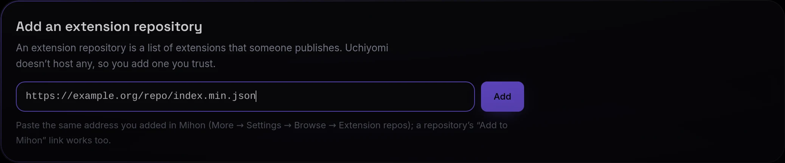
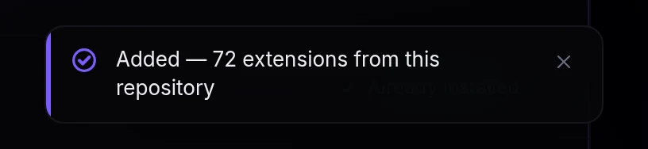
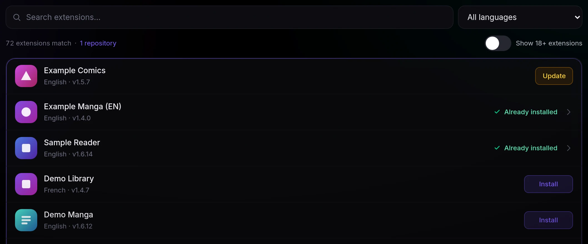

# Extensions (Mihon / Tachiyomi sources)

Uchiyomi ships **generic engines** that reach whole families of manga sites by URL, and MangaDex. On top of
that it can use the **Mihon / Tachiyomi extension ecosystem** — the same extensions those apps use, well over a
thousand of them.

Uchiyomi does not host or ship a single extension, and it has no repository built in. **You add an extension
repository you trust**, once, and from then on its extensions are listed under **Admin → Sources → Add sources**,
one **Install** each. (Since v0.54.0 Admin → Sources is one tab for every source, where Providers and Extensions
were two; `?tab=Extensions` leads there.)

- [What you need first: the extension engine](#what-you-need-first-the-extension-engine)
- [Add an extension repository — step by step](#add-an-extension-repository--step-by-step)
- [Choose your extensions](#choose-your-extensions) · [An extension's own settings](#an-extensions-own-settings)
- [Automatic updates](#automatic-updates) · [Why there is a second container](#why-there-is-a-second-container) ·
  [How it behaves](#how-it-behaves) · [Turning it off](#turning-it-off) · [Your engine's data](#your-engines-data) ·
  [Settings](#settings)
- [Komga-compatible API](#komga-compatible-api) (Mihon reading Uchiyomi, the other direction)

## What you need first: the extension engine

Extensions run in the **extension engine**, a separate program ([why](#why-there-is-a-second-container)).
Where it comes from depends on how you run Uchiyomi:

| You run | The engine |
|---|---|
| **Docker** (the standard [`deploy/docker-compose.yml`](../deploy/docker-compose.yml), and the development stack) | Already there: the `uchiyomi-suwayomi` container starts with the rest. Nothing to set up. `EXTENSION_ENGINE=0` in `.env` turns it off ([Turning it off](#turning-it-off)). |
| **Uchiyomi Desktop, on this computer** | A download of about 200 MB, once: **Admin → Sources** → **Download the extension engine (about 200 MB)**. Step by step in [the desktop guide](DESKTOP.md#add-your-first-sources). |
| **Uchiyomi Desktop, connected to your server** | Your server's. Nothing runs on the computer; Admin → Sources is the server's own. |
| **CasaOS** | An add-on beside the listing. Import [`deploy/casaos/uchiyomi-suwayomi.yml`](../deploy/casaos/uchiyomi-suwayomi.yml) as a custom app (its tips give the one folder command to run first), then set `SUWAYOMI_URL` to `http://uchiyomi-suwayomi:4567` in Uchiyomi's settings. |
| **Unraid** | A template of its own: install **uchiyomi-suwayomi** from Apps ([`templates/uchiyomi-suwayomi.xml`](../templates/uchiyomi-suwayomi.xml): pinned, memory-capped, chapter downloads off, Cloudflare helper on). Set its *FLARESOLVERR_URL* to the solver Uchiyomi uses, then set Uchiyomi's advanced *SUWAYOMI_URL* to `http://YOUR-SERVER-IP:4567`. |
| **Umbrel** | Not available. An Umbrel app cannot offer an optional second container, and putting the engine in the package would cost every Umbrel install about 800 MB whether it uses extensions or not. MangaDex and sites you add by address work there as everywhere. |

When the engine is there, the top of **Admin → Sources** is a slim strip of two cells (since v0.53.0): **Extension
engine** — *Ready*, with its version and how many sources are on under it (*v2.3.2243 · 12 of 25 sources on*) — and
**Cloudflare helper**: *Connected*, or *Not connected* with **Connect** ([how it behaves](#how-it-behaves)). The engine's
**⋯** holds **Turning it off** ([below](#turning-it-off)); on a phone the two cells stack.
When it is not, a **setup card** stands there instead (since v0.49.0; until v0.54.0 it was the whole tab — the
built-in engines, MangaDex and the sites you added are listed under it now, and work meanwhile). It says which of
three things it is:

- *Extensions are turned off* — `EXTENSION_ENGINE=0` on Docker;
- *No extension engine is set up for this server.* — no `SUWAYOMI_URL` (CasaOS and Unraid until you add the
  engine, or emptied by hand);
- *The extension engine isn't answering* — set up, and not there right now (still starting, stopped, or at the
  wrong address), with *Tried 3 times since 14:05 · next try in 4 minutes* under it.

Under that come the steps for your platform — **Docker Compose**, **Unraid**, **CasaOS**, **Umbrel** or **Somewhere
else**, opened on the one Uchiyomi detects (the CasaOS listing, the Unraid template and the Umbrel package say which
they are; a v0.49.0 compose file gives itself away) — each command in a box with **Copy** where the browser allows
it. **Check again** asks at once: when the engine answers, the card turns into the engine's strip by itself,
and its sources are registered in the same moment; when it does not, *Still no answer: <reason>* stays under the
button. The card also asks by itself every 15 seconds while you look at it. It ends with where the engine's data is
and why not to delete it ([Your engine's data](#your-engines-data)).

Uchiyomi keeps trying on its own too: 5 s, 15 s, 30 s, 1 min and 2 min after a failed start, then every
5 minutes for as long as it takes, quietly (one line in the log says so). Before v0.49.0 it gave up after about
four minutes, and an engine that came up later — a slow NAS, a template installed after Uchiyomi, a container
restarted by hand, a **Reload sources** during an outage — stayed missing until someone reloaded by hand.

It costs memory: about **750 MB** once running (731 MiB measured on a server with 22 extensions installed).

## Add an extension repository — step by step

**What a repository is.** An extension repository is a list of extensions that someone publishes, as a small
file on the web. Mihon, Tachiyomi's forks and Uchiyomi all read the same format, so **the repository you use in
Mihon is the one to add here**. Uchiyomi never suggests one: which repository you trust is your call.

**What its address looks like.** It usually ends in **`index.min.json`**:

```
https://example.org/repo/index.min.json
```

(`example.org` stands in for the real host.) **Where to find yours:**

- **In Mihon:** **More → Settings → Browse → Extension repos** lists the repositories you already added. Copy the
  address from there.
- **On the repository's own page:** repositories publish their address, and many have an **Add to Mihon** button.
  That button is a link like `mihon://add-repo?url=https://…/index.min.json` (or `tachiyomi://add-repo?url=…`).
  Uchiyomi understands those: copy the button's link (right-click → *Copy link*) and paste it as it is, and
  Uchiyomi takes the address out of it.

**Adding it:**

1. Open **Admin → Sources** (`/admin/?tab=Sources`) and its **Add sources**.
2. With no repository yet, its **Extensions** part opens on **Add an extension repository**: a line on what a
   repository is, and an address field (`https://…/index.min.json`). Later, the field is behind the repositories link
   in the line under the extensions' search (*1 repository*, *2 repositories*).

   

3. Paste the address and press **Add** (or Enter). The button reads **Checking…** and a line says *Checking the
   repository — this can take up to a minute.*: Uchiyomi has the engine read the repository and waits until its
   extensions have arrived.
4. **Added — {n} extensions from this repository** shows for a few seconds as a card at the bottom of the window
   (bottom-right on a laptop):

   

   The catalogue then lists what the repository offers, each extension with **Install**:

   

   The number is what **this** repository brought — not the size of the whole list, which also counts any
   repositories you added before.

**Later, the address in the list may change.** Right after the add, the list shows exactly what you pasted. After
the extension engine restarts, it may show `…/repo.json` (or `index.pb`) instead of the `index.min.json` you
pasted. It is the same repository. Uchiyomi treats both addresses as one repository, so it is never added twice.
On the desktop app the engine restarts each time the app starts.

**What you can paste:**

| Paste | Uchiyomi |
|---|---|
| `https://…/index.min.json` | the address as it is |
| an *Add to Mihon* link, `mihon://add-repo?url=…` or `tachiyomi://add-repo?url=…`, or a web link ending in `/add-repo?url=…` | takes out the address after `url=` |
| an address without `https://` | adds `https://` |
| a link to one file on GitHub, `…/blob/<branch>/index.min.json` | turns it into the raw file's address |
| a GitHub **repository page** (`https://github.com/<owner>/<name>`) | refuses it: that is a web page, not the list itself |

The extension engine reads a repository's list only from a file named `index.min.json`. So if an `index.json`
address gives nothing, Uchiyomi tries the `index.min.json` beside it once. If a folder address gives nothing, it
tries `<folder>/index.min.json`. When the second address is the one that worked, the message adds *· saved as
index.min.json*. An `index.min.json` that gives nothing is not retried at another address.

**What each message means.** A refusal is shown in the message and also stays in red under the field until you
change the address.

| Message | Meaning |
|---|---|
| *Added — {n} extensions from this repository* | It worked. Next, [choose your extensions](#choose-your-extensions). |
| *That doesn’t look like a repository address. It usually ends in index.min.json.* | Not a web address at all, or not http/https. |
| *That is a GitHub page, not the repository itself. Paste the repository’s index.min.json link instead.* | You pasted the project's page. Uchiyomi never guesses which branch holds the file; find the `index.min.json` link (often behind the *Add to Mihon* button). |
| *That repository is already added.* | It is in the list already. Case, `http`/`https`, a trailing slash or the file name at the end make no difference to this check. |
| *That address gave no extensions, so it was not kept. Check that it is the repository’s index.min.json link, not a web page — or it may only list extensions you already have.* | The engine read the address and nothing new arrived. **It was not saved**, so there is nothing to remove. If the engine gave a reason, *The engine said: …* follows. Usually it gives none here: for a missing file, a host it cannot reach or a file it will not read, the engine writes the reason only to its own log. |
| *The extension engine refused that address: …* | The engine would not take the address; its reason follows. Nothing was changed. |
| *Could not reach the extension engine: …* | The engine is not running or not reachable ([what you need first](#what-you-need-first-the-extension-engine)). Nothing was changed. |

**Removing one:** **Add sources** → the repositories link (*1 repository*) lists each address with **Remove** next to it: *Repository removed*. A removed
repository stays removed (before v0.45.0 the scheduled extension check could put it back). Its installed
extensions keep working until you remove them too, but they get no updates. Add the repository again and they
get updates again.

**Check for extension updates**, at the end of the **Your sources** | **Add sources** row beside **Test all** (its icon
alone on a phone), re-reads every repository: *Refreshed — {n} extensions available*. A repository that does not answer
is said under that row until the next check: *Could not reach the repositories to check for updates.* with the
engine's own reason.

## Choose your extensions


Since v0.54.0 Admin → Sources has two views under the engine's strip: **Your sources**, every source you have — each
language of each extension a row of its own, beside the built-in engines, MangaDex and the sites you added — and **Add
sources**, where the extensions your repositories offer are listed under the other ways in. It opens on Your sources;
`?view=add` opens Add sources (and `?tab=Extensions&view=browse`, its address before, does too).

1. **Find an extension and press Install.** Search by name, or pick a **Language**. The line under them says how many
   match, the repositories they come from (a link to them) and **Show 18+ extensions**. Every extension is reachable:
   the catalogue shows 60 at a time (*Showing 60 of 1,118*) and the next ones come as you scroll, or with **Show 60
   more**. (Before v0.53.0 the list stopped at the first 400 and the rest could only be found by searching.)
   **Install** is one press: the extension installs, its sources switch on straight away, and it is searchable from
   Discover immediately — no second step, no restart. One with several languages then opens its sheet on them, so you
   can switch off the ones you don't read. An installed one says *Already installed* and opens its sheet; one with a
   newer version has **Update**. (What you have installed is **Your sources**: the catalogue has no filter of its own
   for it.)
2. **Adult extensions** stay out of the catalogue until **Show 18+ extensions** is switched on. A search that finds only
   adult ones says so: *An 18+ extension matches. It is hidden while Show 18+ extensions is off.*
3. **Your sources** lists an extension's sources one a row, each with its kind (*Extension*), its state, how many of
   your series use it and its language, and the ones switched off folded away under **Switched off**. An update waiting
   is a row of **Needs attention** at the top of the tab, with **Update**, or **Update all** for several. Press a row
   for the source's sheet.
4. **A source's sheet**, for an extension's source, holds the source's own state and keys (**Test**, **Turn off**, …)
   and, under them, its extension: **Update** beside the name when one waits, its **languages**, a switch each —
   *Each language is its own source; turn on the ones you read.* A language has a line under it only when something is
   wrong: its state (*Failing*, *Blocked by the site*, …), *Turned off* when it was switched off in Admin → Sources
   while its switch here is on, *Over the source limit* for one switched on that search cannot reach, or *Hidden in
   every extension* (a link to **Languages**). Near the limit (from 80 % of it) or over it, *Across all extensions: 20
   of 25 sources on.* is said under them. Its **Settings**, closed until you open them
   ([below](#an-extensions-own-settings)). At its foot, **Remove extension**, which asks first and says how many series
   in your library came from it: they stay readable but stop updating. (Until v0.54.0 the sheet sent you to Providers
   to test its sources; it tests them itself now.)

**An extension installed in the engine's own page** arrives with every source off: its sources are listed under **Your
sources**, folded away under **Switched off**, and their sheet offers **Turn on** for that language and **Turn on its
sources** for all of them. (Before v0.53.0 they stayed off and nothing said so.) A language hidden in every extension
(below) stays off.

**Hide the languages you don't read.** A multi-language extension provides one source per language, and installing
it switches all of them on — thirty sources you will never search, each counting towards the limit below.
**Languages**, beside **Test all** at the end of Your sources' row (the globe on a phone), lists every language your extensions offer with how many sources it has, how many are
on, and how many of your series came from them. **Hide** switches that language's sources off in one go, and it
stays hidden: the next extension you install leaves its sources in that language off (the install message says how
many). **Show** brings them back. Series added from a hidden language stay readable but stop updating until it is
shown again, and the Health page names them. A switch in an extension's sheet is that one source only and leaves
this standing choice alone; the sheet marks a language you hid here *Hidden in every extension*.

**Only 25 extension sources can be switched on at once** (`SUWAYOMI_MAX_SOURCES`, 25 by default), because every
one of them is searched together. The engine's strip counts them (*v2.3.2243 · 12 of 25 sources on*); when more are
switched on than that, the count turns amber, a line under the strip says how many were left out and how to get under
the limit, and **Content → Health** lists them under *Extension source limit*. Hiding languages is the cheap way under it. On a Docker install, raising `SUWAYOMI_MAX_SOURCES` is the other;
the desktop app has no setting for it.

## An extension's own settings

Since v0.49.0. Many extensions have settings of their own — the screen Mihon opens from an extension's entry — and
**Admin → Sources** has them too: under **Settings** in an extension source's sheet (press its row under Your sources,
then **Settings**; with several languages the closed row says whose it opens on, *for English*).

- **One language at a time.** An extension that provides one source per language keeps settings per language, and
  *Settings for* above them says whose they are (it opens on the first one switched on). It only picks whose settings
  to show: which languages are on is the switches above it. The numbering notice in the add
  dialog and on the series page links an admin straight to a series' own source (**Source settings**), and so does
  its row under Health's *Chapter numbering*.
- **As the extension offers them**: switches and checkboxes, a list to pick one from, a list to tick several, and
  text. A change is saved as you make it — text when you press **Save** or Enter — and the sheet then shows what the
  engine holds; *The extension did not take the change.* when it did not. A setting the extension has switched off
  in its version reads *Not available in this version of the extension*.
- **They apply to every series from that source**, for every account.
- **Addressed by name.** The engine stores a change by the setting's position on the screen, and an extension
  update can move a setting. So Uchiyomi reads the screen again at the moment of saving, finds the setting by its
  key, checks the value against that setting's own type and choices, and only then sends it. A setting that is not
  there any more answers *This extension has no such setting any more. Reopen its settings.*
- **Logged, except what is private.** A change is in the audit log (`source.extension_pref`) with the setting and
  its old and new value — but a text setting only by its length, since extensions keep logins, keys and private
  addresses there.
- Admins only, and only while the engine answers.

### Sequential numbering, and the renumber warning

This is the setting [#116](https://github.com/AngeloSha/uchiyomi/issues/116) was about. The **Webtoons** extension
numbers a post by the first *ep* or *ch* in its title, so a series posted in parts gives dozens of different posts
one number (Istrevelia: 226 posts on 13 numbers), and Uchiyomi used to read all but the first on a number as
versions of it. The extension's own **Use sequential chapter numbering** numbers them 1, 2, 3… instead. Since
v0.49.0 Uchiyomi does the same by itself, per series, for any extension source that numbers posts this way —
*posting order* ([USAGE](USAGE.md#chapter-numbering-when-a-source-gives-many-posts-one-number)) — so the switch is
not needed; either way the chapters come out in the order they were posted.

⚠️ **Changing a numbering setting renumbers your library.** The files of every series from that source carry the
numbers the source gave them, and a setting that changes those numbers would leave each file under another post's
number. A setting whose key or title speaks of sequential, chapter or episode numbering is treated as one. Its row
says so before you touch it, with how many series in your library use that source's numbers, and when there are
any the sheet asks once more (*Renumber 3 series?*). Each of those series is then held: its page says *The source's
numbers changed*, nothing new downloads for it, and it updates again once an admin has reviewed the renaming there
(**Review renumbering**, which matches every file to its post under the new numbers and renames it in place,
reading progress and bookmarks included). Series numbered by posting order are not affected: their numbers are the
posts' own. The add dialog's cached chapter lists for that source are dropped at once, so an add shows the new
numbers.

## Automatic updates

Uchiyomi checks your repositories **every 6 hours** and installs new versions of the extensions you have
installed. You do not have to press anything.

The check is a task like any other: **Admin → Server → Tasks** shows when it last ran, what it did, and a
**Run now** button. You get a notification when extensions are updated, and a separate one when an update
fails — an extension whose download 404s stays on its old version, and that is worth knowing rather than
silently living with.

What it does on its own:

- **Re-reads your repositories, then updates.** This order is the whole point. The engine only recalculates
  "an update is available" when its repositories are re-read, so a check that skips that step compares
  against whatever was last fetched by hand and reliably finds nothing to do.
- **Waits for the chapter updater.** Replacing an extension while a library sweep is using it breaks that
  sweep's downloads, so updates wait for the next check instead. The panel says when it did.
- **Puts your repository list back.** The list is stored by Uchiyomi as well as by the engine, so deleting the
  engine's volume no longer silently un-configures the feature. If the volume is wiped, the check restores
  the repositories and reinstalls the extensions you had.
- **Tells you when an extension is abandoned.** An installed extension that no repository offers any more
  keeps working but will never update again. It is reported, never uninstalled — uninstalling would orphan
  every series routed through it.

What it will not do: install extensions you did not ask for, uninstall anything, or reinstall something you
removed yourself. Removing an extension in the engine's own interface is reported, not undone.

**To turn it off:** **Admin → Settings → Updates & schedules** → *Update extensions automatically*. The check still runs and
still tells you what is waiting; it just does not install anything. **Update all** in Admin → Sources' Needs attention
remains the manual path, and it now refreshes the repositories first, so it no longer says
"everything is already up to date" against a stale catalogue.

The interval is *Extension check interval* in the same place. Six hours is chosen against how often the
repositories actually move (roughly every fifteen hours); there is nothing to gain from checking every hour.

## Why there is a second container

Those extensions are Kotlin, compiled to Android bytecode and shipped as APKs. They cannot run in Uchiyomi's
Node server, and there is no converter — "porting" them would mean rewriting hundreds by hand.

[Suwayomi](https://github.com/Suwayomi/Suwayomi-Server) is the one project that solved this. It converts an
extension's Android bytecode to JVM bytecode and supplies a fake Android runtime so the extension believes it
is on a phone. What it does not supply is a browser: for the sources that need to get past Cloudflare it
leans on a FlareSolverr it has been told about, which is why the compose files point it at the bundled one
(below).

So Uchiyomi runs Suwayomi as an **extension engine** and nothing else. It starts with the rest of the stack,
Uchiyomi configures itself to talk to it, and you never open it. Uchiyomi keeps owning your library, reader,
downloads, updates, users and UI; the engine only answers "search this", "list these chapters", "give me this
chapter's pages".

The cost is honest: it is a JVM, and it uses about 750 MB of memory once running (731 MiB measured on a
server with 22 extensions installed).

**Since v0.46.0 the compose files cap it**, with the desktop app's own numbers: a 768 MB Java heap under a
1.5 GB ceiling for the container. Before that there was no cap at all, and a JVM without one sizes its heap
from the host's memory — up to a quarter of it, 15.7 GiB on a 62 GB server — so on a small NAS the engine could
take far more than 750 MB. A long extension list may need more: set `SUWAYOMI_MEM_LIMIT` and
`SUWAYOMI_JAVA_OPTS` ([CONFIGURATION.md](CONFIGURATION.md)). ⚠️ **Updating the image does not update your compose
file.** An install set up before v0.46.0 gets the cap by downloading the current
[`deploy/docker-compose.yml`](../deploy/docker-compose.yml) again, or by adding its two lines — `mem_limit` and
`JAVA_TOOL_OPTIONS` under `uchiyomi-suwayomi` — to the file you have.

## How it behaves

- **Uchiyomi does the downloading.** Chapters land in your own library as CBZ files exactly like every other
  source, so there is one library, one updater and one set of files.
- **Cloudflare is the engine's problem, and the engine cannot solve it alone.** These sources never go through
  Uchiyomi's own FlareSolverr calls, because the engine, not Uchiyomi, talks to the site. But Suwayomi has no
  browser of its own: it hands challenged requests to a FlareSolverr it has been told about, and that is off
  by default. The compose files set `FLARESOLVERR_ENABLED=true` and `FLARESOLVERR_URL=http://uchiyomi-flaresolverr:8191`
  (`yomi-flaresolverr` in the development stack) on the engine's container so it shares the bundled solver.
  If you run the engine yourself, set those two on it too; otherwise every Cloudflare-protected extension
  source fails its search with `Cloudflare bypass currently disabled` and the admin Test button says so, in
  these words: *The extension engine's own Cloudflare bypass is switched off. On the Suwayomi engine's
  container (uchiyomi-suwayomi in the shipped compose files) set FLARESOLVERR_ENABLED=true and
  FLARESOLVERR_URL to the same solver address Uchiyomi uses (http://uchiyomi-flaresolverr:8191 in the
  shipped files), then recreate it. The v0.37.0 compose files already set both, so an upgrade that recreates
  the engine is the fix there.*
- **The engine's page cache is kept empty.** The engine keeps a copy of every page it serves, with no limit, in
  its container (not in its volume: on the host's system disk). Uchiyomi already has those pages in the CBZ it
  wrote, so it asks the engine to delete them after each extension download job, and every half hour while
  nothing is downloading through it; never while an extension download is running. Covers are left alone.
- **If the engine is down, Uchiyomi is fine.** It boots normally, the built-in engines keep working, the panel
  says it isn't answering and keeps asking, and extension-backed series simply do not update until it is back.
  **Admin → Health** then says why those series wait (*…can't be reached because the extension engine isn't
  answering*, or *…is off* — no longer "over the source limit"), and its **Extension engine** row says what
  the engine itself is doing.
- **Health checks the engine's own Cloudflare helper.** The **Extension engine** row reads the engine's
  `flareSolverrEnabled` / `flareSolverrUrl`. When the helper is off, or points at `localhost` (the engine's own
  container, where no solver runs), the row turns amber while an extension source is seen behind Cloudflare, and
  is a greyed line otherwise. The row, and the *Cloudflare helper* cell of the strip at the top of **Admin →
  Sources**, offer **Connect**, which sets the engine to the solver Uchiyomi uses (`FLARESOLVERR_URL`) and switches it
  on. Nothing restarts, and the engine keeps it unless its own container names another solver. It is never changed
  without someone pressing it; with no `FLARESOLVERR_URL` on Uchiyomi both say to set that first. When the engine
  cannot say what its helper is set to while a source fails with its *Cloudflare bypass currently disabled*, the
  row reads *It cannot use its Cloudflare helper*, with the same **Connect** wherever there is a setting to change
  (an engine too old to report the setting has to be set on its own container).
- **Series stay routed** by the source they came from, so the scheduled updater keeps pulling new chapters.

Two things worth knowing:

- A series added through an extension is routed using an id from the engine's own database. Wiping that
  database loses the routing for those series (they stay in your library; re-adding repairs it). Don't delete
  its volume. The scheduled check will put your repositories and your installed extensions back, but it
  cannot restore that routing — nothing outside the engine ever knew those ids.
- Every source you enable is queried on every cross-source search. Installing a handful is fine; installing
  hundreds would make search slow and hammer a lot of sites at once. `SUWAYOMI_MAX_SOURCES` (default 25) is a
  backstop, and it logs what it skipped rather than silently dropping it.

## Turning it off

On Docker: put `EXTENSION_ENGINE=0` in `.env` next to your compose file and run `docker compose up -d`. The
engine's container goes away, its memory with it, and Uchiyomi (which reads the same line) treats extensions as
off; nothing else changes. Its data stays in its volume — `<project>_uchiyomi_suwayomi`, Compose putting your
project's name (the folder's, by default) in front — so deleting the line and running the same command brings it
back where it left off. Never `docker compose down -v` while you might come back: that deletes the volume, and
with it the links for every series you added through an extension.

- The switch needs the v0.49.0 compose files or later. An older file ignores the line: download the file for your
  layout again — [`deploy/docker-compose.yml`](../deploy/docker-compose.yml),
  [`docker-compose.external-db.yml`](../deploy/docker-compose.external-db.yml) or
  [`docker-compose.split.yml`](../deploy/docker-compose.split.yml); each has the switch — or add its two lines to
  yours (`deploy:` / `replicas: ${EXTENSION_ENGINE:-1}` under the engine,
  `EXTENSION_ENGINE: ${EXTENSION_ENGINE:-1}` in the app's environment). An install made before v0.18.0 may run
  the external-database layout under the name `docker-compose.yml` (it has a `uchiyomi-db` container): replace
  that with `docker-compose.external-db.yml`, never with the one-container file, which would start on a new, empty
  database.
- `docker compose pull` still downloads the engine's image while it is off; `docker image rm` reclaims it.
- An empty `SUWAYOMI_URL=` in `.env` turns extensions off in the app too (since the v0.49.0 compose files; the
  older ones put the default back, which is why it never worked), but leaves the container running.
- An engine you run yourself is not affected by the switch: it only turns off the bundled container.

`docker compose stop` only lasts until the next `docker compose up`, which starts it again. On Unraid and CasaOS,
stop or remove the engine's container and empty `SUWAYOMI_URL`. The desktop app has no switch for it: an engine
that was never downloaded costs nothing, and one that was only runs while Uchiyomi does. The same steps, per
platform, are under **Admin → Sources** → the engine's **⋯** → **Turning it off**.

## Your engine's data

The engine keeps its installed extensions, its repositories and — the part nothing else has — the id every
series you added through an extension is routed by. It lives in the engine container's volume on Docker —
`<project>_uchiyomi_suwayomi` in `docker volume ls`, where `<project>` is your Compose project's name (the folder's,
by default) — `/mnt/user/appdata/uchiyomi-suwayomi` with the Unraid template, `/DATA/AppData/uchiyomi-suwayomi` with
the CasaOS add-on, and the `engine` folder of the desktop app's data folder.

**It is not in Uchiyomi's nightly backup**, on purpose: it belongs to another container that Uchiyomi cannot
reach, a copy of its database taken while it runs may not be consistent, and Suwayomi's own backup restores
series under new ids, which would not keep the links anyway. So back it up with your other volumes: stop the
engine, copy, start it.

```bash
docker compose stop uchiyomi-suwayomi
docker run --rm --volumes-from uchiyomi-suwayomi -v "$PWD":/b alpine tar czf /b/engine.tgz -C /home/suwayomi/.local/share/Tachidesk .
docker compose up -d
```

`--volumes-from` borrows the stopped container's own volume, so the copy is of the data it really uses, whatever
Compose named the volume. ⚠️ Never write the volume's name as bare `uchiyomi_suwayomi`: Docker makes a new, empty
volume of that name without a word, and the backup is an empty file. With the engine switched off
(`EXTENSION_ENGINE=0`) there is no container to borrow from: take the volume's full name from `docker volume ls`
and mount that, `docker run --rm -v <project>_uchiyomi_suwayomi:/d -v "$PWD":/b alpine tar czf /b/engine.tgz -C /d .`

On Unraid and CasaOS, copy the folder above the same way, with the engine stopped. Admin → Sources → **⋯** →
**Turning it off** says how many series depend on it, and warns you never to delete it: turning the engine off is safe, deleting its data is
not. Moving it between setups is in [MIGRATING.md](MIGRATING.md#adding-or-removing-the-extension-engine).

## Settings

| Variable | Default | What it does |
| --- | --- | --- |
| `EXTENSION_ENGINE` | `1` | `0` doesn't run the bundled engine: Compose scales it to zero, and the app treats extensions as off. Read by both, from the same `.env` line. Compose only accepts `0` or `1` here (it is the engine's replica count, and any other value stops `docker compose up` for the whole stack); the app also reads `off`, `false` and `no`, for setups that don't pass the line to Compose. Only applies while `SUWAYOMI_URL` names the bundled container (`uchiyomi-suwayomi`, or `yomi-suwayomi` in the development stack). |
| `SUWAYOMI_URL` | the bundled engine | Where the extension engine is. Empty turns the feature off (in the v0.49.0 compose files and later). A trailing slash (or two), a query string or a fragment on this value is ignored; the scheme, host, port and any sub-path are what count. |
| `SUWAYOMI_USERNAME` / `SUWAYOMI_PASSWORD` | empty | Only if your engine has authentication enabled. |
| `SUWAYOMI_MAX_SOURCES` | `25` | Ceiling on how many extension sources register at once. |
| `SUWAYOMI_PAGE_CONCURRENCY` | `4` | Pages of one chapter fetched from the engine at once (1-8). The engine rate-limits the site itself, so extension downloads skip the one-at-a-time pacing that scraped sites need; a 429 from the engine drops back to one for the rest of the chapter. |
| `SOURCE_LATEST_TIMEOUT_MS` | `8000` | How long one source gets to answer "what's new" on Discover before it is given up on and marked unhealthy. A source that keeps overrunning it is diagnosed *answers, but more slowly than it is given* — since v0.37.0 by the admin *Test* button and the daily source check too, not only Discover's health view — and the fix sentence names this budget. |

The update check's own settings live in **Admin → Settings → Updates & schedules**, not here: *Update extensions
automatically* (on by default) and *Extension check interval (hours)* (6). The switch saves as it flips; the interval saves when you leave the field or press Enter, and the row says *Saved*.

**Adult sources.** Extensions declare whether they are adult, and Uchiyomi records that per source. A member
whose age limit is set below 18 cannot reach one: it is left out of their source list entirely, and the
server refuses it by id rather than relying on the app to hide it. Admins and members with no age limit are
unaffected. Sources with no such declaration — the built-in engines, source packs, custom sites — are treated
as not adult, the same way an unrated series stays visible instead of vanishing the moment a limit is set.

You can point `SUWAYOMI_URL` at a Suwayomi you already run instead of the bundled one; Uchiyomi doesn't care
whose it is.

The image is pinned rather than tracking `:stable`, because `:stable` is older than the extension API today's
repository indexes require and would show an empty catalogue.

## Komga-compatible API

The other direction, since v0.38.0: **Mihon reading Uchiyomi**, with reading progress flowing **back**. The
[Uchiyomi extension](https://github.com/AngeloSha/uchiyomi-extension) already adds your library as a source
in Mihon, Tachimanga and Suwayomi, but an extension cannot report what you read — Mihon only lets a
*tracker* do that, and its trackers are built into the app. One of them, the **Komga tracker**, binds to
the **Komga** extension and nothing else, and speaks a small, fixed set of Komga's endpoints. So
Uchiyomi now answers those endpoints (`/api/v1/*`, `/api/v2/*`), enough for the Komga extension to browse
and read the library and for the Komga tracker to sync progress in both directions, forward-only. The wire
contract is in [api.md](api.md#komga-compatible-api-mihons-komga-extension-and-tracker); this is the setup and
the limits.

### Setting Mihon up

1. In Uchiyomi, mint an API token under **Profile → Connections → API tokens → New token** (the form opens inline)
   with **read + write** — tick *Allow changes*. A read-only token browses and reads, but nothing syncs in
   either direction: Mihon retries a failed push a few times with backoff, then gives up quietly until the
   next chapter read. Tick **Include 18+ content** if you want 18+ libraries and series listed on the phone; the
   account's age limit still applies whatever the token says.
2. In Mihon, install the **Komga** extension from the extension repository you use there (it comes as three copies — *Komga*,
   *Komga (2)*, *Komga (3)* — for people with more than one server). In its settings, **Address** is your
   Uchiyomi URL exactly as you reach it — scheme, host, port, no trailing slash — and **API key** is the
   token. (Username and password are only shown while the API key field is empty; if you use them instead,
   put the token in **Password** and anything in **Username** — account passwords are refused on purpose,
   see below. Prefer the API key field: it is sent on every request, so changing the key moves the tracker
   with it, whereas the extension only presents the password after a 401, so a changed password is not
   noticed while the previous cookie is valid, up to 7 days.) The extension checks the login against the
   library list straight away.
3. Enable the Komga tracker in Mihon under **Settings → Tracking** *before* adding series. Mihon binds the
   tracker to a series when the series is added to the library; a series you added before the tracker was on
   has no link, and needs re-adding or a manual bind from its tracking sheet.

From then on, reading a chapter in Mihon marks it read in Uchiyomi for that account, and chapters read in
Uchiyomi (or on any other device) are marked read in Mihon on its next refresh of the series. Tachimanga
(iOS) runs the same Komga extension and its *enhanced tracking* is reported by a contributor to sync against
this API as well; it is closed source and was not tested here — a report either way is welcome.

### What the sync is, and is not

- **It is continuous progress, forward only.** The protocol carries one number per series: the highest
  chapter in the unbroken run of read chapters from the start. Chapters 1, 2 and 4 read reads as *2*, and
  Mihon marks everything up to it. Mihon only ever pushes a higher number, and the Komga protocol has no
  "unread" — marking a chapter unread on either side does not travel. Reads synced from the phone do not
  count towards streaks, the leaderboard or Wrapped, exactly like the app's own bulk mark-read; AniList,
  MyAnimeList and Kitsu are pushed once, only when something actually changed.
- **One Uchiyomi account per phone.** The tracker's own requests carry no credential; they ride on a cookie
  the extension's traffic leaves in the phone's cookie jar, which Android keys by host and cookie name — the
  port is ignored. Two Komga instances on one phone pointed at the same host with two accounts' tokens fight
  over that cookie, and the credential-less sync lands on whichever was minted last. With the API key field
  the cookie is re-minted whenever a request authenticates as a different token, so switching the key moves
  the tracker with it. With username/password the extension only presents the password after a 401, so a
  changed password is not noticed while the previous cookie is valid (up to 7 days) — revoke the old token,
  or use the API key field, which is sent on every request. And do not point the phone at a host where an
  untrusted service also answers: the phone's cookie jar is shared per hostname and ignores the port, so any
  service on the same hostname can plant a session cookie of its own that the tracker's credential-less
  requests would then carry; the extension re-mints the cookie on its next credentialed request, but until
  then those writes land on whoever planted it. Real Komga has both limits.
- **A real Komga on the same host coexists.** Uchiyomi's cookie is named `UCHIYOMI-SESSION`, not
  `KOMGA-SESSION`, precisely so a Komga on another port of the same machine does not overwrite it — the
  migration case. Anything else on that host also sees the cookie (it is scoped to the host, not the port),
  which is why it is a value only these routes can verify and that nothing else on the server accepts.
- **The address is the identity.** Mihon stores each series and each tracker link under the absolute URL you
  typed. Changing the address later — `http://nas:8080` to `https://nas`, say — gives every series a new
  identity in Mihon and orphans every tracker entry. Pick the address you will keep.
- **Passwords are refused, on purpose.** The extension offers username + password; here the password must be
  an API token. An account password would have walked around two-factor authentication and the lockout
  counter, and this protocol has no place to type a 2FA code. Revoking the token, letting it expire or
  disabling the account ends the phone's session on its next request.
- **What the phone sees** is what the token's account may see: library grants, the age limit and hidden
  series apply, and an 18+ library, or a series the admin's 18+ filter hides, is listed only when the token was
  minted with *Include 18+ content*
  (the extension has no reveal button of its own). Collections and read lists are always empty there, so
  that no id from a shelf the account cannot open is disclosed. Chapters deleted from the server are left
  out of the phone's chapter list but still count for progress. A fresh bind sends *0* as its progress, and
  that is treated as nothing rather than as "chapter 0 read", so a chapter numbered 0 (*Extra*, *Oneshot*,
  any file without a digit) is not marked read just by binding the series; the first real sync (n ≥ 1) marks
  a number-0 chapter read on both sides, as Komga does — only the bind-time 0 is ignored. In the other
  direction the server reports the leading run of read chapters: nothing read reports 0, and so does a run
  that ends on — or starts with an unread — number-0 chapter, so an unread *Extra* at the head keeps the run
  behind it from reaching the phone until it is read.
- Plain HTTP on a LAN works; the cookie is marked Secure only over HTTPS.

## Where the line is

Uchiyomi's code contains **no scraper, no site name, and no repository URL**. The catalogue you browse comes
from repositories *you* add, and the engine does the fetching and installing. Uchiyomi never hosts or
redistributes an extension, and ships no default repository — so nothing is fetched from anywhere until you
choose a source for it.

What you point it at, and whether that is lawful where you live, is your call and your responsibility.
